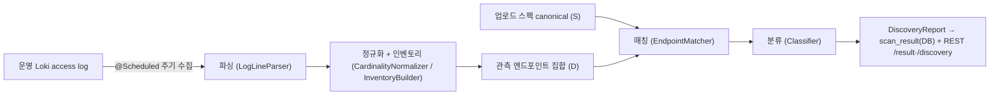

# APIDiscover 온보딩 가이드

> 신규 개발/유지보수 인원을 위한 **단일 진입점**. `doc/00~38` 을 다 읽지 말고 이 문서로 큰 그림을 잡은 뒤, 손댈 영역의 문서만 펴본다.

---

## 1. 이 프로젝트가 하는 일

WAAP **API Discovery Worker**. 사내 Loki 에 쌓인 nginx access log 를 주기적으로 수집해 도메인별 **엔드포인트 인벤토리**를 만들고, 운영자가 업로드한 API 스펙과 대조해 **Shadow / Zombie / Active / Unused** API 를 탐지한다. 결과는 REST 로 조회·중앙 서버와 연동한다.

- 스택: **Java 21 + Spring Boot 3.3** · DB = **PostgreSQL**(운영) / H2(dev·test)
- 배포: **podman play kube**(app + postgres 2컨테이너 1 pod)
- 대상 Loki = **192.168.8.100:3200 (운영 서버)** — 부하보호 우회 금지(§10)

## 2. 5분 정신 모델 — 스캔 파이프라인



한 줄 요약: **로그(관측 D) 와 스펙(문서 S) 을 대조해 4분면으로 분류한다.**

## 3. 핵심 — 분류 4종 (+ WebPage)

이게 제품의 존재 이유다. 나머지는 전부 이걸 정확·저부하로 만들기 위한 장치.

| 분류 | 정의 | 의미 |
|---|---|---|
| **Active** | 스펙 O · 트래픽 O (S∩D) | 정상 사용 중인 문서화 API |
| **Shadow** | 스펙 X · 트래픽 O (D−S) | **미문서 API** — 최고 보안 관심 |
| **Unused** | 스펙 O · 트래픽 X (S−D) | 문서엔 있으나 안 쓰임 |
| **Zombie** | 스펙 deprecated/삭제 + 트래픽 | 폐기 예정인데 계속 호출됨 |
| (WebPage) | `$type`/referer 로 비-API 판정 | 분류 요약에서 제외 |

- **Shadow 만 점수 게이트로 판정**한다(§5). Active/Zombie/Unused 는 **스펙 매칭이 근거**지 점수가 아니다.
- 근거 문서: **`doc/04-matching-and-classification`** (심장부).

## 4. 데이터 모델 — 진실원(SoT) 2개 + 파생 뷰

| 테이블 | 역할 |
|---|---|
| `spec_record` | **업로드 SoT** — 스펙 문서 → canonical(매칭 진실원). host×specName×version 다행. |
| `discovered_endpoint` | **검출 SoT** — 관측 트래픽 누적 인벤토리(firstSeen/lastSeen recency 포함). |
| `documented_api` | 문서화 API 인벤토리(reconcile 결과·파라미터·ADDED/UPDATED/DELETED 상태). |
| `scan_result.reportJson` | **파생 분류 뷰**(재생성 가능·SoT 아님). `/result` 응답 본체. |
| `domain_config` | 도메인 설정(enabled·병합모드·스캔 due 커서 등). |

- 엔티티 9종 / 테이블 10개. 전 테이블 **host 키** 논리 FK(DB FK 없음).
- 상세: **`doc/18-db-schema`**. 스키마는 **ddl-auto=update**(Flyway 없음) — 엔티티에서 자동 생성, ADD 만 반영.

## 5. 점수 게이트 (Shadow admit) — 요약

- `classify/ApiScorer.score()` = **14개 신호 가중합 → clamp[0,1] → threshold 게이트**. 통과(ADMIT)면 Shadow.
- preset **MIDDLE / HIGH / LOW / CUSTOM**(도메인 override > 전역 > preset, `EffectiveClassificationResolver`).
- 판단 근거(신호별 점수·게이트)는 `GET /discovery` 응답의 `rationale` 로 노출(`ApiScorer.scoreExplain`).
- 근거 문서: **`doc/08-api-scoring-and-profiles`**.

## 6. 함정·불변식 (모르면 사고 나는 것)

- **JSON 컬럼은 `@Column(columnDefinition="text")`, `@Lob` 금지.** `@Lob String`은 PostgreSQL 에서 `oid` 로 매핑돼 auto-commit 500 을 유발한다(D40, `doc/28`). 새 JSON 컬럼 추가 시 최우선 주의.
- **삭제 없음 원칙.** 자동 디스커버리는 도메인/설정을 절대 자동삭제하지 않는다. 인벤토리 `DELETED` 는 소프트마크(→ Zombie 입력).
- **ETag = 콘텐츠 지문.** `now()` 안 쓰고 데이터 타임스탬프만 사용, band/이름집합으로 버킷화해 churn 방지. score·lastSeen 은 ETag 입력 아님.
- **watermark** = 수집 진척 시각(증분 스캔 커서). 온디맨드 스캔(`/scan-now`)은 watermark 를 전진시키지 않는다.
- **매칭 진실원은 `SpecStore.loadActiveCanonical`** — `documented_api` 인벤토리는 노출·상태추적용 **보완**이지 매칭 source 가 아니다.

## 7. 빌드 · 테스트 · 배포

```bash
# 빌드 (JDK 21 필요)
JAVA_HOME=/usr/lib/jvm/java-21-openjdk ./gradlew build

# 실 PG 통합테스트 (podman/Testcontainers, docker 없으면 자동 skip)
JAVA_HOME=/usr/lib/jvm/java-21-openjdk ./gradlew test

# 실 Loki end-to-end (운영 서버 호출 — 창을 짧게!)
./gradlew test --tests "*LokiLiveIntegrationTest" -Dloki.live=true

# 배포 (테스트 VM 192.168.8.197, podman)
podman build -t localhost/apidiscover:test .
podman play kube adc.yaml        # hostNetwork, app + postgres:16-alpine, wait-for-db
```

- 배포 런북 전체: **`doc/32-container-deploy-runbook`**.

## 8. 코드 지도 (패키지 → 역할)

| 패키지 | 핵심 클래스 |
|---|---|
| `parse` | `LogLineParser` (access log → ParsedRequest) |
| `normalize` | `CardinalityNormalizer`·`InventoryBuilder`·`EndpointKindClassifier`·`Acc` |
| `spec` | `SpecStore`·3 파서(OpenApi/Postman/Csv)·`SpecCanonicalizer`·`ApiInventoryService` |
| `match` | `EndpointMatcher`·`EndpointMatcherCache`·`ApiHintMatcher` |
| `classify` | `Classifier`·`ApiScorer`·`ZombieSeverity`·`VersionZombieInference` |
| `batch` | `DiscoveryScheduler`·`DiscoveryJobService`·`ScanSelector`·`CombinedDiscoveryService`·`DomainDiscoveryService` |
| `domain` | JPA 엔티티(`DomainConfig`·`SpecRecord`·`DiscoveredEndpointRecord`·`DocumentedApiRecord`·`ScanResult`·`Watermark` 등) |
| `api` | REST 컨트롤러(`DomainController`·`ScanController`·`SpecController`·`ClassificationController`·`CombinedDiscoveryController`·`ApiInventoryController`) |
| `cli` | CLI 모드(`-domain -ls/-export/-scan/-register`) |
| `ingest` / `loki` | `LokiClient`·`LokiBudget` (부하보호) |

## 9. 문서 읽는 순서

1. **필수(뼈대)** — `00-overview` · `01-architecture` · `04-matching-and-classification` · `18-db-schema`
2. **핵심 메커니즘** — `08-api-scoring-and-profiles`(점수) · `02-log-parsing-and-normalization`(파싱)
3. **운영을 맡으면** — `33-scan-load-policy`(스캔 부하 정책) · `32-container-deploy-runbook`(배포)
4. **나머지는 참조용** — 그 기능을 건드릴 때만.
   - 스펙 파싱 → `03`·`14`·`26` / REST·중앙 → `07`·`11`·`35` / 분류설정 → `10`·`11`
   - 인벤토리·상태추적 → `37`·`38`(`GET /spec/apis`) / 캐시·근사·recency 등 개별 근거 → `13`·`15`·`16`·`22`·`24`

> 세션 메모리 3종은 별도다 — `doc/TASKS.md`(할 일), `doc/PROJECT_LOG.md`(작업 이력), `doc/DECISIONS.md`(의사결정 근거 Dnn). 작업 전 이 3개를 먼저 읽는다.

## 10. 운영 주의 (반드시)

- 대상 **Loki(192.168.8.100:3200)는 운영 서버**다. `LokiClient` 의 부하보호(윈도우 슬라이스·페이지네이션·동시성 2·throttle·백오프·시간당 예산)를 **우회하지 말 것**. 임시 스크립트도 창/limit 을 작게, 대용량은 off-peak(01:00–06:00).
- ~14k 도메인은 tier 기반 라운드로빈으로 분산 스캔(`ScanSelector`·`nextScanDueAt`). 한 도메인이 예산·스레드를 독점하지 않도록 per-scan 하드캡(`collectBounded`)이 있다.
