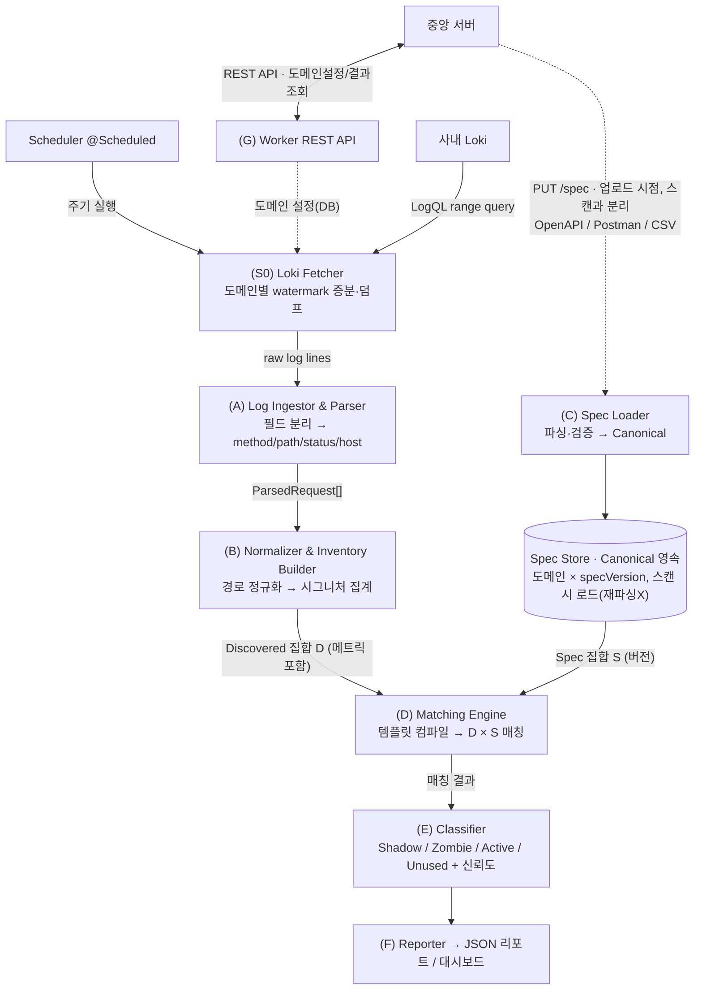

# 아키텍처

## 1. 전체 파이프라인

> MSA: 본 파이프라인은 **API Discovery Worker** 서비스 내부 흐름이다. 중앙 서버 연동(도메인 설정 수신·결과 제공)은 [07-msa-and-central-integration](07-msa-and-central-integration.md).
> 한 도메인 1회 스캔에서 A~F 를 실제로 엮어 돌리는 진입점은 `batch/DiscoveryJobService` 의 `runScan()`(배치 묶음은 `runScanBatched()`).



## 2. 컴포넌트 책임

| ID | 컴포넌트 | 책임 | 핵심 소스 | 상세 문서 |
|---|---|---|---|---|
| G | **Worker REST API** | 중앙 서버에 도메인 설정 수신·스캔 상태·결과(조건부 GET) 제공 | `api/ScanController`, `api/CombinedDiscoveryController`, `api/SpecController` | [07](07-msa-and-central-integration.md) |
| S0 | **Loki Fetcher (Scheduler)** | 주기 실행, 도메인별 LogQL range query, watermark 증분 수집·dedup, raw 덤프 | `batch/DiscoveryScheduler`, `batch/DomainDiscoveryScheduler`, `ingest/LokiClient` | [05](05-log-ingestion-from-loki.md) |
| A | **Log Ingestor & Parser** | `^|^` 구분 라인 파싱, `$request`/`$request_uri`에서 method·path 추출, 잘못된 라인 폐기 | `parse/LogLineParser.parse()` | [02](02-log-parsing-and-normalization.md) |
| B | **Normalizer & Inventory Builder** | 경로를 템플릿으로 정규화, 시그니처별 트래픽 메트릭 집계 → D | `normalize/PathNormalizer`, `normalize/InventoryBuilder`, `normalize/CardinalityNormalizer` | [02](02-log-parsing-and-normalization.md), [13](13-normalization-cardinality.md) |
| C | **Spec Loader + Spec Store** | **업로드 시점에** 포맷 감지·파싱·검증 → Canonical 을 도메인×버전으로 **영속**. 스캔은 저장소에서 로드(재파싱 없음) | `spec/SpecStore`, `spec/SpecFormatDetector`, `spec/{OpenApi,Postman,Csv}SpecParser` | [03 §7](03-spec-formats-and-canonical-model.md) |
| D | **Matching Engine** | 문서 템플릿을 매처로 컴파일, D의 각 시그니처를 S에 매칭 | `match/EndpointMatcher`, `match/EndpointMatcherCache` | [04](04-matching-and-classification.md) |
| E | **Classifier** | 매칭 결과로 분류 + 신뢰도/노이즈 필터 | `classify/Classifier`, `classify/ApiScorer` | [04](04-matching-and-classification.md), [08](08-api-scoring-and-profiles.md) |
| F | **Reporter** | 분류 결과를 JSON 리포트로 직렬화 | `report/ReportBuilder.build()` | 본 문서 §4, [25](25-report-output-enhancements.md) |

## 3. 내부 데이터 모델

### 3.1 ParsedRequest (A 출력)
로그 한 줄을 파싱한 결과. 권위 정의는 `model/ParsedRequest.java`(record) — 아래는 개념 예시다.
```jsonc
{
  "method": "GET",
  "rawPath": "/users/12345",         // query string 제거된 경로
  "queryParams": [                    // 쿼리 파라미터 '이름 + 값 길이 버킷'(값 자체는 폐기, 13 문서 §2.1)
    { "name": "expand", "lenBucket": "S" }  // lenBucket ∈ NONE/S/M/L/XL
  ],
  "status": 200,
  "host": "api.example.com",
  "clientIp": "203.0.113.5",
  "userAgent": "okhttp/4.9",
  "ts": "2026-06-22T09:00:00+09:00",
  "respTimeMs": 35,
  "bodyBytes": 812,
  "https": true,
  "referer": "https://app.example.com/orders",  // 필드13, endpoint_kind 보조(20 문서), nullable
  "type": "document",                // 필드19 $type, endpoint_kind 핵심(21 문서), nullable
  "requestId": "abc123",             // 필드23, dedup 키, nullable
  "acrm": "POST"                     // Access-Control-Request-Method, CORS preflight 신호(23 문서), nullable
}
```

### 3.2 DiscoveredEndpoint (B 출력 — 집합 D의 원소)
정규화된 시그니처 + 누적 메트릭. 권위 정의는 `model/DiscoveredEndpoint.java`(record).
```jsonc
{
  "signature": "GET api.example.com /users/{id}", // 표시용(식별 키 아님 — upsert/recency 는 EndpointIdentity.key)
  "method": "GET",
  "host": "api.example.com",
  "pathTemplate": "/users/{id}",
  "templateSource": "SPEC|INFERRED",    // 스펙 매칭인지 휴리스틱 추론인지 (model/TemplateSource)
  "endpointKind": "API_CANDIDATE",      // WEB_PAGE|STATIC|API_CANDIDATE|UNKNOWN (02 §5, model/EndpointKind)
  "kindConfidence": 0.0,                // endpoint_kind 신뢰도 0~1 (dormant 시 0)
  "hadQuery": true,                     // 관측 중 query string 존재 (ApiScorer 신호)
  "nonBrowserUa": true,                 // SDK/CLI user-agent 다수 (ApiScorer 신호)
  "params": { /* query/path 파라미터 후보 (13 문서 §2, model/ParamCandidates) */ },
  "metrics": {
    "hits": 14820,
    "firstSeen": "2026-06-01T00:03:11+09:00",
    "lastSeen": "2026-06-22T08:59:50+09:00",
    "statusDist": { "2xx": 14010, "3xx": 100, "4xx": 600, "5xx": 110 },
    "distinctClients": 320,             // 근사(HLL)
    "p50RespMs": 30, "p95RespMs": 120,
    "acrmPresentCount": 0               // CORS preflight 신호 acrm 관측 수 (23 문서 §9)
  }
}
```

### 3.3 CanonicalEndpoint (C 출력 — 집합 S의 원소)
3종 포맷이 공통으로 변환되는 내부 표현. 권위 정의는 `model/CanonicalEndpoint.java`, 상세는 [03](03-spec-formats-and-canonical-model.md).
```jsonc
{
  "method": "GET",
  "pathTemplate": "/users/{id}",
  "host": "api.example.com",          // null 가능(호스트 미지정 스펙)
  "deprecated": false,                // Zombie 판정 기준
  "version": "1.0.0",                 // null 가능
  "sourceRef": "openapi#getUserById", // 추적용 원본 참조
  "params": [ /* 스펙 파라미터 SpecParam[] (37 문서 §2). 매칭/dedupe 키 아님 */ ]
}
```

## 4. 출력 리포트 스키마 (F)

한 도메인 1회 스캔 결과. 권위 정의는 `model/DiscoveryReport.java`·`model/Finding.java`(record) 다. 필드명은 record 를 따르며(전역 snake_case 설정 없음 → 대부분 camelCase, `low_confidence`·`band` 등 일부만 `@JsonProperty` 로 snake), `classification` 은 대문자 enum 명(`SHADOW` 등)으로 직렬화된다. 정확한 wire JSON 은 [25-report-output-enhancements](25-report-output-enhancements.md) 와 REST 매뉴얼(`doc/manual/api-rest-manual.html`)이 기준이다. 아래는 개념 예시(주요 필드).

```jsonc
{
  "host": "api.example.com",
  "generatedAt": "2026-06-22T09:10:00+09:00",
  "logWindow": { "from": "2026-06-01T00:00:00Z", "to": "2026-06-22T00:00:00Z" },
  "specVersion": 1719000000,
  "summary": {
    "discovered": 168, "active": 120, "shadow": 26, "zombie": 8, "unused": 22,
    "lowConfidence": 5              // confidence<0.5 인 Shadow/Zombie 수 (25 문서 §A.3)
  },
  "findings": [
    // ★finding 에는 per-endpoint 트래픽 메트릭(hits/status 등)이 실리지 않는다 — 그건 D(DiscoveredEndpoint)·아래 dropped* 집계에 있다.
    {
      "classification": "SHADOW",
      "host": "api.example.com",
      "method": "POST",
      "pathTemplate": "/internal/debug/{id}",
      "confidence": 0.92,          // 04 문서의 신뢰도 산식
      "reason": "트래픽 존재, 문서 내 매칭 템플릿 없음",
      "params": { /* 미문서 endpoint 파라미터 후보(보안신호, 13 문서 §4.2) */ },
      "low_confidence": false
    },
    {
      "classification": "ZOMBIE",
      "host": "api.example.com",
      "method": "GET",
      "pathTemplate": "/v1/orders/{orderId}",
      "confidence": 1.0,           // 명시 deprecated=1.0 / 버전 추정=0.6
      "severity": { "score": 0.7, "band": "HIGH" }, // 조치 시급성(트래픽 메트릭 기반, confidence 와 독립, 16 문서)
      "estimated": false,          // 버전 추정 Zombie 여부
      "specRef": "openapi#getOrderV1",
      "reason": "문서에 deprecated 표기, 그러나 최근까지 트래픽 발생",
      "params": {},
      "low_confidence": false
    }
  ],

  // 스캔이 '버린' 관측·부가 신호 집계 — 모두 항상 non-null. 상세는 각 문서.
  "droppedNonApi":      { /* 비-API 게이트 탈락 사유별 집계 — 12 문서 */ },
  "droppedByLimit":     { /* 카디널리티 상한 초과 drop — 13 문서 */ },
  "droppedNonExistent": { /* 404-only 비실재 drop — 19 문서 */ },
  "endpointKindSignal": { /* endpoint_kind referer 보조 신호 커버리지 — 20 문서 */ },
  "typeDistribution":   { /* corpus $type 히스토그램 — 21 문서 */ },
  "preflightSignal":    { /* CORS preflight 신호(acrm) 가용성 — 23 문서 §9 */ },
  "specSource": { "specVersion": 1719000000, "format": "OPENAPI", "warnings": [], "documents": [] } // 스펙 출처·경고 — 25/26 문서
}
```

## 5. 기술 스택

- 소스는 사내 Loki, 실행은 주기 배치(스트리밍·인라인 불필요). 상세는 [05-log-ingestion-from-loki](05-log-ingestion-from-loki.md).
- 언어/환경은 **Java 21 + Spring Boot** 다(초기 설계의 Python 안은 폐기). 상세는 [06-implementation-stack](06-implementation-stack.md).
- 매칭의 핵심 자료구조는 **정규식 + 해시맵 버킷 인덱스**다 — `(method, host, 세그먼트수)` 로 버킷팅해 후보를 좁힌 뒤 컴파일된 정규식으로 매칭한다(trie 아님, `match/EndpointMatcher`). 대용량 로그는 라인 스트리밍 + 시그니처 집계로 메모리를 상수화한다.
