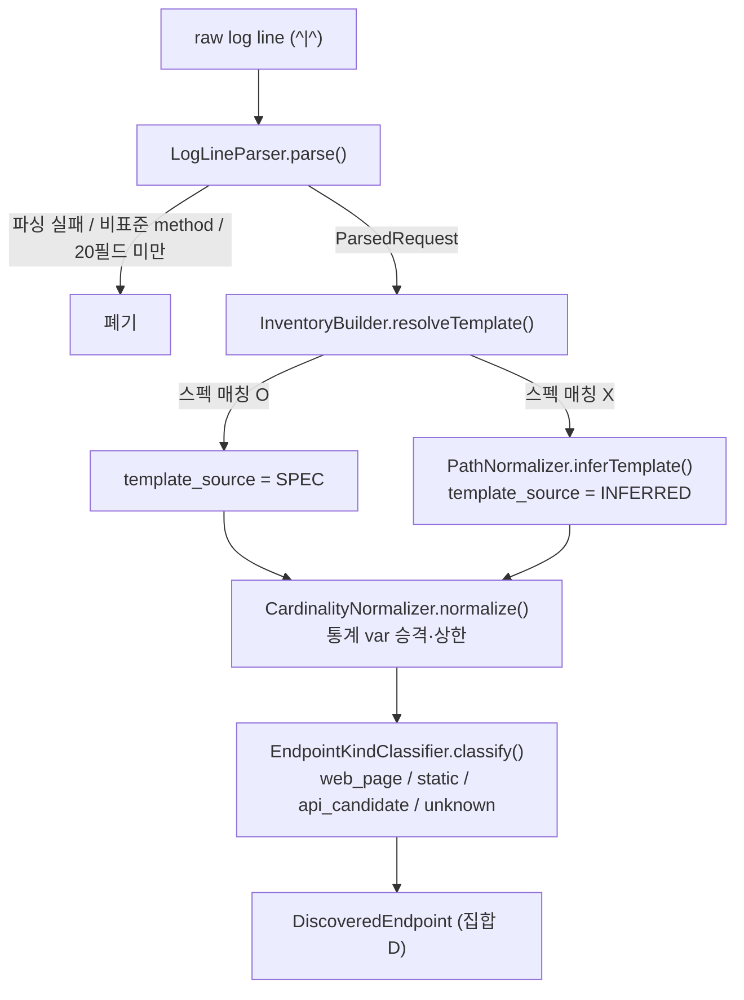
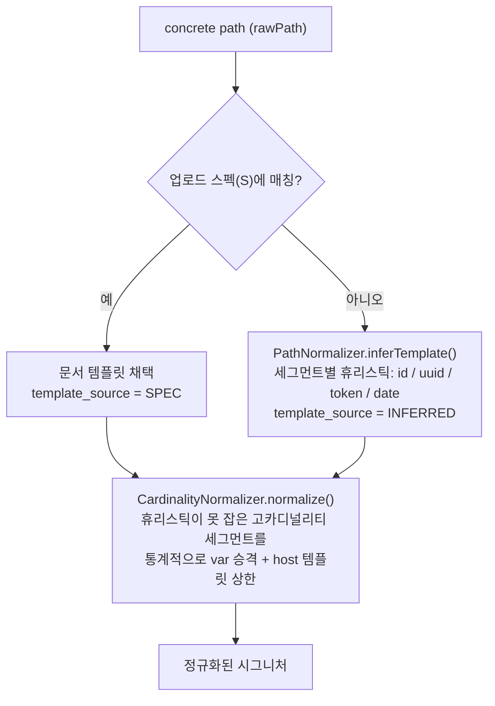
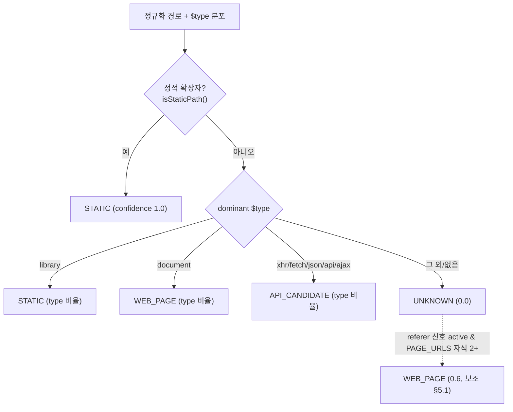

# 로그 파싱과 경로 정규화

컴포넌트 (A) Log Parser, (B) Normalizer 의 상세 설계. 연결 문서 → [01-architecture](01-architecture.md)(A/B 컴포넌트 표), [13-normalization-cardinality](13-normalization-cardinality.md)(고카디널리티 상세), [20-endpoint-kind-referer](20-endpoint-kind-referer.md)(referer 보조신호), [19-existence-filter](19-existence-filter.md)(404-only 실재성).

**구현 위치**

| 단계 | 소스 · 함수 |
|---|---|
| 라인 파싱 | `parse/LogLineParser.parse()` |
| 경로 휴리스틱 추론 | `normalize/PathNormalizer.inferTemplate()` |
| 통계 `{var}` 승격 | `normalize/CardinalityNormalizer.normalize()` |
| 인벤토리 집계·템플릿 해석 | `normalize/InventoryBuilder.buildWithLimits()` / `resolveTemplate()` |
| endpoint_kind 판정 | `normalize/EndpointKindClassifier.classify()` |
| referer 보조신호 | `normalize/RefererSignalExtractor` |

전체 흐름.



## 1. 로그 포맷

구분자 `^|^`, 20개 필드 고정 순서.

```
$http_client_real_ip ^|^ $remote_addr ^|^ $remote_port ^|^ $time_iso8601 ^|^
$upstream_cache_status ^|^ $request ^|^ $request_completion ^|^ $response_time ^|^
$request_uri ^|^ $status ^|^ $body_bytes_sent ^|^ $connection ^|^ $https ^|^
$http_referer ^|^ $http_user_agent ^|^ $host ^|^ $real_host ^|^ $server_addr ^|^
$server_port ^|^ $type
```

### 1.1 필드 → ParsedRequest 매핑

| # | nginx 필드 | 용도 | 추출 대상 |
|---|---|---|---|
| 1 | `$http_client_real_ip` | 실제 클라이언트 IP(프록시 앞단) | `client_ip` (우선) |
| 2 | `$remote_addr` | 직전 홉 IP | `client_ip` (fallback) |
| 3 | `$remote_port` | 클라이언트 포트 | (선택) |
| 4 | `$time_iso8601` | 타임스탬프 | `ts` |
| 5 | `$upstream_cache_status` | 캐시 상태 | (선택) |
| 6 | **`$request`** | `"GET /users/123?x=1 HTTP/1.1"` | **`method`** 추출 |
| 7 | `$request_completion` | 완료 여부 | 미완료 라인 필터 |
| 8 | `$response_time` | 응답 시간 | `resp_time_ms` |
| 9 | **`$request_uri`** | `/users/123?x=1` | **`raw_path` + `query_keys`** |
| 10 | `$status` | HTTP 상태 | `status` |
| 11 | `$body_bytes_sent` | 응답 바이트 | `body_bytes` |
| 12 | `$connection` | 연결 일련번호 | (선택, 동시성 추정) |
| 13 | `$https` | on/off | `https` |
| 14 | `$http_referer` | 리퍼러 | `referer` (endpoint_kind 보조) |
| 15 | `$http_user_agent` | UA | `user_agent` (봇 식별) |
| 16 | `$host` | 요청 Host | `host` (우선) |
| 17 | `$real_host` | 커스텀 호스트 | `host` (fallback) |
| 18 | `$server_addr` | 서버 IP | (선택) |
| 19 | `$server_port` | 서버 포트 | (선택) |
| 20 | `$type` | 콘텐츠 분류(document/library 등) | **`type` (endpoint_kind 핵심)** |

> **실데이터 검증(sample/loki_sample.py 조회)**: 운영 로그는 위 20개 뒤에 **4필드가 더 있어 총 24개**다.
> [21]=geo country(KR 등), [22],[23]=미상(`0`), **[24]=`request_id`(32 hex, 전건 고유)**.
> 파서는 인덱스 기반으로 필요한 필드만 읽고(`LogLineParser` 의 `F_*` 상수), `$type`(idx19)·`request_id`(idx23)를 추가 수집한다.
> 필드가 20개 미만이면 폐기, type/request_id 는 없으면 null(20필드 로그 호환).
> `request_id` 는 dedup 키로 사용한다([05-log-ingestion-from-loki](05-log-ingestion-from-loki.md) §3.3).
> `acrm`(Access-Control-Request-Method, CORS preflight 신호)은 **설정된 인덱스가 있을 때만** 읽는다(`apidiscover.parse.acrm-field-index`, 기본 `-1`=미사용 → preflight 게이트 DORMANT, [23-options-preflight-detection](23-options-preflight-detection.md) §9.2).

### 1.2 method / path 추출 규칙 (`LogLineParser.parse()`)

- **method** 는 `$request` 의 첫 토큰에서 추출한다(공백 split, `firstToken()`). `$request_uri` 에는 method 가 없으므로 반드시 `$request` 를 쓴다.
- **path** 는 `$request_uri`(원본 URI)를 `?` 기준으로 분리한다.
  - 앞부분 → `rawPath`. 이때 **matrix 파라미터(`;key=value`)도 제거**한다(`stripMatrixParams()`, §3 전처리 참조).
  - 뒷부분(쿼리스트링) → `&`/`=` 파싱해 **파라미터 이름 + 값 길이 버킷**만 `queryParams` 로 보존한다(`queryParams()`). 값 자체는 PII·고카디널리티라 폐기하고 길이만 버킷화한다([13-normalization-cardinality](13-normalization-cardinality.md) §2.1).
- `$request` 의 첫 토큰이 표준 HTTP 메서드가 아니거나 없으면 **그 라인 전체를 폐기**한다(method 를 비운 채 저장하지 않고 drop, §2).

## 2. 라인 필터링 (노이즈 제거)

**파싱 단계**(`LogLineParser.parse()`)에서 실제로 버리는 라인은 다음 3가지다.

1. 필드 수가 20개 미만 → 폐기(`f.length < FIELD_COUNT`).
2. `$request` 첫 토큰이 표준 HTTP 메서드(GET/POST/PUT/PATCH/DELETE/HEAD/OPTIONS/TRACE/CONNECT)가 아니거나 없음 → 폐기.
3. 숫자/시간 필드(status·ts 등) 파싱 실패 → 폐기(`catch` → empty).

> ★설계 초안에 있던 `$request_completion != "OK"`(전송 미완료) 필터는 **현재 미구현**이다 — 파서가 해당 필드(idx6)를 아예 읽지 않는다. 필요 시 후속 항목.
> ★**정적 리소스(.js/.css/…) 제외는 파싱 단계가 아니다.** 파서는 정적 경로도 그대로 통과시키고, static 판정·API 제외는 이후 **endpoint_kind 판정(§5, `EndpointKindClassifier`)** 과 **`ApiScorer` 하드 veto**(정적 확장자, [DECISIONS](DECISIONS.md) D55)에서 이뤄진다.
> ★상태코드 기반 필터(404-only 비실재)도 파싱이 아니라 **인벤토리/분류 단계**에서 적용한다(§4, [19-existence-filter](19-existence-filter.md)).

## 3. 경로 정규화 (핵심)

고카디널리티 concrete path(`/users/1`, `/users/2`, …)를 **하나의 템플릿**(`/users/{id}`)으로 수렴시켜야 인벤토리와 Shadow 탐지가 의미를 가진다. 정규화는 아래 **3단계 우선순위**로 진행한다(§3.1 스펙 매칭 → §3.2 휴리스틱 → §3.3 통계 보정). 연결은 `InventoryBuilder.resolveTemplate()`(1·2단계) + `CardinalityNormalizer.normalize()`(3단계).



> **전처리(파서, 1곳)**: `LogLineParser` 가 `rawPath` 산출 시 query(`?...`) + **matrix 파라미터(`;key=value`, RFC3986)** 를 제거한다(세그먼트별 첫 `;` 이후 절단). `rawPath` 가 스펙 매칭·휴리스틱 추론 공통 입력이므로 한 번 정리해 둘 다 정상화한다. 특히 `;jsessionid=...` 등 세션ID 가 세그먼트에 붙으면 ① 스펙 미매칭 ② 세션ID마다 별도 template → **카디널리티 폭증**(실배포 `eos-st.komeda.co.jp POST /st/login;jsessionid=...` 발견). matrix `;` 는 endpoint identity 와 무관(세션 노이즈)이라 전부 제거 안전. (참고: `RefererSignalExtractor.refererPath` 는 query/fragment 만 제거하고 matrix 는 미제거 — referer matrix 는 드물고 PAGE_URLS 는 coverage-gated 보조신호라 영향 미미, 일관성 후속만.)

### 3.1 1단계 — 스펙 우선 매칭 (가장 정확)

업로드된 문서(S)가 있으면, concrete path 를 먼저 문서 템플릿에 매칭한다(`InventoryBuilder.resolveTemplate()` → `EndpointMatcher.match()`).
매칭되면 그 **문서 템플릿을 정규형으로 채택**하고 `TemplateSource.SPEC`.

- 예: 문서에 `/users/{id}` 존재 → 로그 `/users/12345` 는 `/users/{id}` 로 정규화.
- 장점: 어떤 세그먼트가 변수인지 문서가 정확히 알려준다. 추론 오류 없음.
- 매칭 알고리즘은 [04-matching-and-classification](04-matching-and-classification.md)(Matching Engine)의 `EndpointMatcher` 를 그대로 재사용한다.

### 3.2 2단계 — 휴리스틱 추론 (스펙에 없는 경로 = Shadow 후보)

스펙 템플릿에 매칭되지 않은 concrete path 는 변수 세그먼트를 **추론**해 템플릿화한다(`PathNormalizer.inferTemplate()` → 세그먼트별 `classify()`).
세그먼트별로 아래 패턴을 순서대로 적용한다(실제 적용 순서: UUID → 숫자 → 날짜 → 긴 hex/토큰).

| 패턴 | 정규식 (`PathNormalizer` 상수) | 치환 |
|---|---|---|
| UUID | `^[0-9a-fA-F]{8}-…-[0-9a-fA-F]{12}$` (`UUID`) | `{uuid}` |
| 숫자 ID | `^\d+$` (`NUMERIC`) | `{id}` |
| 날짜 | `^\d{4}-\d{2}-\d{2}$` (`DATE`) | `{date}` |
| 긴 hex | `^[0-9a-fA-F]{16,}$` (`LONG_HEX`) | `{token}` |
| Base64-ish | `^[A-Za-z0-9_-]{20,}$` (`TOKENISH`) | `{token}` |
| 그 외 | (사전 단어/소문자 식별자) | 정적 세그먼트로 유지 |

### 3.3 3단계 — 통계적 보정 (휴리스틱이 못 잡는 변수)

휴리스틱으로도 안 잡히는 변수(예: slug `/products/red-shoes`, `/products/blue-hat`)는
**구조 클러스터링 + 카디널리티 분석**으로 보정한다(`CardinalityNormalizer.normalize()`, 상세·임계는 [13-normalization-cardinality](13-normalization-cardinality.md) §1).

1. (method/host/세그먼트수 + 위치 i 제외 세그먼트) 가 같은 path 들을 클러스터로 묶는다.
2. 각 세그먼트 위치에서 **고유값 카디널리티 / 클러스터 내 요청 수** 비율을 본다.
3. distinct·비율·수렴 임계(`statVarMinDistinct`·`statVarRatio`·`statVarMinConvergence`, 값은 [13-normalization-cardinality](13-normalization-cardinality.md))를 모두 충족하면 → 변수 세그먼트로 판정 → `{var}`.
4. 단, 변수 세그먼트로 바꾸면 트래픽이 한 템플릿으로 잘 수렴하는지 검증한다(과병합 방지).

> 통계 보정은 false merge(서로 다른 엔드포인트를 하나로 합침) 위험이 있으므로
> **신뢰도 점수에 반영**하고, 보정으로 만들어진 템플릿은 리포트에 `template_source:"inferred"` 로 표시한다.

### 3.4 정규화 부가 규칙(일관성)

- 호스트는 소문자화.
- path 는 선행 `/` 보장, 후행 `/` 제거(루트 `/` 제외).
- 퍼센트 인코딩은 디코드하지 않고 원형 유지(매칭 일관성). 단 대소문자 정책은 path는 보존, host는 소문자.
- 시그니처 = `"{METHOD} {host} {path_template}"` (공백 구분, 안정적 해시 키).

## 4. 인벤토리 집계 (B 출력)

정규화된 시그니처를 키로 메트릭을 누적한다(`InventoryBuilder.buildWithLimits()`). 누적 결과는 `DiscoveredEndpoint.Metrics`(record).

- `hits`, `firstSeen`, `lastSeen`
- `statusDist` (2xx/3xx/4xx/5xx 버킷)
- `distinctClients` (client_ip 의 근사 distinct — HyperLogLog, [22-hll-tdigest-approximation](22-hll-tdigest-approximation.md))
- 응답시간 분위수 `p50RespMs`/`p95RespMs` (KLL 등 근사, [22-hll-tdigest-approximation](22-hll-tdigest-approximation.md))

### 노이즈/실재성 판정 (분류 단계에서 사용, [19-existence-filter](19-existence-filter.md))
- **존재하지 않는 경로 탐침**은 보통 4xx(주로 404)만 반환한다.
  → `statusDist` 가 **거의 전부 404** 인 시그니처는 "실재 엔드포인트 아님"으로 보고
    Shadow 후보에서 제외하거나 신뢰도를 크게 낮춘다.
- 2xx/3xx/5xx 가 하나라도 의미 있게 존재하면 "라우트가 실재함" 의 강한 신호.
- 단발성(hits 매우 낮음) + 단일 클라이언트 + 비표준 UA(스캐너) → 신뢰도 감산.

## 5. 엔드포인트 종류(endpoint_kind) 추출

목적: "이 경로가 웹 페이지(HTML)인가 정적 리소스인가 API인가"를 구분해 Shadow 오탐을 줄인다.

### 5.0 1순위 신호 — `$type` 필드 (실데이터 검증)
운영 로그에는 nginx `$type`(필드20)이 콘텐츠 종류를 직접 담는다. 실조회 결과 status=200 GET 슬라이스에서
`document`(HTML 3289건)·`library`(JS 등 정적 1711건)가 관찰됐다. 이는 referer 재구성보다 **직접적·고신뢰**다.

매핑(우선순위 순, 신뢰도 = dominant type 비율 또는 1.0). 구현 = `EndpointKindClassifier.classifyByType()`.
1. **정적 확장자(`.js/.css/.png/…`) → static** — **확장자가 권위 신호, `$type`보다 우선** (`isStaticPath()`).
2. `$type == library` → **static**
3. `$type == document` → **web_page**
4. `$type ∈ {xhr,fetch,json,api,ajax}` → **api_candidate**
5. 그 외/미상 → **unknown**



> **실 e2e 검증 교훈**: status=200 슬라이스만 보면 library=정적처럼 보였으나, 2분 전체 창에서
> `.js/.css` 가 `$type=document` 로 찍히는 경우가 많았다. 즉 **`$type` 단독으로는 정적/페이지를
> 신뢰성 있게 구분 못 한다.** 따라서 **확장자 판정을 1순위**로 두어 정적 리소스를 먼저 확정한다.
> `$type=document` 는 서버 렌더링 페이지(예: `/goods/goodsDetail`, `/ckScm/order/orderlist`)에 붙는
> 기본값 성격이라 web_page 의 약한 신호로만 쓴다.
> `static` 으로 판정된 미문서 경로는 Shadow 로 보고하지 않는다([04-matching-and-classification](04-matching-and-classification.md) §3.2).

### 5.1 보조 신호 — referer 부모-자식 (best-effort, 환경 적응형)
`$type` 가 없거나 미상일 때의 보조 신호다(구현 `RefererSignalExtractor` + `EndpointKindClassifier.classify()`, 상세 [20-endpoint-kind-referer](20-endpoint-kind-referer.md)). 근거는 `$http_referer` 의 **부모-자식 관계**(HTML 페이지가 css/js/img/font 의 referer 가 됨).

**대전제 — 정적 리소스 경유는 보장되지 않는다.**
정적 리소스가 이 nginx 프록시를 타는지는 **upstream 구성에 따라 그때그때 다르고, 사전에 알 수 없다.**
(CDN/별도 호스트로 오프로드되면 이 로그에 아예 안 찍힌다.)
따라서 이 신호는 **비대칭 증거(asymmetric evidence)** 로만 사용한다.

- 정적 cascade / referer 부모 관계가 **관찰되면** → 그 경로에 `web_page` 가점 (양성 증거).
- 관찰되지 **않으면** → "API다"라고 **단정하지 않는다.** 부재는 무증거(`unknown`)일 뿐,
  API의 증거가 아니다(단지 정적 자원이 프록시를 안 탈 수도 있음).
- 즉 **신호 부재는 Shadow 신뢰도를 절대 감점하지 않는다**([04-matching-and-classification](04-matching-and-classification.md) §4.1과 연동).

### 5.2 endpoint_kind 값
`web_page` / `static` / `api_candidate` / `unknown` (enum `model/EndpointKind`: `WEB_PAGE`/`STATIC`/`API_CANDIDATE`/`UNKNOWN`). **기본값은 `unknown`**(보수적).

### 5.3 추출 절차
1. 정적 확장자 판정(§5.0, `EndpointKindClassifier.isStaticPath()`)으로 `static` 요청 식별.
2. `static` 요청들의 `$http_referer` 를 수집 → path 부분만 정규화해 **부모 페이지 집합(PAGE_URLS)** 구성.
3. 발견 엔드포인트 경로가 PAGE_URLS 에 임계 이상 등장 → `endpoint_kind = web_page`, `kind_confidence` 부여.
4. 그 외는 `unknown` 유지(**api로 단정 금지**).
   - 보조(약): 비브라우저 UA 위주(okhttp/python-requests 등) + referer 부재가 지속되면 `api_candidate` 로 **약한** 가점만.

### 5.4 coverage 자기보정 — 신호 활성화 게이트
잘못된 신호가 분류를 흔들지 않도록, **이 로그가 신호를 줄 만한 환경인지 먼저 측정**한다.

- `static_ratio` = 정적요청수 / 전체요청수
- `referer_present_ratio` = referer 가 비어있지 않은(`-` 아님) 요청 비율
- 두 값이 임계 미만이면(예: 정적 트래픽이 거의 없음) → 이 환경은 정적 자원이 프록시를 **안 타는 것으로 판단**하고
  `web_page` 신호를 **비활성화(dormant)** 한다. 전 엔드포인트 `unknown`.
- 리포트에 `endpoint_kind_signal: { status: "active|dormant", static_ratio, referer_present_ratio }` 를 노출해
  신호를 썼는지/왜 안 썼는지 추적 가능하게 한다.

### 5.5 보조 신호(약, 선택)
- `$connection` + 같은 초 윈도우로 요청 burst 그룹핑은 보조로만. `$time_iso8601` 이 **초 단위**라 신뢰도 낮음.
- 응답 크기(`$body_bytes_sent`)·상태는 매우 약한 신호이므로 단독 사용 금지.

## 6. 예시

입력 로그(발췌, 구분자 `^|^`):
```
203.0.113.5^|^10.0.0.2^|^51514^|^2026-06-22T09:00:00+09:00^|^MISS^|^GET /users/12345?expand=orders HTTP/1.1^|^OK^|^0.035^|^/users/12345?expand=orders^|^200^|^812^|^99^|^on^|^-^|^okhttp/4.9^|^api.example.com^|^api.example.com^|^10.0.0.10^|^443^|^api
```
파싱 결과 (`ParsedRequest`, 값 6~"orders"=6자 → `lenBucket=S`, $type=`api` → API_CANDIDATE, 20필드라 requestId=null):
```jsonc
{ "method":"GET", "rawPath":"/users/12345",
  "queryParams":[{ "name":"expand", "lenBucket":"S" }],
  "status":200, "host":"api.example.com", "clientIp":"203.0.113.5",
  "ts":"2026-06-22T09:00:00+09:00", "respTimeMs":35, "bodyBytes":812, "https":true,
  "referer":null, "type":"api", "requestId":null, "acrm":null }
```
정규화(문서에 `/users/{id}` 존재 시):
```
시그니처 = "GET api.example.com /users/{id}"  (TemplateSource.SPEC)
```
