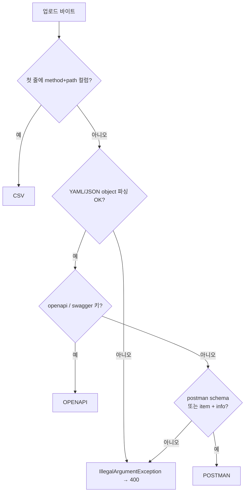
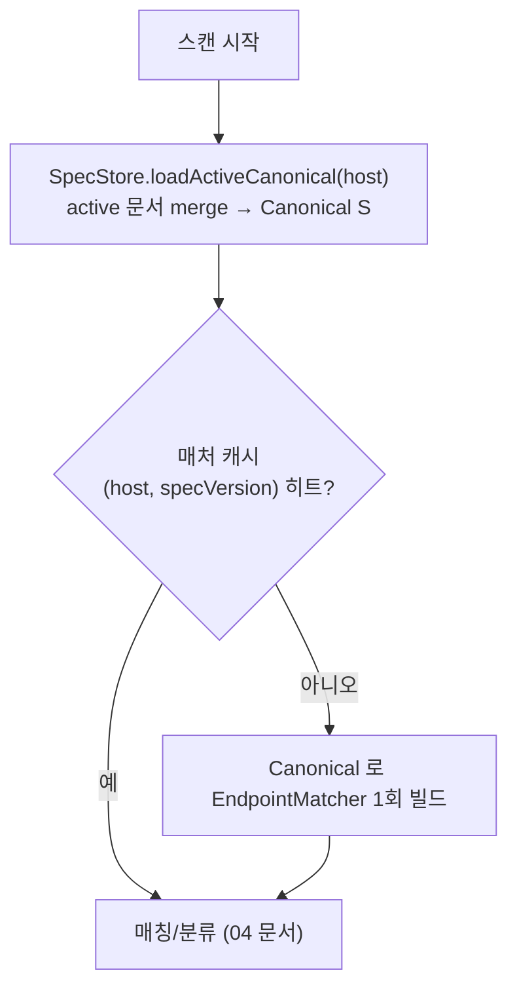

# 문서 포맷과 Canonical 모델

컴포넌트 (C) Spec Loader 의 상세 설계.
지원 포맷 3종을 단일 내부 모델(**CanonicalEndpoint**)로 통합한다.
연결 문서 → [01-architecture](01-architecture.md)(C 컴포넌트), [14-spec-parsers](14-spec-parsers.md)(Postman/CSV 실구현), [26-multi-spec-merge](26-multi-spec-merge.md)(멀티 스펙 병합), [37-spec-inventory-reconcile](37-spec-inventory-reconcile.md)(param 추출·인벤토리 reconcile), [04-matching-and-classification](04-matching-and-classification.md)(매칭).

**구현 위치**

| 대상 | 소스 · 함수 |
|---|---|
| 포맷 감지 | `spec/SpecFormatDetector.detect()` |
| OpenAPI/Swagger 파싱 | `spec/OpenApiSpecParser.parse()` |
| Postman 파싱 | `spec/PostmanSpecParser.parse()` |
| CSV 파싱 | `spec/CsvSpecParser.parse()` |
| 템플릿/host 정규화 | `spec/SpecNormalize.template()` / `host()` |
| dedupe·deprecated OR·정렬·멀티병합 | `spec/SpecCanonicalizer.canonicalize()` / `merge()` |
| 업로드·영속·버전·로드 | `spec/SpecStore.upload()` / `loadActiveCanonical()` |
| Canonical 모델 | `model/CanonicalEndpoint`(record), 파라미터 `model/SpecParam` |

## 1. Canonical 엔드포인트 모델

모든 포맷이 변환되는 공통 표현(`model/CanonicalEndpoint`). 매칭 엔진은 이 모델만 본다.

```jsonc
{
  "method": "GET",                 // 대문자 정규화
  "pathTemplate": "/users/{id}",   // 정규화 규칙 적용(아래 §1.1)
  "host": "api.example.com",       // null 가능(host-agnostic)
  "deprecated": false,             // Zombie 판정 기준
  "version": "1.0.0",              // null 가능
  "sourceRef": "openapi#getUserById", // 원본 추적용
  "params": [ /* SpecParam[] — name/in(QUERY·PATH·HEADER·COOKIE·BODY)/required/type (37 문서 §2). 매칭 키 아님 */ ]
}
```

### 1.1 pathTemplate 정규화 규칙 (포맷 공통, `SpecNormalize.template()`)
세 포맷의 표기를 동일 규칙으로 맞춰야 매칭이 성립한다.

- 파라미터 표기 통일: `{id}`, `:id`, `{{id}}` → **`{id}`** (중괄호 형태).
  - 매칭 시 파라미터 **이름은 무시**하고 위치만 본다(`EndpointMatcher` 변수 세그먼트 = `[^/]+`). 이름은 리포트 가독성용으로만 보존.
  - OpenAPI 는 이미 `{}` 표기라 변환 불필요. `:var`/`{{var}}` 변환은 주로 Postman/CSV 입력에 적용된다.
- 선행 `/` 보장, `//` collapse, 후행 `/` 제거(루트 제외).
- host 는 소문자화(`SpecNormalize.host()`).
- base path/server prefix 가 있으면 path 앞에 결합(§2.1).

## 2. OpenAPI (Swagger) 3.x / 2.0

YAML 또는 JSON. REST 명세의 사실상 표준.

### 2.1 추출 규칙 (`OpenApiSpecParser.parse()`)
- 파서는 통합 `io.swagger.parser.OpenAPIParser` 를 쓴다 — `swagger: "2.0"` 은 v2-converter 로 3.0 자동 변환, `openapi: 3.x` 는 v3 파싱(자동 판별, [DECISIONS](DECISIONS.md) D70).
- 엔드포인트 = `paths` 객체의 각 path × 각 HTTP method 조합(`readOperationsMap()`).
- `path` 키가 곧 템플릿(`/users/{id}`) — 이미 `{}` 표기라 변환 최소.
- **deprecated** = operation 의 `deprecated: true` (없으면 false).
- **host/basePath** — `servers[].url` 을 `(host, basePath)` 로 분해(`toOrigin()`). 여러 server 면 각각에 host 후보 생성(중복 제거), 추출 불가/변수면 host=null(host-agnostic).
  - 3.x: `servers[].url`.
  - 2.0: `host`+`basePath` 는 변환기가 `servers.url` 로 승격한다. schemes 부재 시 protocol-relative `//host/base` 로 나오므로 `toOrigin()` 이 이를 host 로 인식한다(D70).
- **version** = `info.version`.
- **sourceRef** = `"openapi#" + operationId` (없으면 `"openapi#{METHOD} {path}"`).
- **params** = path-level + operation-level `parameters` + `requestBody`(→ `in=BODY`). in/name/required/type 추출([37-spec-inventory-reconcile](37-spec-inventory-reconcile.md) §2).

### 2.2 예시 (OpenAPI 3.0, YAML)
```yaml
openapi: 3.0.1
info: { title: Example API, version: 1.0.0 }
servers:
  - url: https://api.example.com/v2
paths:
  /users/{id}:
    get:
      operationId: getUserById
      responses: { '200': { description: ok } }
  /v1/orders/{orderId}:
    get:
      operationId: getOrderV1
      deprecated: true          # ← Zombie 판정의 기준
      responses: { '200': { description: ok } }
```
변환 결과(S):
```jsonc
[
  { "method":"GET","pathTemplate":"/v2/users/{id}","host":"api.example.com",
    "deprecated":false,"version":"1.0.0","sourceRef":"openapi#getUserById","params":[] },
  { "method":"GET","pathTemplate":"/v2/v1/orders/{orderId}","host":"api.example.com",
    "deprecated":true,"version":"1.0.0","sourceRef":"openapi#getOrderV1","params":[] }
]
```
> 주의: `servers.url` 의 base path(`/v2`)가 각 path 앞에 결합된다(canonical=결합형, SoT 보존).
> 프록시가 prefix 를 떼는 환경 대응은 **at-match strip**([27-base-path-strip](27-base-path-strip.md) §3, D38)으로 구현한다 — 파싱/canonical 은
> 결합형 그대로 두고, 매칭 시점에 `DomainConfig.basePathStrip` prefix 를 **재부착해 추가 시도**한다
> (`EndpointMatcher.match(...,stripPrefix)` — as-is 우선, 미매칭 시 `stripPrefix+path` 재시도).
> parse-time 결합 토글(미결합 canonical)은 재파싱·SoT 손실로 미채택([27-base-path-strip](27-base-path-strip.md) §2). 기본 null=off=현행.

## 3. Postman Collection v2.1

JSON. 협업·테스트용으로 널리 쓰이며 폴더 트리 구조.

### 3.1 추출 규칙 (`PostmanSpecParser.parse()`)
- `item[]` 트리를 DFS 순회(`walk()`). 자식이 없고 `request` 가 있으면 leaf(=엔드포인트).
- **method** = `request.method`.
- **path** = `request.url.path[]` 배열을 `/` 로 join(문자열/`{value}` 객체 세그먼트 모두 처리), 또는 `url.raw`/문자열 url 에서 경로 추출.
  - `SpecNormalize.template()` 로 `:var`·`{{var}}` → `{var}` 변환.
- **host** = `request.url.host[]` join (없으면 null). `{{baseUrl}}` 같은 변수 host 는
  collection `variable` 에서 치환 시도(`resolveHost()`), 실패/잔여변수면 host=null.
- **deprecated**: Postman 표준 필드 없음 → **규약 정의**(§3.3). **폴더 name 의 deprecated 는 자식에 전파**된다.
- **version** = collection `info.version`(없으면 null).
- **sourceRef** = `"postman#" + item 경로`(예 `"postman#FolderA/FolderB/Get User"`).
- **params** = `url.query`(→ QUERY) · `url.variable`(→ PATH) · `body`(urlencoded/formdata → BODY 키, raw → `body`) 에서 추출([37-spec-inventory-reconcile](37-spec-inventory-reconcile.md) §2). `disabled` 항목 제외.

### 3.2 예시 (Postman v2.1, 발췌)
```jsonc
{
  "info": { "schema": "...collection/v2.1.0/..." },
  "item": [
    {
      "name": "Get User",
      "request": {
        "method": "GET",
        "url": {
          "raw": "https://api.example.com/v2/users/:id",
          "host": ["api","example","com"],
          "path": ["v2","users",":id"]
        }
      }
    },
    {
      "name": "[DEPRECATED] Get Order v1",
      "request": {
        "method": "GET",
        "url": { "raw": "https://api.example.com/v1/orders/:orderId",
                 "host":["api","example","com"], "path":["v1","orders",":orderId"] }
      }
    }
  ]
}
```

### 3.3 Postman deprecated 규약 (우리가 정의)
표준 필드가 없으므로 아래 중 하나로 deprecated 판정(우선순위 순).
1. item 또는 상위 폴더 `name` 에 `[DEPRECATED]` 또는 `(deprecated)` 토큰 포함 (대소문자 무시).
2. `request.description` 에 `deprecated: true` (front-matter 또는 키워드) 포함.
3. collection `variable` 에 엔드포인트별 표기(고급, 선택).

> 규약은 문서화하여 고객에게 안내해야 한다. 위 예시는 폴더/이름 규칙(1번)을 따름.

## 4. CSV (포맷 정의)

가장 단순한 입력. 스키마를 본 설계에서 확정한다.

### 4.1 스키마 (`CsvSpecParser.parse()`)
- 인코딩 UTF-8(BOM 허용·제거), 구분자 `,`, **헤더 행 필수**. 헤더는 소문자·trim 후 인덱싱하므로 컬럼 순서는 자유.
- 컬럼.

| 컬럼 | 필수 | 설명 | 예 |
|---|---|---|---|
| `method` | ✅ | HTTP 메서드 | `GET` |
| `path` | ✅ | path 템플릿(`{param}` 표기) | `/users/{id}` |
| `host` | ❌ | 호스트(빈 값이면 host-agnostic) | `api.example.com` |
| `deprecated` | ❌ | `true`/`false` (빈 값=false) | `true` |
| `version` | ❌ | API 버전 | `1.0.0` |
| `params` | ❌ | 파라미터 목록 — `name:in:required:type` 를 `;` 로 구분 (37 문서 §2) | `id:path:true:integer;q:query:false:string` |
| `description` | ❌ | 설명(현재 파서는 미소비, 문서 가독성용) | `사용자 조회` |

- `path` 의 파라미터는 `{id}` 형태 권장. `:id` 입력 시에도 `SpecNormalize.template()` 이 변환.
- `deprecated` 파싱: 참=`true/1/y/yes`, 거짓=`false/0/n/no`(대소문자 무시). 그 외 값은 경고 후 false.
- method/path 가 빈 행은 경고 후 skip(전체 실패 아님). `sourceRef = "csv#row{n}"`.
- `params` 토큰의 `in` 은 `query/path/header/cookie/body`. `type` 생략 시 `string`.

### 4.2 예시
```csv
method,path,host,deprecated,version,description
GET,/users/{id},api.example.com,false,1.0.0,사용자 조회
POST,/users,api.example.com,false,1.0.0,사용자 생성
GET,/v1/orders/{orderId},api.example.com,true,1.0.0,주문 조회(구버전)
DELETE,/sessions/{token},api.example.com,false,1.0.0,세션 종료
```
변환 결과(S): 각 행 → CanonicalEndpoint 1개. `sourceRef = "csv#row{n}"`. (`params` 컬럼을 넣으면 파라미터도 함께 추출된다.)

## 5. 포맷 자동 감지 (Spec Loader 진입, `SpecFormatDetector.detect()`)

**내용으로만** 판별한다(확장자·Content-Type 무관). 순서.
1. 첫 비어있지 않은 줄을 `,` 로 나눠 `method` 와 `path` 컬럼이 **둘 다** 있으면 → **CSV**.
2. YAML/JSON 트리 파싱(YAML 매퍼가 JSON 도 처리):
   - 최상위 `openapi` 또는 `swagger` 키 → **OpenAPI**.
   - `info.schema` 에 `getpostman.com`/`schema.postman.com` 포함, **또는** `item` 배열 + `info` 존재 → **Postman**.
3. 어느 것도 아니면 `IllegalArgumentException`(→ 업로드 400, [DECISIONS](DECISIONS.md) D70).



## 6. 검증/에러 처리 (`SpecCanonicalizer`)
- 필수 필드 결손 행/오퍼레이션은 스킵 + 경고 리스트에 기록(전체 실패 아님).
- 중복 `(method, host, pathTemplate)` 은 dedupe, `deprecated` 는 **OR 결합**(하나라도 true 면 deprecated), `(host, template, method)` 안정 정렬(ETag 결정성). → `SpecCanonicalizer.canonicalize()`.
- 여러 active 문서를 함께 볼 때의 병합(비-deprecated 필드 version/sourceRef 는 latest-upload-wins)은 `SpecCanonicalizer.merge()`([26-multi-spec-merge](26-multi-spec-merge.md) §5).
- 파싱 경고는 리포트 `specSource.warnings[]` 에 노출([25-report-output-enhancements](25-report-output-enhancements.md) §A.1).
- 문서가 유효하지 않거나 엔드포인트 0건이면 `IllegalArgumentException` → 업로드 **400**(중앙에 동기 피드백, [DECISIONS](DECISIONS.md) D70).

## 7. Spec Store — 파싱 1회, 캐논 영속, 스캔마다 재사용

스펙은 **스캔할 때마다 원본 문서를 읽고 파싱·정규화하지 않는다.** 비효율적이고, 매 회차 결과가
흔들릴 수 있다. 대신 **업로드 시점에 1회 파싱**해 Canonical 형태로 영속하고, 스캔은 그것을 읽어 쓴다.

### 7.1 공급 경로


Worker 는 중앙이 전달한 문서를 받아 저장한다(원본 파일명 등 메타 동반). 업로드 API 는 [07-msa-and-central-integration](07-msa-and-central-integration.md) §3.1.

### 7.2 업로드 시 처리(동기, `SpecStore.upload()`)
1. 포맷 자동 감지(§5) → 파싱 → Canonical 변환 → **검증**.
2. 유효하면 **새 SpecRecord** 로 저장하고 같은 (host, specName)의 **구버전 active=false 로 비활성화**(멀티 스펙은 [26-multi-spec-merge](26-multi-spec-merge.md) §5). 무효/0건이면 `IllegalArgumentException` → 400(중앙에 동기 피드백, [07-msa-and-central-integration](07-msa-and-central-integration.md) §3.1, D70). 업로드는 인벤토리 reconcile 과 한 트랜잭션([37-spec-inventory-reconcile](37-spec-inventory-reconcile.md)).
3. 저장 직후 해당 도메인의 **매처 캐시 무효화**(`EndpointMatcherCache.invalidate(host)`) — 다음 스캔이 새 버전 사용.

### 7.3 무엇을 저장하나 (도메인 × spec 버전)
| 저장물 | 용도 | 비고 |
|---|---|---|
| **원본 문서(raw)** | 감사·로직 업그레이드 시 재파싱 | Postgres large object(oid) — 스캔 경로 외 미접근([18-db-schema](18-db-schema.md)) |
| **Canonical 엔드포인트 집합** | 매칭의 진실원(S) | `canonicalJson` 으로 영속 |
| 파싱 경고·메타 | 리포트/디버깅 | `format`·`endpointCount`·`uploadedAt`·`filename`·`specName`·`active` |
| (캐시) 컴파일된 매처 인덱스 | 매칭 가속([04-matching-and-classification](04-matching-and-classification.md) §1) | **Canonical 에서 재생성 가능** → `EndpointMatcherCache` 메모리 캐시 |

> 진실원은 **Canonical 집합**이다. 매처 인덱스는 그로부터 재생성 가능한 파생 캐시이므로
> 메모리 캐시 + 버전 키로 충분(기동 시 lazy 빌드, [15-matcher-cache](15-matcher-cache.md)).

### 7.4 버전 관리
- `specVersion` 은 **Canonical 내용 해시**다(`SpecStore.syntheticVersion()`) — 같은 내용 재업로드는 같은 버전. 도메인별 active 문서는 `active=true` 플래그로 관리.
- 각 스캔은 사용한 `specVersion` 을 결과에 기록 → 스펙이 바뀌면 결과 `version(ETag)` 도 바뀐다([07-msa-and-central-integration](07-msa-and-central-integration.md) §3.3).
- 이전 버전 보관(롤백/이력) 여부는 정책. 최소 active 1개는 보존.

### 7.5 스캔 시 사용 흐름


> 원본 문서 재파싱 없음. 매처 인덱스는 `(host, specVersion)` 키 메모리 캐시(`EndpointMatcherCache`) — 업로드로 버전이 바뀌면 evict 후 재빌드([15-matcher-cache](15-matcher-cache.md)).
