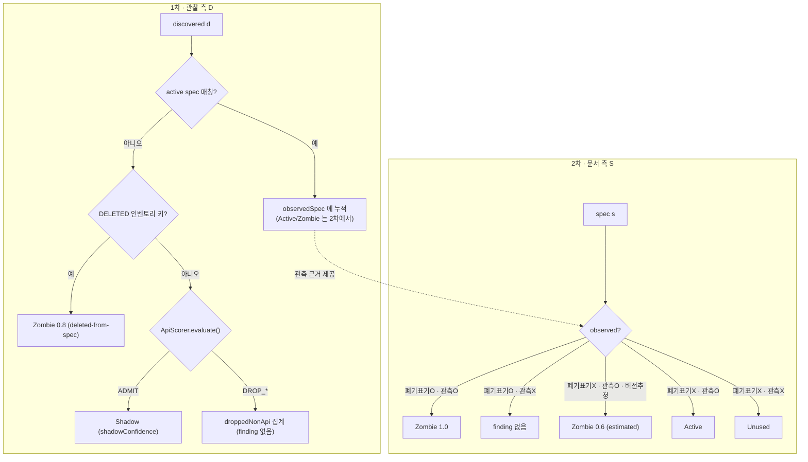

# 매칭 엔진과 Shadow/Zombie 분류

컴포넌트 (D) Matching Engine, (E) Classifier 의 상세 설계.
**문서 기반 Shadow/Zombie 탐지의 핵심 로직.**
연결 문서 → [01-architecture](01-architecture.md)(D/E 컴포넌트), [08-api-scoring-and-profiles](08-api-scoring-and-profiles.md)(게이트·점수), [16-version-zombie-severity](16-version-zombie-severity.md)(버전 Zombie·severity), [19-existence-filter](19-existence-filter.md)(실재성), [24-cross-scan-recency-zombie-severity](24-cross-scan-recency-zombie-severity.md)(recency), [37-spec-inventory-reconcile](37-spec-inventory-reconcile.md)(DELETED→Zombie).

> **전제([08](08-api-scoring-and-profiles.md))** — Classifier 앞단에는 **선별 관문(이하 "게이트")** 이 있다. 게이트란 발견된 endpoint 를 **"API 후보로 인정(`ADMIT`)"할지 "버림(`DROP`)"할지 판정**하는 `ApiScorer.evaluate()` 를 말한다(문처럼 통과/차단을 결정). spec 미매칭 endpoint 는 이 게이트를 통과(`ADMIT`)해야만 Shadow 로 보고된다. 게이트 결과는 6가지 — `ADMIT`(Shadow 후보) 외에 `DROP_OVERSIZE`(초장문 경로, D68)·`DROP_EXCLUDED`(운영자 제외)·`DROP_STATIC`(정적 파일, D55)·`DROP_WEB_FORM`(웹폼 write)·`DROP_LOW_SCORE`(점수 미달) — `DROP_*` 는 finding 이 아니라 버려진 관측(`droppedNonApi`) 집계로 들어간다([12](12-non-api-dropped-metric.md)). spec 에 매칭된 endpoint 는 스펙이 권위이므로 게이트를 우회한다. endpoint_kind(static/web_page)에 의한 제외도 이 게이트에서 처리된다(별도 finding 아님).

**구현 위치**

| 대상 | 소스 · 함수 |
|---|---|
| 매처 컴파일·매칭·specificity | `match/EndpointMatcher.compile()` / `match()` / `moreSpecific()` |
| API 후보 게이트 | `classify/ApiScorer.evaluate()` |
| 분류(1차 D·2차 S) | `classify/Classifier.classifyWithMetrics()` |
| Shadow 신뢰도 | `classify/Classifier.shadowConfidence()` |
| 버전 추정 Zombie | `classify/VersionZombieInference.estimate()` |
| Zombie severity | `classify/ZombieSeverity.of()` |
| 분류 종류 | `model/Classification`, `model/Finding`(Shadow/Zombie/Active/Unused/WebPage) |

## 1. 매처 컴파일 (문서 템플릿 → 매처)

집합 S(CanonicalEndpoint)의 각 템플릿을 빠른 매칭용 구조로 변환.

### 1.1 템플릿 → 정규식 (`EndpointMatcher.compile()`)
- 변수 세그먼트는 **이름 없는** `[^/]+` 로 컴파일한다(이름 미보존 — 매칭은 위치만 본다).
  - `/users/{id}` → `^/users/[^/]+$`
  - `/v1/orders/{orderId}/items` → `^/v1/orders/[^/]+/items$`
  - 정적 세그먼트는 `Pattern.quote()` 로 이스케이프. 루트 `/` 는 `^/$`.
- 와일드카드/캐치올(OpenAPI엔 없음, 일부 도구 `{proxy+}`) — **현재 미지원**(D37 F2/D39): 파서 3종이 `{var+}` 미생성 + §1.2 의 `(method,host,segCount)` 버킷팅이 다중 세그먼트 `.+` 매칭을 구조적 차단(후보가 정확 segCount 버킷에서만 옴). 지원하려면 **버킷팅 재설계**(템플릿 segCount 이상 버킷 스캔 등)가 필요한 **별도 기능**. 단일 세그먼트로는 일반 변수 `{var}`(`[^/]+`)와 동치.

### 1.2 인덱싱(성능, `EndpointMatcher` 버킷 인덱스)
concrete path 마다 전체 정규식을 순회하면 O(D×S). 다음으로 가지치기.
- **(method, host, 세그먼트 개수)** 3중 키(`bucketKey()`)로 매처 버킷팅 — `Map<String, List<CompiledEndpoint>>`.
- host=null(host-agnostic) 매처는 `"*"` host 버킷에 등록되고 매칭 시 host-specific 버킷과 함께 조회된다.
- 매칭 시 같은 버킷 후보만 정규식 평가 → 실제 비교량 대폭 축소.
- (trie 등 추가 가지치기는 **미구현** — 현재는 버킷 + 정규식만.)

## 2. 매칭 규칙 (`EndpointMatcher.match()`)

concrete request (method, host, path) 를 매처에 질의.

1. method 일치 필수(대문자 정규화).
2. host 일치 또는 매처가 host-agnostic(host 는 소문자 비교).
3. path 정규식 일치(후행 슬래시 제거 후, `normalizePath()`).
4. **다중 매칭 시 우선순위(specificity)** — 라우팅 관례와 동일(`moreSpecific()`).
   - 정적 세그먼트(1) > 변수 세그먼트(0). **앞쪽 세그먼트부터** 비교.
   - 예: `/users/me` 는 `/users/me`(정적)와 `/users/{id}`(변수) 둘 다 매칭되지만
     **정적 템플릿이 승리**. 즉 `/users/me` 는 별도 엔드포인트로 인식.
   - 동률이면 정적 세그먼트 총수(`staticCount`)가 많은 쪽 우선.
5. 부가 정책.
   - path 는 case-sensitive, host 는 소문자.
   - base path prefix strip — 4-arg `match(method,host,path,stripPrefix)` 가 as-is 우선, 미매칭 시 `stripPrefix+path` 재시도([03-spec-formats-and-canonical-model](03-spec-formats-and-canonical-model.md) §2.2, [27-base-path-strip](27-base-path-strip.md)).

## 3. 분류 매트릭스 (`Classifier.classifyWithMetrics()`)

관찰 집합 D 와 문서 집합 S 를 두 방향에서 종합한다(1차 관찰 측 D → 2차 문서 측 S).

### 3.1 문서 측(S) 순회 — Zombie/Active/Unused
각 문서 엔드포인트 s 에 대해 "트래픽에서 매칭됐는가(observed)" 판정.

| s.deprecated | observed(트래픽 매칭) | 결과 | 의미/조치 |
|---|---|---|---|
| true | **true** | **Zombie** (confidence 1.0) | 폐기 예정인데 여전히 사용 중 → 마이그레이션/차단 검토 |
| true | false | **finding 없음** | 정상적으로 안 쓰임(Deprecated-clean) → 보고할 것 없음 |
| false | true | **Active** | 정상 |
| false | true (버전 추정) | **Zombie** (confidence 0.6, estimated) | 신버전 active + 구버전 트래픽 지속(§5) |
| false | false | **Unused** | 문서엔 있으나 트래픽 없음 → 미배포/오문서 검토 |

> ★"Deprecated-clean" 은 **별도 finding 이 아니다.** deprecated + 미관측이면 아무 finding 도 만들지 않는다(조치 불필요). `Classification.DEPRECATED_CLEAN` enum 값은 존재하나 현재 어디서도 생성되지 않는다(예약값).

### 3.2 관찰 측(D) 순회 — Shadow / DELETED→Zombie
각 관찰 시그니처 d 에 대해 "active 문서에 매칭되는가" 판정.

| active spec 매칭 | 부가 조건 | 결과 |
|---|---|---|
| 매칭됨 | — | (§3.1 에서 Active/Zombie 로 분류) |
| 매칭 안 됨 | **DELETED 인벤토리 키** 해당 | **Zombie** (confidence 0.8, `deleted-from-spec`) — 문서에서 제거됐으나 트래픽 지속([37-spec-inventory-reconcile](37-spec-inventory-reconcile.md) §6, 게이트 우회) |
| 매칭 안 됨 | ApiScorer 게이트 `ADMIT` | **Shadow** (신뢰도 §4.1) |
| 매칭 안 됨 | 게이트 `DROP_*` (static/web_form/low_score/excluded/oversize) | **finding 없음** — `droppedNonApi` 메트릭으로 집계([12](12-non-api-dropped-metric.md)) |

> ★endpoint_kind=web_page 는 **별도 `undocumented_web_page` finding 으로 분리되지 않는다**(§4.1.1). 웹폼 write 는 `DROP_WEB_FORM`, 그 외 web_page 는 점수 미달로 `DROP_LOW_SCORE` 되어 not_api 로 집계된다. `Finding.WebPage` 레코드는 정의만 있고 현재 생성되지 않는다.

### 3.3 분류 요약

행 = 문서(스펙) 상태, 열 = 트래픽 관측 여부.

| 문서(스펙) 상태 | 트래픽에서 관측됨 | 관측 안 됨 |
|---|---|---|
| **문서에 있음 · 폐기표기 없음** | Active | Unused |
| **문서에 있음 · 폐기표기됨(deprecated)** | Zombie ⚠ (1.0) | finding 없음 (Deprecated-clean) |
| **활성 문서엔 없음 · 과거 삭제(DELETED) 이력** | Zombie ⚠ (0.8) | — |
| **문서에 없음 · 게이트 통과(ADMIT)** | Shadow ⚠ | — |
| **문서에 없음 · 게이트 탈락(DROP)** | 비-API 로 버림(dropped 집계) | — |

## 4. 신뢰도 점수 (false positive 억제)

Shadow/Zombie 는 오탐 비용이 크므로 0~1 신뢰도를 부여한다.

### 4.1 Shadow 신뢰도 (`Classifier.shadowConfidence()`)
정규화 추론 오류와 스캐너 노이즈를 흡수한다. 기본 1.0 에서 가감 후 [0,1] clamp·소수 3자리 반올림.
- 감산.
  - `statusDist` 의 **4xx 비율 ≥ 0.9** → **-0.7** (실재 엔드포인트 아닐 가능성).
  - `hits < 5` → **-0.2** (단발성).
  - `distinctClients ≤ 1` → **-0.2** (단일 클라이언트 = 스캐너 가능성). ※UA 는 이 신뢰도 계산엔 쓰지 않는다(스캐너 UA 감점은 미구현).
  - `templateSource == INFERRED` (통계/휴리스틱 보정, 과병합 위험) → **-0.1**.
- 가산.
  - `endpointKind == API_CANDIDATE` (약한 양성 신호) → **+0.05**.
- confidence < 0.5 (`Finding.LOW_CONFIDENCE_THRESHOLD`)는 리포트에 `low_confidence` 플래그로 분리([25-report-output-enhancements](25-report-output-enhancements.md) §A.3).

### 4.1.1 endpoint_kind 반영 (신호가 있을 때만 반영)
스펙(OpenAPI/Postman/CSV)은 **API** 를 기술한다. 스펙에 없는 발견 경로가 사실은 HTML 페이지·정적 리소스면 "API Shadow" 로 보고하면 안 된다. 근거 신호는 [02-log-parsing-and-normalization](02-log-parsing-and-normalization.md) §5의 `endpoint_kind`.

> **비대칭(asymmetric)** — 신호가 **있을 때만** 판단에 반영하고 **없을 때는 감점하지 않는다**는 원칙. 정적 리소스가 CDN 등으로 빠지면 이 로그에 아예 안 찍히므로 "신호 부재 = API 다"의 증거가 될 수 없다([02](02-log-parsing-and-normalization.md) §5.1).

**현재 구현.**
- `endpoint_kind = static` → `ApiScorer` 게이트에서 **`DROP_STATIC` 하드 veto**(D55) — Shadow 안 됨.
- `endpoint_kind = web_page` + write method(POST 등) + 강신호 없음 → 게이트 **`DROP_WEB_FORM`**. 그 외 web_page 는 점수 미달로 `DROP_LOW_SCORE`. **별도 `undocumented_web_page` finding 은 발행하지 않는다**(§3.2 — `Finding.WebPage` 미생성).
- `endpoint_kind = api_candidate` → Shadow 신뢰도 **+0.05**(`shadowConfidence()`).
- `endpoint_kind = unknown` → 가감 없음. 신호 부재를 API 증거로도 페널티로도 쓰지 않는다([02](02-log-parsing-and-normalization.md) §5.1 비대칭).
- 신호가 dormant([02](02-log-parsing-and-normalization.md) §5.4)면 web_page 판정이 서지 않아 자연히 미적용.

> **Zombie 는 문서의 `deprecated` 기반**이라 endpoint_kind 와 무관(영향 없음).

### 4.2 Zombie 신뢰도·severity
- **confidence**(진짜 Zombie 인가)와 **severity**(조치 시급성)는 직교한다.
  - 문서 deprecated 명시 + 트래픽 매칭 → confidence **1.0**.
  - DELETED-from-spec(문서에서 삭제됐으나 트래픽 지속) → **0.8**([37-spec-inventory-reconcile](37-spec-inventory-reconcile.md) §6).
  - 버전 추정 Zombie(§5) → **0.6**, `estimated=true`.
- **severity** = `ZombieSeverity.of(evidence, firstSeen)` — hits·recency(`lastSeen`)·entrenchment(cross-scan `firstSeen`, [24-cross-scan-recency-zombie-severity](24-cross-scan-recency-zombie-severity.md)) 기반 score(0~1) + band(HIGH/MEDIUM/LOW). 상세는 [16-version-zombie-severity](16-version-zombie-severity.md).

## 5. 버전 기반 Zombie 보강 (`VersionZombieInference.estimate()`)

문서에 deprecated 표기가 없어도, 버전 prefix 로 Zombie 를 추정한다(구현됨, [16-version-zombie-severity](16-version-zombie-severity.md)).
- 같은 리소스의 상이한 버전 감지: `/v1/orders/{id}` 와 `/v2/orders/{id}` 가 모두 관측된 active S 에 존재.
- 신버전(v2)이 active 인데 구버전(v1)에도 트래픽 → v1 을 **Zombie 후보(추정)** 로 표시.
- deprecated 명시(1.0)보다 낮은 confidence **0.6** + `estimated=true` 로 보고하고 `reason` 에 근거를 명시한다.

## 6. 처리 흐름 (`Classifier.classifyWithMetrics()`)



의사코드.

```text
matcher = EndpointMatcher(loadActiveCanonical(host))   # 03 문서 §7 (재파싱 없음)
D = build_inventory(parse_logs(...))                    # 02 문서
findings, dropped = [], {}

# 1차: 관찰 측 D
for d in D:
    if OPTIONS(d) and not genuine(d): continue          # preflight 제외 (23 문서)
    s = matcher.match(d.method, d.host, d.path, stripPrefix)   # §2
    if s: observedSpec[key(s)].add(d)                   # Active/Zombie 는 2차
    elif d in deletedKeys: findings.add(Zombie(d, 0.8, "deleted-from-spec"))  # 37 문서 §6
    else:
        gate = ApiScorer.evaluate(d, cors, hints)       # 08 문서
        if gate == ADMIT: findings.add(Shadow(d, shadowConfidence(d)))  # §4.1
        else: dropped[gate] += 1                         # not_api (12 문서)

# 2차: 문서 측 S
estimated = VersionZombieInference.estimate(observed_active)   # §5
for s in S:
    ev = observedSpec.get(key(s))
    if s.deprecated and ev:      findings.add(Zombie(s, 1.0, severity=ZombieSeverity.of(ev)))
    elif s.deprecated:           pass                    # Deprecated-clean → finding 없음
    elif ev and s in estimated:  findings.add(Zombie(s, 0.6, estimated=True))
    elif ev:                     findings.add(Active(s))
    else:                        findings.add(Unused(s))  # OPTIONS 면 preflightAmbiguous(M1)

report = summarize(findings, dropped, ...)              # 01 문서 §4 스키마
```

## 7. 엣지 케이스

| 케이스 | 처리 |
|---|---|
| host-agnostic 문서(host 미지정) | host 무시하고 method+path 로만 매칭 |
| 프록시가 base path 를 strip | at-match strip — 매칭 시 `stripPrefix` 재부착 재시도([03](03-spec-formats-and-canonical-model.md) §2.2, [27](27-base-path-strip.md)) |
| 동일 path, 다른 method | 별개 엔드포인트(method 포함 시그니처) |
| `/users/me` vs `/users/{id}` | specificity 우선순위로 정적 승리(§2) |
| 통계 보정 과병합 | 신뢰도 감산 + `inferred` 표기, 검토 대상 |
| 404-only 탐침 경로 | 실재성 필터로 Shadow 제외/저신뢰(§4.1, [19](19-existence-filter.md)) |
| 구버전 트래픽(deprecated 미표기) | 버전 기반 Zombie 추정(§5, 0.6) |
| 미문서 경로가 사실 HTML 페이지 | endpoint_kind=web_page → ApiScorer 게이트에서 `DROP_WEB_FORM`/`DROP_LOW_SCORE`(별도 finding 아님, §3.2·§4.1.1) |
| 정적 자원이 프록시를 안 탐(CDN 오프로드) | endpoint_kind 신호 dormant → 적용 안 함, Shadow는 부재로 감점 안 함([02](02-log-parsing-and-normalization.md) §5.4) |

### 7.1 동작 보장 테스트 매핑 (회귀 방지, DECISIONS D37)

> **회귀 테스트(regression test)** = 이미 맞게 동작하는 것이 이후 코드 변경으로 다시 깨지지 않도록 붙들어 두는 자동 테스트("회귀/regression" = 예전 버그로 되돌아감). **보장 규칙(invariant, 불변식)** = 항상 참이어야 하는 동작 규칙.

§7 케이스별 **보장 규칙(항상 참이어야 하는 동작) ↔ 이를 검증·고정하는 테스트 ↔ 구현 상태**. 코드가 바뀌어 규칙이 깨지면 해당 테스트가 실패해 알려준다. 신규 테스트는 기존 클래스에 `// doc/04 §7 case N` 태그로 추가한다(중복 회피).

| §7 케이스 | 계층 | 보장 규칙(불변식) | 검증 테스트 | 상태 |
|---|---|---|---|---|
| host-agnostic | matcher | host=null 템플릿=모든 host 매칭, host-specific=자기 host 만 | `EndpointMatcherTest.hostAgnosticMatchesAnyHost/hostSpecificMatchesOnlyItsHost` | ✅ |
| base path strip | matcher | 프록시 strip 관측에 `stripPrefix` 재부착 매칭(as-is 우선) | `EndpointMatcherTest.stripPrefixReattachesAndMatchesProxyStrippedPath`(+`asIsMatchTakesPriorityOverStripRetry`·`nullStripPrefixIsAsIsOnly`·`wrongStripPrefixDoesNotCreateSpuriousMatch`) | ✅ (D38, [27](27-base-path-strip.md)) |
| 동일 path 다른 method | matcher | method 포함 시그니처 → 별개 매칭 | `EndpointMatcherTest.methodMustMatch`(mismatch) + `sameTemplateDistinctMethodsMatchSeparately`(case3) | ✅ |
| `/users/me` vs `{id}` | matcher | 정적 > 변수, **앞 세그먼트 우선** | `EndpointMatcherTest.staticSegmentWinsOverVariable` + `specificityFrontSegmentPriorityAndTie`(case4 앞세그·동률) | ✅ |
| 통계 과병합 inferred | classify | `INFERRED` → shadowConfidence −0.1 + `inferred` 표기 | `ClassifierTest.shadowConfidenceDropsForFourxxOnly`(번들) + `inferredOnlyShadowLosesExactlyPointOneConfidence`(case5 −0.1 격리) | ✅ |
| 404-only 탐침 | inventory/classify | 100%-404 INFERRED hard-drop / mostly-4xx soft −0.7 | `InventoryBuilderTest`·`ClassifierTest`(doc/19) | ✅ |
| 구버전 트래픽 | classify | 신버전 active + 구버전 트래픽 → 추정 Zombie 0.6 | `VersionZombieInferenceTest`(doc/16) | ✅ |
| 미문서 web_page | classify | endpoint_kind=WEB_PAGE + write → `DROP_WEB_FORM`(Shadow/undocumented finding 아님) | `ClassifierTest.webFormPostNotReportedWithoutStrongSignal`(+`webFormPostReportedWithCorsOverride` cors 예외) | ✅ |
| CDN dormant | normalize/classify | referer 신호 dormant → 미적용 · Shadow 부재 무감점 | `RefererSignalExtractorTest`(doc/20) | ✅ |

**플래그(확인 필요)**:
- **F1 base-path-strip**: D38 에서 **at-match strip 으로 구현 완료**([27-base-path-strip](27-base-path-strip.md)) — 파싱/canonical 은 결합형 유지, 매칭 시 `DomainConfig.basePathStrip` 재부착 재시도. 위 표 참조(더 이상 미구현 아님).
- **F2 catch-all `{var+}`**: `EndpointMatcher` 에 `.+` 분기 존재하나 (a) 어떤 파서도 `{var+}` 미생성(**도달 불가**), (b) `segCount` 버킷팅이 다중 세그먼트 `.+` 매칭을 막음(도달 시 오동작). dead code 정리 vs 의도 확인(후속).
