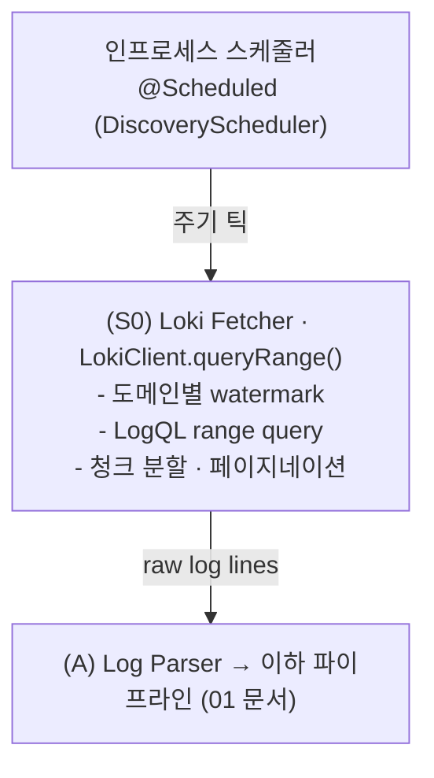

# 로그 수집 — Loki 주기적 배치

컴포넌트 (A) 앞단의 **로그 소스/수집 계층** 설계.
nginx access log 는 사내 **Loki** 서버에 적재되어 있고, API Discovery 는
**실시간이 아니라 주기적 배치**로 특정 도메인의 로그를 내려받아 수행한다.
연결 문서 → [02-log-parsing-and-normalization](02-log-parsing-and-normalization.md)(파싱), [33-scan-load-policy](33-scan-load-policy.md)(**스캔 부하 운영정책 권위 문서**), [30-domain-auto-discovery](30-domain-auto-discovery.md)(도메인 자동 발견), [07-msa-and-central-integration](07-msa-and-central-integration.md)(설정 분리).

**구현 위치**

| 대상 | 소스 · 함수 |
|---|---|
| 주기 스캔 틱(스케줄러) | `batch/DiscoveryScheduler` (`@Scheduled`) |
| 도메인 스캔 실행·워터마크 | `batch/DiscoveryJobService.runScan()` / `advanceWatermark()` |
| Loki 조회(페이지네이션·백오프·스로틀) | `ingest/LokiClient.queryRange()` |
| LogQL 구성 | `ingest/LokiQueryBuilder` |
| 시간당 쿼리/바이트 예산 | `ingest/LokiBudget` |
| 워터마크 영속 | `domain/Watermark`(host, lastEnd) · `WatermarkRepository` |
| 정적 설정 바인딩 | `config/ApiDiscoverProperties` |

## 1. 동작 모델



- **비실시간**: 인라인 차단이 목적이 아니라 인벤토리/리포트 생성이므로 배치로 충분하다.
- **도메인 단위**: 분석 대상 도메인(`$host`)별로 독립 실행/리포트.
- **주기**: 짧은 틱(`scan.tick-interval`, 기본 PT1M)마다 least-recently-scanned 상위 K 도메인만 스캔한다(전수 순회 대체, 상세 [33-scan-load-policy](33-scan-load-policy.md)). "cron/k8s" 외부 스케줄러가 아니라 **상주 서비스 내부 `@Scheduled`** 다.

## 2. Loki 조회 (LogQL)

> 실제 접속 정보·라벨·쿼리 형태는 `sample/loki_sample.py`(운영 export 도구)를 기준으로 한다.
> 단 그 샘플의 **수집 방식(거대 limit·무 페이지네이션·전 hostname 동시 발사)은 일회성 export 용**이며,
> 주기 분석기에서는 §2.4 부하 보호 규칙을 따른다(운영 서버 영향 방지).

### 2.1 실제 라벨 체계 (샘플 기준)
- 엔드포인트: `http://192.168.8.100:3200/loki/api/v1/query_range`
- 라벨: `job="access_log"`, `hostname="<엣지/프록시 서버명>"` (예: `AAI11`, `PAI11`, `PAI21`).
  - **`hostname` 은 도메인이 아니라 로그를 생성한 엣지 서버 인스턴스**다. 한 도메인이 여러 엣지 서버에 걸칠 수 있다.
- 도메인은 **로그 라인 안에** 있고, **라인 필터 `|=`**(정확 부분문자열)로 좁힌다.

### 2.2 LogQL 구성
```logql
{job="access_log", hostname="PAI11"} |= `api.example.com`
```
- **라벨로 1차 축소**(job + hostname)는 인덱스 기반이라 싸다. **반드시 활용**해 스캔량을 줄인다.
- `|=` 도메인 라인필터는 **볼륨 축소용**. `^|^` 20필드 **정밀 파싱·도메인 확정은 (A) Log Parser**(02 문서)가
  단일 진실원으로 수행(서버측 정밀 파싱은 fragile).
- **★`|=` 는 substring coarse 매치라 foreign-host 라인이 섞인다** — referer/URL/UA 등 다른 필드에 도메인 문자열이 든 **다른 Host** 라인도 통과한다. 따라서 **정밀 host 필터는 파싱 후 Java 에서** — `DiscoveryJobService.analyze` 가 parse→dedup 직후 `스캔도메인.equals(DomainNames.normalize(r.host()))` 로 스캔도메인 전용만 남긴다(공유 `DomainNames.normalize`=discovery 등록과 동일 규칙). 안 그러면 이질 host endpoint 가 스캔도메인 인벤토리·discovered_endpoint 에 유입돼 오염된다(실배포 발견, [26-multi-spec-merge](26-multi-spec-merge.md) §2).
- 도메인을 서빙하는 hostname 목록은 도메인 설정에 둔다(§2.3, [07-msa-and-central-integration](07-msa-and-central-integration.md)). 모르면 hostname 라벨 없이
  job 만으로 조회 가능하나 **스캔량이 커지므로 비권장**.

### 2.3 도메인 ↔ hostname(엣지 서버) 매핑
- 도메인 설정에 `hostnames: [PAI11, PAI21, ...]`(해당 도메인을 처리하는 엣지 서버 라벨값)를 둔다.
- 여러 hostname 은 **순차 또는 제한된 동시성**으로 조회(§2.4). 샘플처럼 전부 동시 발사하지 않는다.

### 2.4 시간창 range query — 부하 보호형 (운영 서버 핵심, `LokiClient.queryRange()`)
- HTTP API: `GET /loki/api/v1/query_range` (`query`, `start`, `end` ns, `limit`, `direction=forward`).
- 샘플과 달리 **반드시 다음을 지킨다**(설정값은 §5·6절, 상세 정책은 [33-scan-load-policy](33-scan-load-policy.md)). 아래는 모두 `LokiClient` 에 구현돼 있다.
  - **윈도우 분할**: 큰 범위를 `loki.chunk-window`(현재 PT30M) 단위로 쪼개 순차 조회. 하루 한 방 금지.
  - **유한 batch limit + 페이지네이션**: `loki.page-limit`(현재 2000) 유한값. `limit=1e8` 금지. 응답 수 == limit 이면 다음 `start` = 마지막 ts + 1ns 로 이어 조회(forward).
  - **동시성 상한**: `loki.max-concurrent-queries`(현재 2) `Semaphore` 로 제한.
  - **쿼리 간 간격/스로틀**: `loki.min-query-interval`(현재 200ms). 429/5xx·I/O 실패 시 **적응형 감속**(throttle level × 2^n, D58).
  - **429/5xx 백오프**: `RETRYABLE = {429,502,503,504}` 지수 백오프(I/O 실패는 재시도 안 하고 감속만).
  - **시간당 하드캡**: `scan.max-queries-per-hour`·`max-bytes-per-hour`(`LokiBudget`) — 소진 시 틱 조기 종료([33](33-scan-load-policy.md) §E).
- (선택) bulk 백필은 `logcli`(`--batch`, `--forward`) 사용 가능하나, **동일한 윈도우 분할·동시성 상한**을 적용.

## 3. 증분 수집 — 수집 진척 시각(watermark) 과 정합성

> **수집 진척 시각(watermark)** = "여기까지 수집·처리를 끝냈다"를 표시하는 시각. 강물의 수위 자국(high-water mark)처럼 진척 경계를 가리킨다. DB 에는 도메인별 `Watermark(host, lastEnd)` 로 저장된다(`domain/Watermark`, PostgreSQL).

### 3.1 수집 진척 시각 (watermark)
- 도메인별 **마지막으로 수집을 끝낸 시각**을 저장한다(`Watermark.lastEnd`).
- 다음 실행 윈도우 = `[lastEnd, now − ingest_lag)`.
- 분석/적재를 성공적으로 마친 뒤에만 진척 시각을 앞으로 옮긴다(`DiscoveryJobService.advanceWatermark()`, at-least-once). 부분 성공이면 완료된 마지막 슬라이스 끝까지만 전진한다(gap-free).
- 트래픽이 없어 스캔을 건너뛸 때(delta-skip)는 진척 시각을 `now − lag` 로 바로 점프시켜 백로그가 쌓이지 않게 한다(D60/D61, 상세 [33-scan-load-policy](33-scan-load-policy.md)).

### 3.2 Loki 적재 지연 보정 (ingest_lag)
- 아주 최근 로그는 아직 Loki 에 다 안 들어왔을 수 있다.
- 윈도우 끝을 `now` 가 아니라 `now - ingest_lag`(예: 5~10분)로 잡아 **late-arriving 로그 누락** 방지.

### 3.3 경계/중복 처리
- 윈도우는 `[start, end)` 반열림으로 잡아 인접 윈도우 간 중복을 원천 차단.
- 그래도 재시도/겹침이 생길 수 있으므로 **dedup 키** 정의:
  **`request_id`(필드24, 32 hex)** — 실데이터에서 전건 고유 확인. 이것이 1순위 키.
  (없는 로그면 fallback `hash(connection + time_iso8601 + request)`)
- dedup 은 (A)→(B) 사이에서 적용. 집계(hits) 중복계수 방지.

### 3.4 retention
- Loki 보존기간을 넘어선 과거는 조회 불가. 최초 backfill 범위는 보존기간 내로 한정.

## 4. 저장과 흐름
- 수집한 로그 라인은 `LokiClient` 가 페이지네이션으로 받아 **메모리에서 바로 파싱·분석**한다(`DiscoveryJobService.analyze()`). 슬라이스 경계로 유한하게 끊어(`collectBounded`) OOM 을 막는다 — 별도 jsonl 파일로 덤프하지 않는다.
- 상태(수집 진척 시각)·업로드 스펙·분류 결과는 **PostgreSQL**(adc-db)에 JPA 로 영속한다([18-db-schema](18-db-schema.md)). 별도 JSON/SQLite 상태 파일은 쓰지 않는다.
- 도메인별 독립 실행 → 장애 격리. 분산/HA 는 현재 범위 밖(단일 인스턴스).

## 5. 설정 — 정적/동적 분리

설정은 두 갈래(상세 [07-msa-and-central-integration](07-msa-and-central-integration.md) §4). 정적 설정은 `config/ApiDiscoverProperties`(`@ConfigurationProperties("apidiscover")`)로 바인딩된다.
- **정적(인프라)**: Loki 접속·인터벌·ingest-lag·backfill·부하 보호 → `application.yml`.
- **동적(운영)**: 대상 도메인·도메인별 스펙·override → **중앙 서버 API → DB**(07 §3.1). 도메인 목록은 config 파일에 두지 않는다(자동 디스커버리·중앙 주입, [30-domain-auto-discovery](30-domain-auto-discovery.md)).

정적 설정 예(`application.yml` 실제 키). 접속값은 `sample/loki_sample.py` 기준.
```yaml
apidiscover:
  loki:                         # 인증 없음(운영 정책) — auth 키 없음
    addr: "http://192.168.8.100:3200"
    job-label: "access_log"
    query-timeout: "30s"
    chunk-window: "PT30M"       # range query 1회당 시간창 (D60)
    page-limit: 2000            # query_range limit (유한값, 1e8 금지)
    max-concurrent-queries: 2   # Loki 동시 쿼리 상한(Semaphore)
    min-query-interval: "200ms" # 쿼리 간 최소 간격(스로틀)
  schedule:
    default-interval: "PT1H"
    ingest-lag: "PT10M"
    initial-backfill: "P7D"
    off-peak-window: "01:00-06:00"
  scan:                         # ★스캔 부하 운영정책 — 키·현재값 권위는 doc/33 + application.yml (D58~D69)
    tick-interval: "PT1M"
    domains-per-tick: 500
    max-queries-per-hour: 6000
    throttle-on-error: true     # 429/5xx·I/O 실패 적응형 감속(D58)
    # ... 티어링·off-peak·배칭(query-batch-size)·롤링 샘플링(sample-window) 등 (33 문서)
```
> ★`auth`(인증)·`retry`(재시도)는 **별도 config 키가 아니다.** 인증은 미사용, 429/5xx 지수 백오프·적응형 감속은 `LokiClient` 에 내장돼 있고 `scan.throttle-on-error` 로 켜고 끈다. Loki 부하 보호의 **키·현재 튜닝값 권위는 [33-scan-load-policy](33-scan-load-policy.md) + `application.yml`(D67 승격 기본값)** 이다.

### 5.1 시간 값 표기 — Duration (`PT…` 은 무엇이고, 어떻게 바꾸나)

`chunk-window`·`ingest-lag`·`tick-interval` 같은 시간 값은 Java `java.time.Duration` 으로 바인딩된다. 두 형식 중 **아무거나** 쓰면 된다.

- **ISO-8601** (`PT…`): `P`(기간 시작) + `T`(시간부 구분) 뒤에 숫자·단위. 단위 = `H`(시)·`M`(분)·`S`(초). **일(日)은 `T` 앞에** — `P7D`(7일)·`P1D`(1일).

| 원하는 값 | ISO-8601 | 간이 표기 |
|---|---|---|
| 5분 | `PT5M` | `5m` |
| 10분 | `PT10M` | `10m` |
| 1시간 | `PT1H` | `1h` |
| 1시간 30분 | `PT1H30M` | `90m` |
| 30초 | `PT30S` | `30s` |
| 200밀리초 | `PT0.2S` | `200ms` |
| 7일 | `P7D` | `7d` |

- **간이 표기** (숫자+단위 접미, Spring Boot 지원): `PT` 없이 `5m`·`1h`·`200ms`·`7d`. 지원 단위 = `ns`·`us`·`ms`·`s`·`m`·`h`·`d`. 실제 이 설정의 `min-query-interval: "200ms"` 가 이 형식이다.

**즉 `PT` 접두어는 필수가 아니다.** 예) `chunk-window` 를 10분에서 1시간으로 바꾸려면 `chunk-window: "PT1H"` **또는** `chunk-window: "1h"`, 5분이면 `"PT5M"` 또는 `"5m"`.

> ⚠️ 함정 — ISO-8601 에서 **`T` 뒤의 `M` 만 "분"** 이다. `T` 를 빠뜨리고 `P10M` 이라 쓰면 "10개월"로 해석돼 오류가 난다. 분은 반드시 `PT10M`. 헷갈리면 간이 표기(`10m`)가 안전하다.

## 6. 운영 서버 부하 보호 (필수)

대상 Loki 는 **운영 중**이라 과도한 조회가 서비스 로깅 파이프라인에 영향을 줄 수 있다.
`sample/loki_sample.py` 의 `limit=1e8`·무 페이지네이션·전 hostname 동시 발사 방식은 **그대로 쓰지 않는다.**

| 위험 | 보호 장치 |
|---|---|
| 거대 단일 응답(OOM/타임아웃) | **유한 `page-limit`(1k~5k) + 페이지네이션**(§2.4) |
| 넓은 윈도우가 querier/ingester 압박 | **`chunk-window` 분할**(5~15분) 순차 조회. `max_query_length` 이내 유지 |
| 도메인×hostname 폭주 | **`max-concurrent-queries` 세마포어**(예 1~2) |
| 순간 부하 스파이크 | **`min-query-interval` 스로틀** |
| Loki 한도 초과(429)·지연 | **지수 백오프 + 적응형 감속**(429/5xx·I/O 실패 시 throttle level↑, D58). 반복 시 해당 회차 중단·다음 틱으로 이월 |
| 재처리로 인한 과수집 | **수집 진척 시각 증분**(3절)으로 매 회차 신규 구간만 조회 |
| 시간당 총량 폭주 | **`scan.max-queries-per-hour`/`max-bytes-per-hour` 하드캡**(`LokiBudget`) — 소진 시 틱 조기 종료 |
| 백필이 한 번에 큼 | `initial-backfill` 을 슬라이스로 나눠 여러 틱에, **off-peak 시간대** 상향(선택) |

이 표의 보호 장치는 모두 `ingest/LokiClient`(백오프·throttle·`Semaphore`) + `ingest/LokiBudget`(시간당 캡)에 구현돼 있다. 상세 운영정책은 [33-scan-load-policy](33-scan-load-policy.md).

추가 운영 원칙.
- Loki 서버 한도(`max_entries_limit_per_query`, `max_query_length`, `max_query_parallelism`)를 **존중**하도록 설정값을 그 이하로 둔다.
- 부분 성공 시 진척 시각 미전진(다음 회차 재수집, dedup 흡수). 도메인별 독립 실행으로 장애 격리.
- ★`off-peak-max-window` 를 PT24H 같은 대량 조회로 되돌리지 않는다(과부하 이력, application.yml 주석·D48).

## 7. 범위 메모
- 실시간 스트리밍·인라인 차단은 범위 밖([00-overview](00-overview.md)와 일치).
- Loki 가 유일 소스. 파일 직접 투입(오프라인 분석)은 (A) Parser 가 동일 인터페이스로 수용 가능(테스트/백필 편의).
