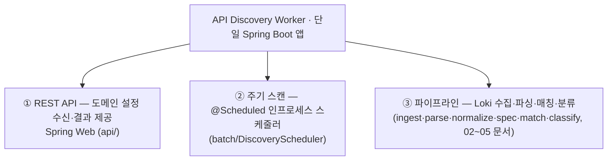

# 구현 스택 / 개발 환경 — Java + Spring

> 실제 스택의 권위 근거는 `build.gradle.kts`(플러그인·의존성·Java 21)와 `application.yml` 이다. 연결 문서 → [01-architecture](01-architecture.md)(컴포넌트), [31-cli-export-and-deploy](31-cli-export-and-deploy.md)·[32-container-deploy-runbook](32-container-deploy-runbook.md)(배포).

## 1. 결정

- **언어/런타임**: **Java 21 (LTS)** (`build.gradle.kts` `languageVersion = 21`).
- **프레임워크**: **Spring Boot 3.3.5** (사내 표준).
- **배포 모델**: **상주 Spring Boot 서비스**(web + scheduler 단일 앱). 회차마다 Pod 를 띄우는 CronJob 이 아니라 상주 서비스라 **부팅 비용은 최초 1회**, JVM warm 유지. 실제 배포는 테스트 VM 에 `podman play kube`([31-cli-export-and-deploy](31-cli-export-and-deploy.md)·[32-container-deploy-runbook](32-container-deploy-runbook.md)).
- **아키텍처**: MSA. 본 모듈은 **API Discovery Worker** 서비스로, 중앙 서버와 REST API 로 통신([07-msa-and-central-integration](07-msa-and-central-integration.md)).

## 2. 왜 이 조합인가

Spring 이 사내 표준 → DI·설정·영속·스케줄링이 한 생태계로 일관된다. 본 앱은 **세 역할을 한 서비스**로 수행한다.



- Java 21 의 **record / sealed interface / switch 패턴매칭**을 데이터 모델·분류에 적극 사용한다(§4).
- ※가상 스레드(virtual thread)는 **현재 미사용** — 수집은 `Semaphore` 로 동시성을 제한한 순차 조회다([05-log-ingestion-from-loki](05-log-ingestion-from-loki.md) §2.4).

## 3. 스택 구성

채택값은 `build.gradle.kts` 기준이며, "starter만 있고 미사용"인 것은 비고에 명시한다.

| 영역 | 채택 | 비고 |
|---|---|---|
| 런타임 | Java 21 LTS | record, sealed interface, switch 패턴매칭 (가상 스레드는 미사용) |
| 코어 | Spring Boot 3.3.5 | |
| REST API | Spring Web (MVC) | 중앙 서버 통신([07](07-msa-and-central-integration.md)) |
| 주기 실행 | Spring **`@Scheduled`** (인프로세스) | `batch/DiscoveryScheduler`·`DomainDiscoveryScheduler`. ★`spring-boot-starter-batch` 의존성은 있으나 **Spring Batch(Job/Step/JobRepository)는 실사용 안 함** |
| 영속 | Spring Data JPA | 도메인 설정·**Spec Store(원본 oid+Canonical, 버전별)**·스캔 메타·결과 ([03](03-spec-formats-and-canonical-model.md) §7, [18](18-db-schema.md)) |
| DB | 운영 PostgreSQL(adc-db) / 개발·테스트 H2 | |
| 보안 | Spring Security | ★현재 `SecurityConfig` 는 **`anyRequest().permitAll()` + csrf disable**(인증 미적용). mTLS/OAuth2 는 미구현(후속, [07](07-msa-and-central-integration.md) §5) |
| HTTP 클라이언트(Loki) | JDK `java.net.http.HttpClient` | `LokiClient` — `query_range` 호출 |
| JSON | Jackson | Postman·리포트 직렬화 |
| YAML | jackson-dataformat-yaml | OpenAPI YAML·감지 |
| **OpenAPI 파싱** | **swagger-parser 2.1.22** (`io.swagger.parser.v3:swagger-parser`) | 통합 `io.swagger.parser.OpenAPIParser` 사용 — 2.0→3.0 자동변환·`$ref`·`deprecated` (D70) |
| Postman | Jackson 트리 + 자체 매핑([03](03-spec-formats-and-canonical-model.md)) | 표준 라이브러리 없음 |
| CSV | univocity-parsers 2.9.1 | (Commons CSV 미사용) |
| 근사 distinct + 분위수 | **Apache DataSketches** `datasketches-java 6.1.1` | HLL(distinct) + KLL(분위수), [22](22-hll-tdigest-approximation.md) |
| 관측 | Spring Actuator + Micrometer | `/actuator/*` |
| 로깅 | SLF4J + Logback | |
| 테스트 | JUnit 5, AssertJ, Mockito, **Testcontainers**(PostgreSQL) | 실 PG 통합 테스트([28](28-testcontainers-pg-integration.md)) |
| 빌드 | Gradle (Kotlin DSL) | `bootJar` |
| 품질 | (Spotless/Checkstyle 등 정적분석 플러그인 미설정) | 후속 |

## 4. 데이터 모델링 (Java 21)

- `ParsedRequest`, `CanonicalEndpoint`, `DiscoveredEndpoint`, `DiscoveryReport` → **record**.
- `Finding` 계열(Shadow/Zombie/Active/Unused/WebPage) → **sealed interface** + `switch` 패턴매칭.
- 매칭 엔진 → `java.util.regex`(변수 세그먼트 = 이름 없는 `[^/]+`, **named group 미사용**) + `(method,host,segCount)` 해시맵 버킷(**trie 아님**, [04](04-matching-and-classification.md) §1).
- ※도메인별 수집 병렬화용 가상 스레드는 **현재 미사용**(§2).

## 5. 모듈/패키지 구성 (실제, `com.pentasecurity.apidiscover`)

```
apidiscover-worker/                  ← 단일 Spring Boot 서비스
  api/          # REST 컨트롤러 (중앙 서버용)                     ← 07 문서
  central/      # 중앙 서버 웹훅 클라이언트(CentralWebhookClient)  ← 07 문서
  ingest/       # Loki 조회·예산(LokiClient, LokiQueryBuilder, LokiBudget) ← 05 문서
  batch/        # @Scheduled 스케줄러 + 스캔 오케스트레이션
                #   (DiscoveryScheduler, DiscoveryJobService, DomainDiscovery*) ← 05·30 문서
  parse/        # 로그 라인 파서(LogLineParser)                    ← 02 문서
  normalize/    # 정규화·인벤토리·endpoint_kind                    ← 02 문서
  spec/         # 업로드 파싱→Canonical, Spec Store(버전)          ← 03 §7
  match/        # 매처 컴파일/매칭(EndpointMatcher)                ← 04 문서
  classify/     # Shadow/Zombie/Active/Unused 분류·점수(Classifier, ApiScorer) ← 04 문서
  report/       # 리포트 생성(ReportBuilder)                       ← 01 문서
  domain/       # 도메인 설정·스캔 메타·엔티티/리포지토리(JPA)      ← 18 문서
  model/        # record/sealed 데이터 모델
  cli/          # CLI 러너(CSV 내보내기·등록·스캔)                 ← 31 문서
  config/       # 정적 설정 바인딩(@ConfigurationProperties) + SecurityConfig
  util/         # 공용 유틸(DomainNames 등)
```

## 6. 배포·운영

- **배포**: `bootJar` 를 컨테이너 이미지로 빌드해 테스트 VM(192.168.8.197)에 **`podman play kube`(rootful)** 로 상주([31-cli-export-and-deploy](31-cli-export-and-deploy.md)·[32-container-deploy-runbook](32-container-deploy-runbook.md)). DB 는 adc-db(PostgreSQL) 컨테이너.
- **스케줄러 단일 실행**: 상주 **단일 인스턴스**(replica 1)로 운영한다. Quartz/ShedLock 등 분산 락은 **현재 미사용**(HA 필요 시 후속).
- **설정 외부화**: 정적 설정은 `application.yml`(배포 시 env override), 동적 설정(도메인)은 중앙 API → DB. 구분은 [07-msa-and-central-integration](07-msa-and-central-integration.md) §4.
- **관측**: Actuator `/actuator/*`, Micrometer 메트릭.

## 7. 다루지 않는 범위 (out of scope)
- 실시간 스트리밍·인라인 차단 없음(배치).
- 분산 처리 프레임워크·가상 스레드 병렬은 현재 미사용 — 단일 인스턴스 + `Semaphore` 제한 순차 수집으로 충분.
