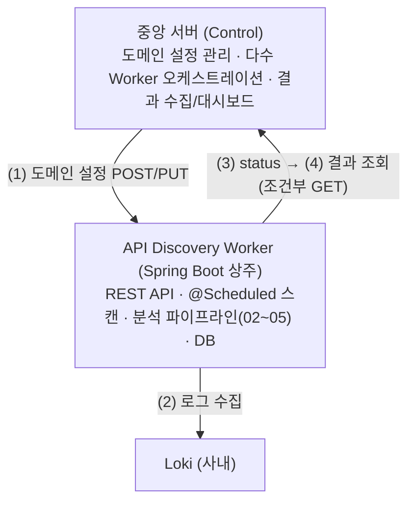
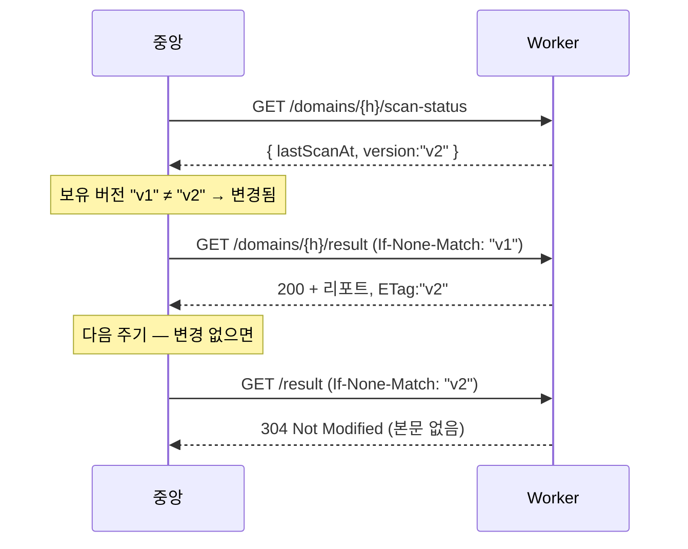

# MSA 구조와 중앙 서버 연동

API Discovery 를 MSA 의 **작업(Worker) 서비스**로 두고, **중앙 서버(Control Plane)** 와
REST API 로 연동하는 설계. 요구사항(도메인 원격 설정, 결과 제공, 마지막 검사 시점 확인, 설정 분리)을 반영한다.
연결 문서 → [01-architecture](01-architecture.md), [03-spec-formats-and-canonical-model](03-spec-formats-and-canonical-model.md)(스펙 업로드), [08-api-scoring-and-profiles](08-api-scoring-and-profiles.md)(분류 설정), [35-rest-api-batch](35-rest-api-batch.md)·[37-spec-inventory-reconcile](37-spec-inventory-reconcile.md)(인벤토리 API). 운영자용 REST 레퍼런스는 `doc/manual/api-rest-manual.html`(권위).

**구현 위치 (REST 컨트롤러)**

| 대상 | 컨트롤러 · base 경로 |
|---|---|
| 도메인 설정 | `api/DomainController` (`/api/v1/domains`) |
| 스펙 업로드·메타 | `api/SpecController` (`/api/v1/domains/{host}/spec`) |
| 스펙 API 인벤토리(reconcile) | `api/ApiInventoryController` (`/api/v1/domains/{host}/spec/apis`) |
| 스캔 상태·결과·트리거 | `api/ScanController` (`/scan-status`·`/result`·`/scan`·`/scan-now`) |
| 결합 Discovery 뷰 | `api/CombinedDiscoveryController` (`/discovery`) |
| 분류 설정 튜닝 | `api/ClassificationController` (`/classification`) |
| 정적판정 룰 | `api/StaticClassifyController` (`/api/v1/config/static-classify`) |
| 중앙 완료 통지(스텁) | `central/CentralWebhookClient` |

## 1. 역할 분리



- **중앙 서버**: 어떤 도메인을 검사할지 결정하고(설정 주입), 결과를 모아 본다. 다수 Worker 관리.
- **Worker(본 모듈)**: 설정된 도메인의 Loki 로그를 주기적으로 분석하고, 결과를 **API 로 제공**한다. 주기 실행은 `@Scheduled`(Spring Batch 프레임워크 아님, [06-implementation-stack](06-implementation-stack.md)).

## 2. 통신 모델 — 중앙 주도 Pull + 조건부 GET

요구사항 "결과 전송 전 마지막 검사 시점 확인 → 동일 결과 중복 호출 최소화" 를 만족하는 핵심 설계.

1. 중앙이 Worker 에 **도메인 설정을 주입**(push, 중앙→Worker API 호출).
2. Worker 가 **주기적으로 자체 분석**(`@Scheduled` 스케줄러). 결과·메타를 DB 에 저장.
3. 중앙이 **가벼운 `scan-status`** 를 조회 → 도메인의 `lastScanAt`·`version(etag)` 확인.
4. 중앙이 가진 버전과 다를 때만 **`result` 를 조회**. 같으면 호출 생략, 또는 조건부 GET 으로 `304`.

> 즉 무거운 결과 전송은 **변경됐을 때만** 일어난다. 메타(작은 응답)로 먼저 거른다.
> (선택) 즉시성 필요 시 Worker→중앙 **완료 웹훅**으로 보강 가능(§6).

## 3. Worker REST API (중앙 서버에 노출)

base: `/api/v1`. 인증은 §5. 응답은 JSON.

### 3.1 도메인 설정 (원격 세팅, `DomainController`·`SpecController`·`ApiInventoryController`)
| Method | Path | 설명 |
|---|---|---|
| `GET` | `/domains` | 등록 도메인 목록 + 각 스캔 상태 요약 |
| `POST` | `/domains` | 도메인 등록 `{ host, specRef?, intervalOverride?, enabled }` |
| `GET` | `/domains/{host}` | 단건 설정 + 상태 |
| `PUT` | `/domains/{host}` | 설정 수정(스펙·인터벌·enabled) |
| `DELETE` | `/domains/{host}` | 등록 해제 |
| `PUT` | `/domains/{host}/spec` | API 문서 업로드(OpenAPI/Swagger/Postman/CSV) → **업로드 시 파싱·저장**. `?filename=` 옵션 |
| `GET` | `/domains/{host}/spec` | active 스펙 메타 **목록**(멀티 문서, M6): specName·format·specVersion·endpointCount·uploadedAt·filename |
| `GET` | `/domains/{host}/spec/apis` | 문서 API 인벤토리(reconcile 결과 — ADDED/UPDATED/DELETED 상태, [37](37-spec-inventory-reconcile.md)). `?breaking`·`?view=merged` 옵션 |

> ~~`GET /spec/raw`(원본 다운로드)~~ 는 **미구현**이다(원본은 Postgres large object 로 저장되나 다운로드 엔드포인트 없음).

#### 분류 설정 튜닝 API (`ClassificationController`, [08](08-api-scoring-and-profiles.md) — 미탐/과탐 조정)
운영자가 중앙에서 **전역·도메인별 프로파일과 가중치**를 조정해 API Discovery 정확도를 튜닝한다.
| Method | Path | 설명 |
|---|---|---|
| `GET` | `/classification` | 시스템 전역 분류 설정 조회 |
| `PUT` | `/classification` | 전역 분류 설정(profile/min_api_confidence/weights/path matchers) |
| `PATCH` | `/classification/weights` | 전역 가중치 부분 수정(`{name: value}`) |
| `GET` | `/domains/{host}/classification` | 도메인 override + effective(병합 결과) 조회 |
| `PUT` | `/domains/{host}/classification` | 도메인 override 설정 |
| `PATCH` | `/domains/{host}/classification/weights` | 도메인 가중치 부분 수정 |

> 설정 항목·병합 규칙·프로파일(high/middle/low/custom)은 [08](08-api-scoring-and-profiles.md) §4~§5. `custom` 일 때만
> `min_api_confidence`·`weights.*` 가 도메인에서 override 된다.

#### 정적판정 룰 API (`StaticClassifyController`, `/api/v1/config/static-classify`, D55/D56)
| Method | Path | 설명 |
|---|---|---|
| `GET` | `/config/static-classify` | 정적 확장자·파일명 토큰 룰 조회 |
| `POST` | `/config/static-classify` | 룰 추가 `{ kind, value }` |
| `DELETE` | `/config/static-classify/{kind}/{value}` | 룰 삭제 |
| `POST` | `/config/static-classify/reload` | DB 룰을 런타임 반영(`EndpointKindClassifier` 교체) |

도메인 설정 모델(예):
```jsonc
{
  "host": "api.example.com",
  "enabled": true,
  "hostnames": ["PAI11", "PAI21"], // 이 도메인을 서빙하는 엣지 서버(Loki hostname 라벨, 05 §2.3)
  "intervalOverride": "PT1H",      // null 이면 전역 기본 인터벌 사용(config)
  "spec": { "format": "OPENAPI", "specVersion": 1719000000, "endpointCount": 142,
            "uploadedAt": "..." },  // 현재 활성 스펙 메타(specVersion = Canonical 내용 해시, 03 §7)
  "createdAt": "...", "updatedAt": "..."
}
```

#### 스펙 업로드 동작 (고객→중앙→Worker, [03](03-spec-formats-and-canonical-model.md) §7)
- 흐름: **고객 업로드 → 중앙 서버 → `PUT /domains/{host}/spec`** 로 Worker 에 전달.
- 요청: 문서 본문을 **raw body(byte[])** 로. 포맷은 내용 자동감지(확장자·Content-Type 무관). ★단 `Content-Type` 은 form 계열이 아니어야 한다(`application/octet-stream` 등) — form 이면 body 바인딩 실패.
- Worker 는 **업로드 시점에 파싱·정규화·검증**하고 Canonical 을 영속한다(스캔마다 재파싱 안 함).
- 응답(성공): `200` `SpecMetaView`(format·specVersion·endpointCount·uploadedAt·filename 등).
- 응답(실패): 무효/미인식/0건 → **`400`**(`SpecController` 가 `IllegalArgumentException` → `ResponseStatusException`, D70) → 중앙에 동기 피드백.
- 부수효과: 구버전 active=false 비활성화 + 매처 캐시 무효화 + 인벤토리 reconcile(한 트랜잭션). `specVersion` 은 내용 해시라 같은 내용 재업로드는 동일 버전.

### 3.2 스캔 상태 — 가벼운 메타 (요구사항: 마지막 검사 시점 확인)
| Method | Path | 설명 |
|---|---|---|
| `GET` | `/domains/{host}/scan-status` | 마지막 검사 시점·버전·요약(작은 응답) |

```jsonc
{
  "host": "api.example.com",
  "state": "idle",                 // idle | running | failed
  "lastScanAt": "2026-06-22T09:00:00+09:00",
  "version": "a1b2c3d4",           // 결과 ETag(스캔 단위 버전)
  "logWindow": { "from": "...", "to": "..." },
  "summary": { "discovered": 168, "active": 120, "shadow": 26, "zombie": 8, "unused": 22 }
}
```
> 중앙은 이 응답의 `version`/`lastScanAt` 만 비교해 결과 재조회 여부를 결정한다.

### 3.3 결과 — 조건부 GET (`ScanController.result()`, 결과 제공 + 중복 최소화)
| Method | Path | 설명 |
|---|---|---|
| `GET` | `/domains/{host}/result` | 최신 결과 리포트([01](01-architecture.md) §4 스키마). **조건부 GET 지원** |

- 응답 헤더 `ETag: "a1b2c3d4"`.
- 완료된 스캔이 없으면 **`204 No Content`**.
- 요청 `If-None-Match` 가 현재 ETag 와 같으면 **`304 Not Modified`**(본문 없음) → 동일 결과 재전송 방지.
- 변경됐으면 `200` + 전체 리포트(finding 판단 근거 인라인 포함, [34](34-api-rationale-exposure.md)).
- ※`/scans`·`/scans/{scanId}`(이력 목록/단건)은 **미구현**(현재는 최신 결과만).

### 3.4 온디맨드/운영 (`ScanController`·`CombinedDiscoveryController`)
| Method | Path | 설명 |
|---|---|---|
| `POST` | `/domains/{host}/scan` | 비동기 재검사 트리거 → **`202 Accepted`**(스케줄러 runScan) |
| `POST` | `/domains/{host}/scan-now?window=PT30M` | **동기** 스캔 후 결합 결과 즉시 반환(`CombinedDiscovery`). Loki 실패=`502` |
| `GET` | `/domains/{host}/discovery` | 결합 Discovery 뷰(검출 ∪ 스펙 분류, [26](26-multi-spec-merge.md)·[34](34-api-rationale-exposure.md)) |
| `GET` | `/actuator/health` | readiness/liveness (Actuator) |

## 4. 설정 분리 (요구사항 6)

| 구분 | 항목 | 위치/방식 |
|---|---|---|
| **정적(인프라)** | Loki addr/job 라벨/타임아웃, **부하 보호값(chunk-window·page-limit·동시성·스로틀)**, 스캔 정책(scan.*, [33](33-scan-load-policy.md)), 전역 인터벌, ingest-lag, backfill, 중앙 서버 URL | `application.yml`(배포 시 env override). `@ConfigurationProperties("apidiscover")` 바인딩(`ApiDiscoverProperties`) |
| **동적(운영)** | 대상 도메인, 도메인별 **hostnames(엣지 서버)**, 스펙, 인터벌 override, enabled, **분류 설정(profile/weights/path matchers, [08](08-api-scoring-and-profiles.md))** | 중앙 API(§3.1) → **DB 저장**. 런타임 변경 |

`application.yml` (정적) 예 — 실제 키. 시간 값 표기(`PT…`)는 [05](05-log-ingestion-from-loki.md) §5.1.
```yaml
apidiscover:
  loki:                            # 인증 없음(운영 정책) — auth 키 없음
    addr: "http://192.168.8.100:3200"
    job-label: "access_log"
    query-timeout: "30s"
    chunk-window: "PT30M"          # 운영 부하 보호 (05 §2.4/§6)
    page-limit: 2000
    max-concurrent-queries: 2
    min-query-interval: "200ms"
  schedule:
    default-interval: "PT1H"
    ingest-lag: "PT10M"
    initial-backfill: "P7D"
  scan: { ... }                    # 스캔 부하 정책 — doc/33 + application.yml (D58~D69)
  central:
    base-url: "https://central.internal"   # ★현재 auth 키 없음(Central record = base-url 만)
```
> 도메인·hostnames 는 여기 두지 않는다(동적, DB). 시크릿은 Secret/시크릿 매니저.

## 5. 서비스 간 인증/보안

> ★**현재 상태**: `config/SecurityConfig` 는 **`anyRequest().permitAll()` + csrf disable** 로, **인증을 적용하지 않는다**(내부망 전제). 아래는 향후 권장안이며 미구현이다.

- **권장(후속)**: mTLS(상호 TLS) 또는 **OAuth2 client-credentials**(사내 인가 서버 사용 시). Spring Security 로 구성.
- 중앙→Worker, Worker→중앙(웹훅 시) 양방향 모두 인증.
- 도메인 설정 변경 API 는 쓰기 권한 스코프 분리. 감사 로그 기록.

## 6. (선택) 완료 웹훅 — 즉시성 보강

> ★**현재 상태**: `central/CentralWebhookClient.notifyScanCompleted()` 는 **TODO 스텁**(실제 전송 미구현)이다. 결과 동기화는 아래 §7 의 **조건부 GET(pull)** 로만 동작한다.

Pull 만으로 충분하나, 결과 신선도 즉시 반영이 필요하면 Worker→중앙 push 를 붙일 수 있다(후속).
- 스캔 완료 시 Worker 가 중앙에 `POST {central}/workers/{id}/scan-events`
  `{ host, version, lastScanAt, summary }`(요약만) 통지 → 중앙이 필요 시 `result` 조회(여전히 조건부 GET).
- 본문(전체 리포트)은 푸시하지 않는다. **신선도 신호만 push, 데이터는 조건부 pull** 원칙 유지.

## 7. 시퀀스 — 중앙의 결과 동기화



## 8. 멱등/정합성 메모

- 도메인 등록/수정은 `host` 기준 멱등(PUT). 중복 POST 는 409 또는 upsert 정책 명시.
- `version(ETag)` = 스캔 결과의 안정적 해시(또는 scanId). 같은 입력 재분석이어도 결과 동일하면 version 유지 권장.
- Worker 재시작에도 도메인 설정·최신 결과·수집 진척 시각(watermark)은 DB 영속([05-log-ingestion-from-loki](05-log-ingestion-from-loki.md)와 연동).
