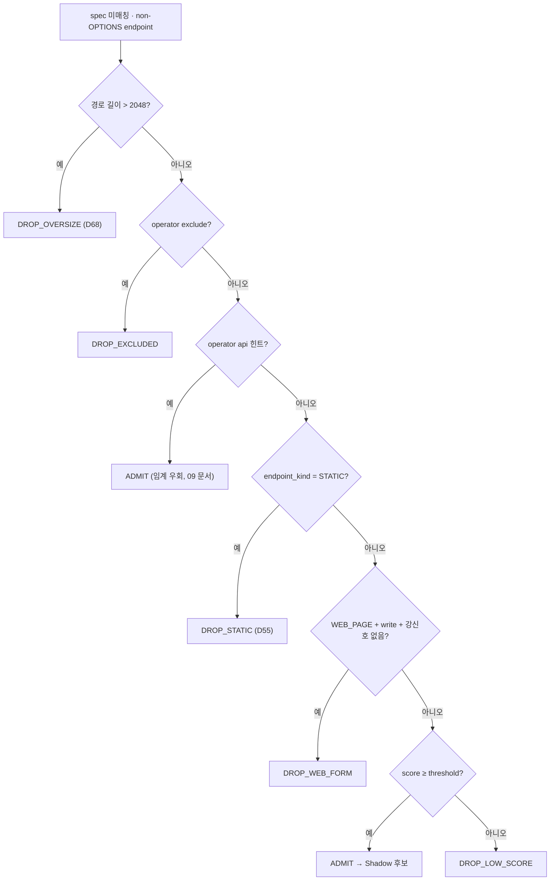

# API 후보 점수화 모델 + 분류 프로파일 (평가 및 린 채택)

> 타 프로젝트(body·헤더가 있는 환경) API Discovery 설계를 **평가한 결과**, 전체 복제가 아니라
> **일부만 린(lean)하게 채택**한다. 본 프로젝트는 **nginx access log only(body·대부분 헤더 없음)** 제약이 있어
> 참고 설계의 판정력 상당 부분(Content-Type/Accept/AJAX/body 신호)을 재현할 수 없기 때문이다.

연결 문서 → [04-matching-and-classification](04-matching-and-classification.md)(게이트 소비처), [09-explicit-hint-matcher](09-explicit-hint-matcher.md)(hint 매칭 규칙·pathHint), [10-classification-config-store](10-classification-config-store.md)(설정 저장·override), [17-response-type-api](17-response-type-api.md)(responseTypeApi 신호), [07-msa-and-central-integration](07-msa-and-central-integration.md) §3.1(튜닝 API).

**구현 위치**

| 대상 | 소스 · 함수 |
|---|---|
| 게이트 판정(ADMIT/DROP_*) | `classify/ApiScorer.evaluate()` |
| 점수 산출 | `classify/ApiScorer.score()` / `scoreExplain()` |
| 가중치·프로파일 | `ApiScorer.Weights`(record) · `presetWeights()`(HIGH/MIDDLE/LOW) |
| override 적용·검증 | `ApiScorer.applyOverrides()` / `validateWeightOverrides()` |

## 1. 결론 (채택 범위)

| 구분 | 항목 |
|---|---|
| **채택** | high/middle/low/custom **프로파일**(임계 preset), **중앙 API 전역·도메인 튜닝**, **린 점수 모델**(가용 신호만) |
| **독립 채택** | 정규화 고카디널리티 상한·`{var}` 승격, query/path 파라미터 후보, sensitive key matcher (점수 모델과 무관하게 유익) |
| **보류** | endpoint decision cache(배치 재집계 구조라 이득 작음), 참고 설계의 **정확한 가중치 값**(우리 데이터 보정 전엔 임의값) |
| **미채택(불가)** | request/response Content-Type, Accept, AJAX 헤더, body schema (로그에 없음) |

## 2. 평가 — 장단점

**왜 전체 복제가 아닌가.** 참고 설계의 API 판정력은 대부분 `response Content-Type=json`, `Accept`,
`X-Requested-With`, request body 구조에서 나온다. **우리는 이 강신호가 전부 없다.** 남는 신호(path shape,
method, query, user-agent, `$type`)는 **이미 `EndpointKindClassifier`+path 휴리스틱이 잡는 것과 거의 동일**하다.
→ 점수 모델로 바꿔도 입력 정보량은 늘지 않고, 표현 유연성과 복잡도만 는다.

| 도입 시 장점 | 도입 시 단점/리스크 |
|---|---|
| 운영자가 과탐/미탐을 임계·가중치로 조정(요구사항) | 약한 신호 위의 정교한 기계장치 = false precision 위험 |
| 점수형이 범주형보다 유연(반복관측 보강 자연스러움) | `api_confidence`(후보성)와 기존 `shadow confidence`(실재성) **두 confidence 공존** → 혼동 |
| 도메인별 튜닝 실효 | 가중치 값이 보정 전엔 추정. 그대로 신뢰하면 오해 소지 |

**완화책**: ① 신호를 **우리가 실제 가진 것만**으로 린하게 유지. ② 두 confidence의 **역할을 명확히 분리**(§6).
③ 가중치는 **"잠정 기본값"**으로 표기하고 **실데이터 보정을 선행 작업으로 명시**(§8).

## 3. 가용 신호 매핑 (참고 설계 → 본 프로젝트)

| 참고 신호 | 가용? | 본 프로젝트 |
|---|---|---|
| path prefix/regex, path shape, write_method, query | ✅ | 그대로 |
| request/response Content-Type, Accept | ❌ | **미채택** |
| AJAX/fetch 헤더 | ❌ | **user-agent 클래스(non_browser_ua)** 로 대체 |
| repeat observation | ✅ | 그대로 |
| static penalty | ✅ | 확장자 + `$type=library` (강한 감점) |
| ~~html(response) penalty~~ | ⚠️ | **제거** — `$type=document` 가 JSON API 응답에도 붙어 진짜 API를 0점화(§8 보정 결과) |
| body schema | ❌ | query/path 파라미터 후보만 |
| **host=api 서브도메인** | ✅ **(보정 시 추가)** | `$host` 가 `api.`/`apis.`/`*-api.` → 강한 양성. access log 기반 최강 가용 신호 |
| **CORS preflight** | ✅ **(보정 시 추가)** | 같은 template 이 `OPTIONS` 로 관측됨 → 교차출처 API 양성 신호 |

## 4. 린 점수 모델 (보정 완료, `ApiScorer.scoreExplain()`)

```text
api_confidence = clamp_0_1(
    pathHint                                   # explicit hint 모드: 설정 매칭 규칙(api_path_prefixes/regexes) 매치
  + host_api_subdomain                         # $host = api.* / apis.* / *-api.* / api-*
  + cors_preflight                             # 같은 template 이 OPTIONS(프리플라이트)로 관측
  + api_segment + graphql_segment + version_segment + path_id_segment + machine_endpoint  # pathless 모드만
  + write_method + query + non_browser_ua
  + response_type_api                          # dominant $type ∈ {xhr,fetch,json,api,ajax} → API_CANDIDATE (17 문서)
  + repeat_observation_bonus
  + static_asset_penalty                       # 확장자 또는 $type=library, 정적 파일명(img.php 류)  (html penalty 없음)
)
```
- **explicit hint 모드**(`api_path_prefixes`/`api_path_regexes` 설정 시): 내장 path-shape(api/graphql/version/id/machine) 비활성, `pathHint` 만 가산. host/CORS/method/query/UA/response_type/static 은 공통.
- **pathless strict 모드**(둘 다 비움): 내장 path-shape 포함 전 신호 사용(현행 기본).
- **html_response_penalty 없음**: `$type=document` 는 JSON API 응답에도 붙어(§8) 감점하면 진짜 API를 죽인다.
- 미발화 신호는 0.0 가산, 최종 `[0,1]` clamp + 소수 3자리 반올림.

### 보정된 가중치 (§8 실데이터 보정 반영, middle 이 anchor)

| weight | middle/custom | high | low | 출처(로그) |
|---|---|---|---|---|
| `host_api_subdomain` | 0.40 | 0.35 | 0.45 | `$host` 가 api 서브도메인 |
| `cors_preflight` | 0.30 | 0.25 | 0.35 | template 이 OPTIONS 로 관측 |
| `path_prefix` / `path_regex` | 0.55 | 0.50 | 0.65 | 설정 매칭 규칙 |
| `api_segment` / `graphql_segment` | 0.55 | 0.50 | 0.65 | `/api`,`/graphql`,`/rpc` |
| `version_segment` | 0.26 | 0.20 | 0.34 | `/v1/` |
| `path_id_segment` | 0.15 | 0.10 | 0.22 | numeric/uuid/token id |
| `machine_endpoint` | 0.20 | 0.12 | 0.28 | `/healthz`,`/status`,`/metrics` |
| `write_method` | 0.34 | 0.30 | 0.42 | POST/PUT/PATCH/DELETE |
| `query` | 0.12 | 0.06 | 0.18 | query 존재 |
| `non_browser_ua` | 0.24 | 0.18 | 0.30 | SDK/CLI UA |
| `response_type_api` | 0.25 | 0.18 | 0.32 | dominant `$type` = xhr/fetch/json/api/ajax (17 문서) |
| `static_asset_penalty` | **-0.60** | -0.70 | -0.50 | 확장자/`$type=library`/정적 파일명 |
| `repeat_observation_bonus` | 0.12 | 0.08 | 0.18 | 반복 관측(min_count 회 이상) |
| `repeat_observation_min_count` | 3 | 5 | 2 | |
| `path_hint` | 0.55 | 0.50 | 0.65 | explicit hint 매칭 규칙 매치(9 문서) |

임계값(threshold): high `0.85` / middle `0.70` / low `0.55` / custom 기본 `0.70`. (실제 상수 `ApiScorer.MIDDLE/HIGH/LOW`.)

## 5. 프로파일 (`ApiScorer.Profile`, `presetWeights()`)

`profile` ∈ `high | middle | low | custom`. 기본 `middle`(코드 상수 `MIDDLE` = 기본 weight).
- `high/middle/low`: preset(threshold + weights). 도메인의 `min_api_confidence`·`weights.*` override 무시.
- `custom`: `MIDDLE` 을 base 로 시작 + operator 지정 key만 `applyOverrides()` 로 교체(설정 저장·병합은 [10-classification-config-store](10-classification-config-store.md)). enum 자체는 HIGH/MIDDLE/LOW 3개이고 custom 은 resolver 단계에서 처리한다.

## 6. api_confidence vs shadow confidence — 역할 분리 (혼동 방지)

| | 의미 | 산출 | 사용처 |
|---|---|---|---|
| **api_confidence** (본 문서) | "이 endpoint 가 **API 후보인가**" | §4 점수 모델 | Classifier **앞단 게이트**. 임계 미만 → `dropped(not_api)` |
| **shadow confidence** ([04](04-matching-and-classification.md) §4.1) | "이 미문서 endpoint 가 **실재하는 Shadow 인가**" | 4xx/hits/단일클라/inferred 감점 | Shadow finding 의 신뢰도 |
| **zombie confidence** ([04](04-matching-and-classification.md) §4.2) | deprecated 인데 트래픽 지속의 명확성 | deprecated 명시=1.0 | Zombie finding |

→ **순서**: api_confidence 게이트 통과 → 매칭 → (미문서면) shadow confidence 부여. **두 값은 서로 독립적이다** — 측정하는 대상이 다르고 한쪽이 다른 쪽 값에 영향을 주지 않는다(별개 축).

게이트 판정 순서(`ApiScorer.evaluate()`). 점수(§4)는 마지막 단계에서만 쓰인다.



## 7. 설정 + 중앙 API

§5 프로파일·가중치·매칭 규칙(`api_path_prefixes`/`api_path_regexes`/`exclude_path_prefixes`/`include_web_forms`)를
**전역 + 도메인**으로 둔다. 병합 규칙·중앙 API 엔드포인트는 [07-msa-and-central-integration](07-msa-and-central-integration.md) §3.1·§4, 매칭 규칙 상세는 [09-explicit-hint-matcher](09-explicit-hint-matcher.md) 참조.
- 전역 `GET/PUT /api/v1/classification`, 도메인 `GET/PUT /api/v1/domains/{host}/classification`(effective 노출).
- `custom`에서만 `min_api_confidence`·`weights.*` 도메인 override. include/exclude 매칭 규칙은 전역+도메인 합집합, exclude 최우선.
- 매칭 규칙 정규식은 로드 시 compile(`java.util.regex`), 길이·개수 상한 + 매칭 타임아웃으로 ReDoS 완화.

## 8. 보정 결과 (2026-06-22, 실 Loki)

샘플: **api.weble.net**(hostname AORV1, API 호스트=양성) vs **www.dreampark-sporex.com**(hostname AOKD1, 웹사이트=음성).
라벨은 호스트 성격 기준 휴리스틱(api 서브도메인=API, www 정적/HTML 페이지=비API) — 운영 적용 전 사람 검토 권장.

**발견 1 — `$type=document` 의 함정**: api.weble.net 의 JSON API(`/users/{id}/stats` 등)가 전부 `$type=document`.
초기 모델(html penalty 포함)에서 **진짜 API가 전부 0.00 → 100% 미탐**. → html penalty **제거**.

**발견 2 — 약한 신호**: api.weble.net 은 `/api`·`/v1` prefix 없는 깨끗한 REST(`/users/{id}`,`/events`)이고
SPA fetch 라 UA=browser. path/method/query/repeat 만으로는 0.12~0.46 으로 임계 미달.

**발견 3 — 강한 가용 신호 둘**: ① `$host` 가 api 서브도메인, ② **CORS preflight(OPTIONS)** 대량 관측
(api.weble.net 56개 template / dreampark 0개). 이 둘을 추가하니 깨끗하게 분리됨.

| 도메인 | 보정 후 점수 | 임계 0.70 |
|---|---|---|
| api.weble.net | 전 엔드포인트 **0.82 ~ 1.00** | 전부 API 후보 ✓ |
| dreampark 정적 | 0.00 | 제외 ✓ |
| dreampark 문서페이지 `/m03/{id}` | 0.27 | 제외 ✓ |
| dreampark 루트 `/` | 0.12 | 제외 ✓ |

→ 분리 마진 큼(0.82 vs 0.27). 보정 변경: html penalty 제거 + `host_api_subdomain`(0.40) + `cors_preflight`(0.30) + static penalty 강화(-0.60).

**남은 한계**: api 서브도메인도, `/api` prefix 도, CORS 도 없는 **동일 출처 www JSON API**(+`$type=document`)는 여전히 분리 난망.
→ 이 경우 operator 가 `api_path_prefixes`/`api_path_regexes` 를 설정해 explicit hint 로 보완해야 한다(이게 점수 게이트의 본질적 한계).

## 9. 보류/미채택 + 한계

- **보류**: endpoint decision cache(배치 재집계라 이득 작음), 참고 설계의 정확한 가중치 값(보정 전 미사용).
- **미채택(불가)**: Content-Type/Accept/AJAX/body — 로그 부재.
- **한계**: 가용 신호가 참고 설계보다 적어 판정력이 약하다. 점수 모델의 실질 이득은 **no-spec/unknown-API 탐지**와
  **운영자 튜닝**에 집중되며, 스펙이 업로드된 경우엔 스펙 매칭이 1차 판정원이라 점수 게이트의 추가 이득은 제한적이다.
