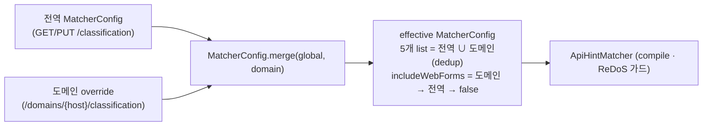

# explicit-hint 매처 + 매처 설정 (설계)

> 범위: explicit hint 모드(`api_path_prefixes`/`api_path_regexes`) + 매처 설정(prefixes/regexes/exclude),
> ReDoS 방어, 전역/도메인 병합, `include_web_forms`, ApiScorer 게이트 통합까지.
> **범위 밖(후속)**: DB 저장(전역 classification 레코드 / 도메인 override), 중앙 API `GET/PUT /classification`.
> 이번 설계는 **effective 매처 객체가 주입된다고 가정**한다. 근거 결정은 [DECISIONS](DECISIONS.md) **D16**.

> **용어** — 이 문서의 "매처(matcher)"는 경로 매칭 규칙(prefix/regex)을 컴파일·평가하는 컴포넌트 `ApiHintMatcher` 를 가리킨다.

연결 문서 → [08-api-scoring-and-profiles](08-api-scoring-and-profiles.md)(게이트·점수), [04-matching-and-classification](04-matching-and-classification.md)(분류 오케스트레이션), [23-options-preflight-detection](23-options-preflight-detection.md)(optionsOperationPrefixes), [10-classification-config-store](10-classification-config-store.md)(설정 저장·병합).

**구현 위치**

| 대상 | 소스 · 함수 |
|---|---|
| 매처 설정 shape·병합 | `model/MatcherConfig`(record) · `merge()` |
| 힌트/제외 판정·ReDoS 가드 | `match/ApiHintMatcher.apiHinted()` / `excluded()` / `genuineOptions()` |
| 게이트 통합 | `classify/ApiScorer.evaluate()` (게이트 순서 Mermaid = [08](08-api-scoring-and-profiles.md) §6) |

## 0. 배경 (doc/08 연계)

- doc/08 §4 공식 첫 항 `path_prefix | path_regex` 는 **문서에만 있고 현재 코드(`ApiScorer`)엔 없다.** 이번에 구현.
- doc/08 §8 발견 4: api 서브도메인·`/api` prefix·CORS 가 모두 없는 **동일 출처 www JSON API** 는 점수 게이트로 분리 불가.
  operator 가 explicit hint 로 보완해야 한다 → 이 작업이 그 경로.
- doc/08 §8 발견 1: `$type=document` 가 진짜 JSON API 응답에도 붙어 **html/web_page penalty 를 제거**했다.
  → web_page 관련 신호는 다시 도입하면 안 되고, 도입한다면 `$type=document` 함정을 피하는 좁은 형태여야 한다(§5).

## 1. 설정 객체 shape — `MatcherConfig`

```text
MatcherConfig (record, com.pentasecurity.apidiscover.model) — 실제 6필드
  List<String> apiPathPrefixes         // 양성 힌트 prefix      예: "/api", "/internal/v2"
  List<String> apiPathRegexes          // 양성 힌트 regex(full)  예: "/svc/[a-z]+/data"
  List<String> excludePathPrefixes     // 강제 제외 prefix       예: "/legacy", "/debug"
  List<String> excludePathRegexes      // 강제 제외 regex        예: ".*\.(js|css|map)$"
  List<String> optionsOperationPrefixes// "OPTIONS 가 진짜 operation" operator 선언 (23 문서 §8, M2)
  Boolean      includeWebForms         // null=상속, 기본 false (§5)
  + MatcherConfig NONE               // 빈값 + includeWebForms=true. 매처 비활성 센티넬(레거시/미연결)
  + static merge(global, domain)     // §4 — 6개 list 전역∪도메인 union
```
> 초기 설계는 5필드였으나 doc/23(M2)에서 `optionsOperationPrefixes` 가 추가돼 현재 6필드다. 하위호환 5-arg 생성자가 남아 있다(기존 stored matcherJson 무변경).

설계 결정.
- exclude 는 doc/08 §7 에선 `exclude_path_prefixes`(prefix only)였으나, regex 엔진을 양성 힌트용으로 어차피 만들므로
  **`excludePathRegexes` 를 대칭 추가**한다. (정적 확장자 억제 등에 필요. doc/08 §7 에 후속 반영 필요.)
- **prefix 매칭은 세그먼트 경계** 기준. `path == prefix` 또는 `path.startsWith(prefix + "/")`.
  `/api` 가 `/apidocs` 를 매칭하지 않게 한다.
- **regex 는 full-match(`matches()`)**. spec EndpointMatcher 와 동일 앵커 정책. 부분 매칭은 operator 가 `.*` 명시.
- prefix/regex 모두 **pathTemplate** 기준 매칭(ApiScorer·Classifier 가 다루는 값과 동일, 정적 prefix 보존됨).
- `NONE` = 모든 list 빈값 + `includeWebForms=true`. 레거시 오버로드·미연결 파이프라인이 쓰면 **현행 동작과 100% 동일**.

## 2. ApiScorer 게이트 통합 / 우선순위

게이트("이게 API 후보인가")의 본질이므로 **ApiScorer 가 후보 판정 전체를 소유**한다.
Classifier 는 spec 매칭(권위) → 게이트 → Shadow 신뢰도 순서만 오케스트레이션한다.

### 2.1 핵심 결정 — 힌트=강제 양성, exclude=강제 제외(최우선)

doc/08 §4 표는 path_prefix/regex 를 weight 0.55 로 적지만, middle 임계 0.70 에서 `0.55 + repeat 0.12 = 0.67 < 0.70`
이라 **가중치만으로는 §8 이 보완하려는 케이스를 구제하지 못한다.** explicit hint 는 operator 의 선언적 단언이므로
임계와 무관하게 **admit**(force-positive)한다. 단 0.55 weight 는 **api_confidence 보고값 산출엔 그대로 사용**하고,
**admit 결정만** 임계를 우회한다. (대안 = 순수 가중치 모델: 목적 미달로 미채택.)

### 2.2 게이트 순서 (d 가 spec 미매칭, OPTIONS 아님)

```text
0.  spec 매칭됨            → 게이트 우회. Active/Zombie (스펙 권위, doc/08 §6 불변)
0.5 경로 길이 > 2048       → DROP_OVERSIZE     [최우선 하드 veto, D68 — 이후 추가]
1.  exclude 매치           → DROP_EXCLUDED     [힌트·점수 모두 무시]
2.  api 힌트 매치          → ADMIT             [explicit operator allow. 임계 우회]
2.5 endpoint_kind = STATIC → DROP_STATIC       [정적 파일 하드 veto, D55 — 이후 추가]
3.  web-form 억제 조건     → DROP_WEB_FORM     [§5. host_api·cors·hint 있으면 미적용]
4.  score >= threshold ?   → ADMIT : DROP_LOW_SCORE
```

- **exclude vs spec**: exclude 는 게이트(미문서 분기)에만 작용. spec 매칭은 exclude 보다 위(operator 가 스펙으로 API 라 명시).
  드문 충돌(문서화된 경로를 exclude)은 스펙 우선 해소 + WARN 권장.
- 반환은 enum `Gate {ADMIT, DROP_EXCLUDED, DROP_WEB_FORM, DROP_LOW_SCORE, DROP_STATIC, DROP_OVERSIZE}` (초기 4값 → D55/D68 로 `DROP_STATIC`·`DROP_OVERSIZE` 추가돼 현재 **6값**).
  DROP 사유 분리 → 비-API dropped 메트릭이 사유별로 버킷팅된다([12-non-api-dropped-metric](12-non-api-dropped-metric.md)).

### 2.3 explicit-hint 모드 점수 (doc/08 §4 line 59)

- 힌트가 하나라도 설정됨(`isExplicitHintMode`) → 내장 path-shape 신호(api_segment/graphql/version/id/machine) **비활성**,
  힌트 매치 시 `pathHint`(0.55) 가산.
- 힌트 미설정(pathless strict) → 현행 그대로.
- host/cors/write/query/ua/static/repeat 는 **양 모드 공통**.

## 3. 정규식 처리 (compile 캐시 · 상한 · ReDoS)

`ApiHintMatcher` 가 effective `MatcherConfig` 로 **1회 생성될 때** 검증·컴파일하고 `Pattern` 을 보유한다(= compile 캐시).
설정 변경 = 새 인스턴스 = 자연 무효화(후속 DB 연동도 동일).

### 3.1 상한 (빌드 시 검증, 위반 → IllegalArgumentException fail-fast; 후속 중앙 API 에선 400)

| 항목 | 상한 |
|---|---|
| prefix 개수 (api/exclude 각각, effective) | 200 |
| regex 개수 (api/exclude 각각, effective) | 50 |
| regex 패턴 길이 | 200자 |
| prefix 길이 | 256자 |

- regex 컴파일 실패(`PatternSyntaxException`) → 잘못된 패턴 문자열 포함 throw(조용히 skip 금지 — 활성 오인 방지).
- **내용 검증**: prefix 는 비공백 + `/` 시작(빈/공백 prefix 는 `startsWith` 로 전 경로 match-all/drop-all → 금지), regex 는 비공백. 위반 시 패턴 포함 throw.

### 3.2 ReDoS 방어 (매칭당 타임아웃)

- `java.util.regex` 는 내장 타임아웃 없음 → **deadline 기반 interruptible CharSequence**.
  입력 path 를 `charAt()` 마다 `System.nanoTime()` 으로 deadline 초과 검사 → 초과 시 내부 예외 throw.
  파국적 백트래킹은 내부 char 접근을 반복하므로 deadline 에 걸려 중단. **별도 스레드 불필요**
  (executor+Future.get 은 매칭당 스레드 비용 + interrupt 무시 → 미채택).
- 보조: 매칭 입력 길이 상한 4096자(초과 → regex skip = no-match + 카운터). prefix 는 `startsWith` 로 선형 안전.
- 매칭당 budget **50ms**.
- **초과 시 동작**: 해당 regex 를 **no-match** 로 처리 + 타임아웃 카운터 증가 + 패턴별 WARN 1회(rate-limited).
  throw 금지(런타임 매칭이 스캔을 죽이면 안 됨). 의미 일관: 양성 timeout=미힌트(정상 score 게이트로),
  exclude timeout=미제외(정상 score 게이트로). 둘 다 안전한 fallback.

## 4. 전역/도메인 병합 — `MatcherConfig.merge(global, domain)`

[08](08-api-scoring-and-profiles.md) §7 "include/exclude 매칭 규칙은 전역+도메인 합집합, exclude 최우선".



- 5개 list = **전역 ∪ 도메인** (순서 보존 dedup).
- `includeWebForms` = 도메인 non-null → 도메인 값, 아니면 전역, 그래도 null → **false**.
  (단일 플래그라 상속 시맨틱 → 도메인 override 는 nullable `Boolean`.)
- "exclude 최우선" 은 **병합 규칙이 아니라 게이트 결정 규칙**(§2 order 1). 병합은 단순 합집합이고,
  충돌(같은 경로가 api 힌트 ∩ exclude)은 게이트에서 exclude 승리로 해소.
- **profile/weights override(custom 한정)는 이 병합과 별개**(= "설정 저장" 후속). 이번 병합은 매처+플래그만.

## 5. `include_web_forms` 의미 + web_page penalty 상호작용

**블랭킷 web_page/html penalty 는 doc/08 §8 에서 제거됨**(`$type=document` 가 진짜 JSON API 에도 붙어 100% 미탐).
따라서 `include_web_forms` 는 **penalty 를 되살리지 않고**, §8 함정을 피하는 **좁고 override 가능한 게이트 규칙**으로 정의한다.

- **"web form 제출" 정의**: `endpoint_kind == WEB_PAGE` **AND** write_method(POST/PUT/PATCH/DELETE).
  (서버 렌더 페이지의 폼 POST. body/Content-Type 부재로 폼 vs JSON 완벽 구분 불가 → best-effort.)
- `includeWebForms = false`(기본): 위 조건 endpoint 를 게이트에서 **DROP_WEB_FORM**.
  **단, 강한 API 신호가 있으면 미적용**(override) — api-hint 매치 · api 서브도메인 host · CORS preflight 중 하나라도.
- `includeWebForms = true`: 이 drop 미적용 → 정상 score 게이트(write_method 가 양성 가중치 기여).

§8 함정 회피.
- api.weble.net JSON API 들은 host_api(0.40) 강신호로 admit → drop 안 됨.
- §8 트랩(GET JSON API 가 `$type=document`)은 **write-method 만 대상**이라 GET 은 절대 web-form drop 안 됨.
- 동일출처 www `POST` JSON API(`$type=document`, CORS·힌트 없음)는 기본 drop → 이게 §8 이 말한
  "operator 가 힌트로 보완해야 하는" 케이스. `include_web_forms=true` 또는 `api_path_prefix` 로 구제. (정직한 한계.)

요약: web_page penalty 는 없어졌고, `include_web_forms=false` 는 그 자리에
**write-to-web_page 한정 + 강신호 override 가능한 hard-drop** 을 둔다.

## 6. 한계 / 후속

- body/Content-Type 부재로 폼 POST vs JSON POST 완벽 구분 불가 → `include_web_forms` 는 best-effort + override 가능.
- 저장(전역 레코드/도메인 override)·중앙 API·메트릭 연결은 후속(TASKS API 점수화 섹션).
- doc/08 §7 의 `exclude_path_prefixes` 표기는 `exclude_path_regexes` 추가로 보완 필요.
