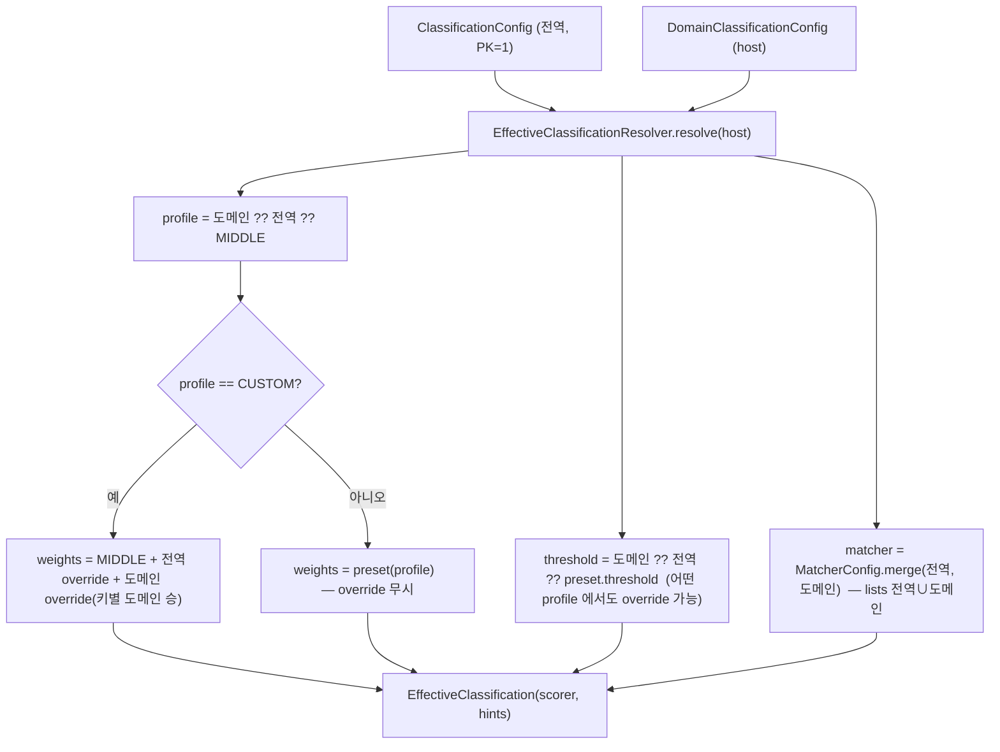

# 분류 설정 DB 저장 + effective 병합 (설계)

> 범위: 영속(엔티티/리포지토리) + 병합 규칙 + effective 해석(host→ApiScorer.Weights + ApiHintMatcher) + DiscoveryJobService 연결. 근거 결정은 [DECISIONS](DECISIONS.md) **D17**. 연계: [08-api-scoring-and-profiles](08-api-scoring-and-profiles.md) §4~§5·§7, [09-explicit-hint-matcher](09-explicit-hint-matcher.md)(MatcherConfig), D16.
> ★설계 당시 후속으로 뒀던 **중앙 REST `GET/PUT /classification` + effective 캐시·무효화**는 [11-classification-rest-api](11-classification-rest-api.md)(D18)에서 구현 완료(§4 반영).

**구현 위치**

| 대상 | 소스 |
|---|---|
| 전역 설정 엔티티 | `domain/ClassificationConfig`(고정 PK=1) · `ClassificationConfigRepository` |
| 도메인 override | `domain/DomainClassificationConfig`(host PK) · `DomainClassificationConfigRepository` |
| 프로파일 enum | `model/ClassificationProfile`(HIGH/MIDDLE/LOW/CUSTOM) |
| effective 해석·캐시·무효화 | `classify/EffectiveClassificationResolver.resolve()` / `invalidate()` / `invalidateAll()` |
| effective 결과 | `classify/EffectiveClassification`(record) |

## 0. 설계 당시 현 상태 (연결 대상)

- `ApiScorer` 는 profile(HIGH/MIDDLE/LOW) 전용. `Weights`(**14 override 가능 가중치 double** + `repeatMinCount`(int, override 제외) + `threshold`) record.
  custom weights/Weights 주입 경로 없음. `@Component` 싱글톤(MIDDLE).
- `DiscoveryJobService.analyze`: `ApiHintMatcher.NONE`(includeWebForms=true) 사용 = 당시 무억제.
- `MatcherConfig.merge`([09](09-explicit-hint-matcher.md)): lists 합집합, includeWebForms `도메인 ?? 전역 ?? false`.
- 영속 컨벤션: `ddl-auto: update`, H2(dev)/PostgreSQL(prod), **private 필드 + 접근자(캡슐화, [29](29-entity-encapsulation.md) D41)**, JSON 은 **`@Column(columnDefinition="text")` + 수동 Jackson**(`@Lob String`→PG oid/LOB 결함 회피, [28](28-testcontainers-pg-integration.md) D40/D37), `@Enumerated(STRING)`. **벤더 JSON 타입(JSONB) 미사용**(H2 이식성).

## 1. 엔티티

### 1.1 전역 단일 레코드 — `ClassificationConfig`

```text
@Entity @Table(name="classification_config")
class ClassificationConfig {
  @Id Long id = 1L;                       // 단일행 보장: 고정 PK=1, resolver 는 findById(1L) upsert
  @Enumerated(STRING) ClassificationProfile profile = MIDDLE;  // HIGH/MIDDLE/LOW/CUSTOM
  Double  thresholdOverride;              // nullable
  @Column(columnDefinition="text") String customWeightsJson;  // nullable, Map<String,Double>(custom 한정 가중치 override)
  @Column(columnDefinition="text") String matcherJson;        // nullable, MatcherConfig(전역) 직렬화
  Instant updatedAt;
}
```

- **단일행 보장**: 고정 PK=1L + `findById(1L)`. CHECK 제약은 H2/PG 이식성 떨어져 미채택.
- **`ClassificationProfile` 신규 enum**(HIGH/MIDDLE/LOW/CUSTOM). `ApiScorer.Profile`(3 preset)에 CUSTOM 추가 시
  `ApiScorer(CUSTOM)` 가 무의미 → 분리. resolver 가 preset→ApiScorer 가중치, CUSTOM→MIDDLE 베이스+override 로 매핑.

### 1.2 도메인 override — 신규 엔티티 `DomainClassificationConfig` (DomainConfig 확장 아님)

```text
@Entity @Table(name="domain_classification_config")
class DomainClassificationConfig {
  @Id String host;                        // 1:1 DomainConfig.host
  @Enumerated(STRING) ClassificationProfile profile;  // nullable = 전역 프로파일 상속
  Double  thresholdOverride;              // nullable
  @Column(columnDefinition="text") String customWeightsJson;  // nullable
  @Column(columnDefinition="text") String matcherJson;        // nullable, MatcherConfig(도메인 override, includeWebForms nullable)
  Instant updatedAt;
}
```

**확장 vs 신규 — 신규 채택 근거.**
1. 관심사 분리: `DomainConfig` 는 *무엇/어디를 스캔*(hostnames/interval/enabled), 분류 튜닝은 별개의 *선택적* 관심사.
2. 희소성: 대부분 도메인은 override 없음 → 행 부재 = "전역 사용". `DomainConfig` 전 행에 nullable 컬럼 더하지 않음.
3. 전역 레코드와 **동일 shape** → resolver 대칭, 병합 추론 쉬움.
4. `DomainConfig` 는 이미 캡슐화 TODO 대상 → 더 키우지 않음(surgical).
5. [07-msa-and-central-integration](07-msa-and-central-integration.md) §3.1 의 `/domains/{host}/classification` 가 sub-resource → 별 엔티티가 자연.

## 2. JPA 저장 방식 (H2/PostgreSQL 양쪽 호환)

| 데이터 | 방식 | 근거 |
|---|---|---|
| 매처 lists + includeWebForms | `@Column(columnDefinition="text") String matcherJson` (= `MatcherConfig` record 통째 Jackson) | record 라 왕복 그대로. 컬럼 1개. `@ElementCollection`(테이블+eager 조인) 회피. prefix 쿼리 불필요 |
| custom weight override | `@Column(columnDefinition="text") String customWeightsJson` (`Map<String,Double>`, override 된 key 만) | 가중치 추가 시 스키마 무변경. 개별 가중치 쿼리 안 함 |
| threshold override | `Double` 스칼라 컬럼 | 단일 값·precedence 제어 명확, 쿼리 가능 |

- **벤더 JSON 타입 미사용 + `@Column(columnDefinition="text")`**: 초안은 `@Lob String` 이었으나 PostgreSQL 에서 `@Lob`→oid(large object)로 매핑돼 결함 → **`@Column(columnDefinition="text")`(PG text)** 로 교정([28](28-testcontainers-pg-integration.md) D40/D37). H2/PG 동일 동작(JSONB 는 H2 깨짐). `canonicalJson`/`reportJson` 과 동일 컨벤션.
- weight override map 의 **key = `Weights` 필드명(`ApiScorer.WEIGHT_KEYS`, 14개)**: `hostApiSubdomain, corsPreflight, apiSegment, graphqlSegment,
  versionSegment, pathIdSegment, machineEndpoint, writeMethod, query, nonBrowserUa, staticAssetPenalty, repeatBonus, pathHint, responseTypeApi`. 단일 명명원.
- `repeatMinCount` override 는 **범위 밖**(preset 유지). threshold(별도) + **14 double** 만 override.

## 3. 병합 규칙



```text
effective.profile   = domain.profile ?? global.profile ?? MIDDLE
effective.weights   = preset(effective.profile)                          # HIGH/MIDDLE/LOW
                      또는 CUSTOM → MIDDLE 베이스 + global override + domain override(키별 domain 승)
effective.threshold = domain.threshold ?? global.threshold ?? preset(effective.profile).threshold
effective.matcher   = MatcherConfig.merge(globalMatcher, domainMatcher)   # lists 전역∪도메인
effective.webForms  = domain.includeWebForms ?? global.includeWebForms ?? TRUE   # §5
```

- **weights override 는 effective.profile==CUSTOM 일 때만**(preset 이면 무시 — doc/08 §5).
- **threshold 는 어떤 프로파일에서도 override 가능**(도메인>전역>preset). "HIGH 쓰되 임계만 0.80" 같은 흔한 튜닝 허용.
  → doc/08 §5 의 "preset→임계 override 무시"를 **가중치에 한정**하도록 완화(D17 기록).
- custom 가중치: base=MIDDLE → global map → domain map(키별 domain 승). 미지정 key=MIDDLE.

## 4. effective 해석 서비스

```text
record EffectiveClassification(ClassificationProfile profile, ApiScorer.Weights weights,
                               MatcherConfig matcher, ApiScorer scorer, ApiHintMatcher hints)

@Service EffectiveClassificationResolver {
  EffectiveClassification resolve(String host)  // 전역(1L)+도메인(host) 로드 → §3 병합 → §5 default/정규화 → scorer/hints 빌드
}
```

- pipeline 은 `scorer`+`hints` 사용. `profile/weights/matcher` 는 `GET .../classification`(effective 노출) 소비자용 — 어차피 계산되므로 동봉(추가 비용 0).
- **컴파일/캐시**: **호스트별 `ConcurrentHashMap` + `computeIfAbsent` 캐시가 구현돼 있다**([11-classification-rest-api](11-classification-rest-api.md) §3, D18). effective 객체 불변 → 동시 read·공유 안전. 무효화는 REST PUT 이 `invalidate(host)`(도메인)·`invalidateAll()`(전역, 전 호스트) 호출. (설계 초안의 "v1 스캔당 재빌드(무캐시)"는 REST 단계에서 캐시로 대체됨.)
- **fail-fast**: matcherJson/customWeightsJson 파싱 실패·`ApiHintMatcher` 상한 위반 → throw(조용히 default 금지, 잘못된 설정을 스캔까지 끌고 가지 않음 — [09](09-explicit-hint-matcher.md) §3.1 동일 원칙). build throw 시 해당 host 미캐시(poisoning 없음).
- **값 검증(reject)**: unknown weight 키(14 `Weights` 필드명 외)·threshold [0,1] 범위 밖·비유한 weight(NaN/Infinity/null) → throw.
  customWeightsJson 파싱·검증은 **profile 무관 항상 수행**(preset 에서도 손상/오타 reject), 값 적용만 CUSTOM 한정.

## 5. 무회귀 기본값 (최우선)

현행 = `ApiScorer(MIDDLE)` + `ApiHintMatcher.NONE`(includeWebForms=true, 무억제). resolver 가 100% 재현해야 한다.

- **전역 레코드 부재** → resolver 무회귀 default: profile=MIDDLE, weights=MIDDLE preset, threshold=0.70,
  matcher=`MatcherConfig.NONE`(includeWebForms=true). ⇒ `ApiHintMatcher.NONE` 와 동치.
- **default seed 전역 레코드**(MIDDLE, override 없음, matcherJson=NONE) → 위와 동치.
- **충돌 해소(중요)**: `MatcherConfig.merge` 의 raw default 는 `?? false`(억제 ON). 그대로면 web-form 억제가 출시 즉시
  전 도메인에 켜져 **무회귀 위반** + §8 함정(www POST JSON API 오drop). → **resolver 가 전역 includeWebForms=null 을 TRUE 로
  정규화**한 뒤 merge 호출. 결과 `effective.webForms = domain ?? global ?? TRUE` = **억제 opt-in**(operator 명시 false 때만 ON).
  `MatcherConfig.merge` 코드/테스트 **무변경**(정규화는 resolver 책임).
  → D16 의 "기본 false" 를 **"effective 기본 true(억제 opt-in)"** 로 조정(D17).

## 6. DiscoveryJobService 연결 변경점

`analyze()` 139-141 교체.

```text
// before
ApiHintMatcher hints = ApiHintMatcher.NONE;
List<Finding> findings = classifier.classify(discovered, spec, matcher, hints);
// after
EffectiveClassification eff = resolver.resolve(host);
List<Finding> findings = classifier.classify(discovered, spec, matcher, eff.scorer(), eff.hints());
```

- `EffectiveClassificationResolver` 생성자 주입.
- `Classifier` 5-arg 오버로드 `classify(discovered, spec, specMatcher, ApiScorer scorer, ApiHintMatcher hints)` 추가
  (전달 scorer 사용). 기존 3-arg(field scorer+NONE)·4-arg(field scorer+hints) 유지 → 기존 테스트·호출부 불변.
- `runOnDemand` 는 analyze 경유라 자동 반영.

## 7. 한계 / 후속

- ✅ **구현 완료**: 중앙 REST(`GET/PUT /classification` 전역·도메인, effective 노출) + effective 캐시·invalidate 연결 → [11-classification-rest-api](11-classification-rest-api.md)(D18). non_api dropped 메트릭 → [12-non-api-dropped-metric](12-non-api-dropped-metric.md).
- **남은 한계**: `repeatMinCount` override 는 여전히 범위 밖(preset 유지).
