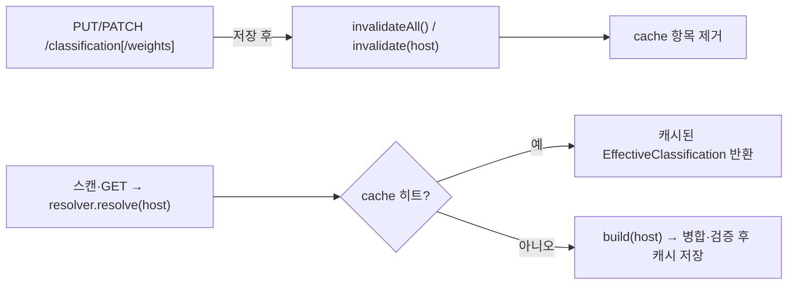

# 분류 설정 중앙 REST API + 캐시 활성화 (설계)

> 범위: REST 엔드포인트(전역/도메인 GET·PUT + 가중치 PATCH) + effective 노출 + resolver 캐시 + PUT invalidate 연결 + 쓰기 검증(400). 근거 결정은 [DECISIONS](DECISIONS.md) **D18**. 연계: [07-msa-and-central-integration](07-msa-and-central-integration.md) §3.1, [10-classification-config-store](10-classification-config-store.md)(저장/병합/캐시), D17.
> **남은 한계(후속)**: 서비스간 인증(`SecurityConfig` permitAll 유지), repeatMinCount override, `@Version` 낙관락, HA cross-instance 캐시 무효화. (non_api dropped 메트릭은 [12-non-api-dropped-metric](12-non-api-dropped-metric.md) 로 구현됨.)

**구현 위치**

| 대상 | 소스 |
|---|---|
| REST 컨트롤러 | `api/ClassificationController` (`/api/v1`) |
| DTO(5 record) | `api/dto/ClassificationDtos` |
| effective 해석·캐시·무효화 | `classify/EffectiveClassificationResolver.resolve()` / `invalidate()` / `invalidateAll()` |
| 쓰기 검증 | `classify/ApiScorer.validateThreshold()` / `validateWeightOverrides()` |

## 0. 설계 당시 현 상태 (연결 대상, 직전 작업 산출물)

- 엔티티/리포: `ClassificationConfig`(PK=1L)·`DomainClassificationConfig`(host PK) + 각 `JpaRepository`. seeder 가 전역 MIDDLE 1회 삽입.
- `EffectiveClassificationResolver.resolve(host)`→`EffectiveClassification(profile, weights, matcher, scorer, hints)`.
  당시 `invalidate(host)`/`invalidateAll()` 은 no-op 스텁 → **이 작업에서 실구현**(§3).
- 검증기(모두 `IllegalArgumentException`): `ApiScorer.validateThreshold`/`validateWeightOverrides`/`applyOverrides`,
  `ApiScorer.WEIGHT_KEYS`(public), `new ApiHintMatcher(matcher)`(상한/regex/blank/'/'시작).
- 컨트롤러 컨벤션: `@RestController` + record DTO 직접 반환 + `ResponseStatusException(BAD_REQUEST/NOT_FOUND/CONFLICT)`.
  **전역 ControllerAdvice 없음**. DTO 는 `api/dto/*Dtos.java`(record 묶음).
- `MatcherConfig`(public record, NONE/merge)·`ApiScorer.Weights`(public record) → DTO 직접 재사용 가능.

## 1. 엔드포인트 계약 (6종)

단일 `ClassificationController`(`@RequestMapping("/api/v1")`)에 전역+도메인 엔드포인트를 모은다.
응집(분류 설정 DTO 매핑·검증·무효화 한 곳) + `DomainController`(도메인 CRUD) 비대화 방지.
경로 계층(`/domains/{host}/classification`)은 유지 — `/domains/{host}`·`/domains/{host}/spec` 와 충돌 없음(Spring 최장 매칭).

| Method | Path | 동작 |
|---|---|---|
| GET | `/api/v1/classification` | 전역 **저장값** 조회. 행 부재 → 200 + default(MIDDLE/null/empty) |
| PUT | `/api/v1/classification` | 전역 upsert(PK=1L) → `invalidateAll()` |
| PATCH | `/api/v1/classification/weights` | 전역 가중치 **부분 수정**(`{name: value}` map) → `invalidateAll()` |
| GET | `/api/v1/domains/{host}/classification` | 도메인 override + **effective(병합값)** 노출 |
| PUT | `/api/v1/domains/{host}/classification` | 도메인 upsert(host) → `invalidate(host)` |
| PATCH | `/api/v1/domains/{host}/classification/weights` | 도메인 가중치 부분 수정 → `invalidate(host)` |

> PUT=전체 교체(null=clear), **PATCH=가중치 부분 수정**(map 에 준 key 만 갱신, 나머지 유지).

### DTO (신규 `api/dto/ClassificationDtos.java`)

```text
// PUT body (전역·도메인 공용). PUT=전체 교체 — omit/null = 해당 항목 clear
ClassificationUpsert(ClassificationProfile profile,   // 전역: 필수 / 도메인: nullable(상속)
                     Double thresholdOverride,         // nullable
                     Map<String,Double> customWeights, // nullable, key=Weights 필드명
                     MatcherConfig matcher)            // nullable (model record 재사용)

GlobalClassificationView(profile, thresholdOverride, customWeights, matcher, Instant updatedAt)  // GET 전역

DomainClassificationView(String host, OverrideView override, EffectiveView effective)            // GET 도메인
OverrideView(profile?, thresholdOverride?, customWeights?, matcher?, updatedAt?)                  // 행 부재 시 null 필드
EffectiveView(ClassificationProfile profile, ApiScorer.Weights weights, MatcherConfig matcher)
//            weights 에 threshold·repeatMinCount 포함, matcher.includeWebForms()=정규화된 effective 플래그
```

- `EffectiveView` 는 `EffectiveClassification` 에서 `scorer/hints`(런타임 객체, 직렬화 부적합) 제외 매핑.
- `MatcherConfig`·`ApiScorer.Weights` DTO 직접 재사용(둘 다 public record, 저장 JSON shape 동일) → 평행 DTO 회피.
- record `@RequestBody` 역직렬화는 기존 `DomainUpsert` 와 동일하게 동작(컴파일 `-parameters` 전제, 기존 검증됨).

## 2. 쓰기 검증 → 400 (PUT 시점 거부, 스캔까지 안 끌고 감)

PUT 핸들러가 **저장 전** 기존 검증기를 그대로 호출한다(직렬화는 그 뒤).

```text
ApiScorer.validateThreshold(req.thresholdOverride());          // [0,1]·유한 아니면 IAE
ApiScorer.validateWeightOverrides(req.customWeights());        // unknown 키·비유한 아니면 IAE
if (req.matcher() != null) new ApiHintMatcher(req.matcher());  // 상한/regex/blank/'/'시작 위반 IAE (검증 후 폐기)
```

- customWeights 검증은 **profile 무관 항상**(preset 에서도 오타/비유한 reject) — doc/10 §4 "검증 항상, 적용 CUSTOM 한정" 일치.
- 손상 JSON body → Jackson 역직렬화에서 Spring 자동 400(`HttpMessageNotReadableException`).
- **400 매핑**: 전역 advice 없음 → **컨트롤러-로컬 `@ExceptionHandler(IllegalArgumentException.class)`→400**(메시지 포함).
  가장 surgical(타 컨트롤러 동작 불변), 검증기 IAE 를 한 곳에서 변환.
  `IllegalStateException`(손상 *저장* JSON, resolver.parse)은 **별도 `@ExceptionHandler(IllegalStateException)`→500**(데이터 손상=서버오류; resolver 가 손상 IAE 를 ISE 로 래핑하므로 직접 타입 핸들러 필요).
- 전역 PUT 의 `profile==null` → 400("profile required"). 도메인 PUT 은 null=상속(정상).
- `new ApiHintMatcher(matcher)` 는 검증 겸 "이 매처가 빌드 가능한가" 확인 — 폐기.

## 3. 캐시 (resolver 구현 완료)

`EffectiveClassificationResolver` 에 아래가 구현돼 있다(설계 당시 no-op 스텁 → 실구현).

```text
private final Map<String,EffectiveClassification> cache = new ConcurrentHashMap<>();
resolve(host)    = cache.computeIfAbsent(host, this::build);   // build(host) = 기존 resolve 본문 추출
invalidate(host) = cache.remove(host);
invalidateAll()  = cache.clear();
```



- `EffectiveClassification`(+scorer/hints/weights/matcher) 모두 **불변** → 호스트 간 공유·동시 read 안전.
- **무효화 주체 = 컨트롤러 PUT**(전역→`invalidateAll`, 도메인→`invalidate(host)`).
- **스캔 경로(`DiscoveryJobService`)는 이미 `resolver.resolve(host)` 호출** → 캐시 자동 경유, **코드 변경 없음**.
- `computeIfAbsent` mappingFunction 이 throw 하면 항목 미저장 → 다음 호출 재시도(캐시 poisoning 없음, fail-fast 보존).
- **HA 한계**: in-memory per-instance 캐시 → 다중 인스턴스 시 타 인스턴스는 PUT 무효화 미수신 stale 가능.
  현재 단일 인스턴스 전제(HA=ShedLock 후속 TODO). HA 도입 시 TTL 또는 cross-instance invalidation(pub/sub) — v1 범위 밖, 문서화만.

## 4. GET 응답 규칙 — 대상이 없을 때

요청 대상은 세 층위(전역 설정 행 / 도메인 override 행 / 도메인 자체)로 나뉜다. 각각이 DB 에 **없을 때** GET 이 무엇을 반환하는지의 규칙이다.
핵심: **"설정이 없다"는 오류가 아니라 기본값**이지만, **"도메인이 없다"는 404** 다.

- **전역 GET, 전역 설정 행이 없을 때** → **200 + 기본값**(MIDDLE/null/empty/updatedAt=null). 전역 분류는 개념상 항상 존재한다(없으면 MIDDLE). 404 아님(seeder 유무와 무관).
- **도메인 GET, override 행이 없을 때** → **200**. `override` 필드는 비어 있고(null), `effective` 는 전역 기준 병합값으로 채운다. 이 엔드포인트의 목적이 "override **+ effective**"라 effective 는 항상 계산 가능 → 200(404 아님).
- **도메인(`DomainConfig`) 자체가 미등록일 때** → **404**(GET·PUT 공통). `/domains/{host}` 의 하위 리소스이므로 `DomainController` 의 404 와 일관되고, 등록되지 않은 도메인에 orphan override 가 생기는 것을 막는다. `DomainConfigRepository.existsById(host)` 로 가드한다. (의도적 계약, 필요 시 완화 가능.)

## 5. 동시성 / 단일행 upsert / updatedAt

- 전역: `globalRepo.findById(1L).orElseGet(ClassificationConfig::new)` → 필드 set, `id=1L`, `updatedAt=now`, save(멱등).
- 도메인: `domainRepo.findById(host).orElseGet(DomainClassificationConfig::new)` → host·필드 set, `updatedAt=now`, save.
- **PUT=전체 교체**(PATCH 아님): null 필드는 해당 항목 clear. 계약 명시.
- 동시 PUT = **last-writer-wins**(설정 쓰기 희소). `@Version` 낙관락은 선택적 하드닝(범위 밖, 엔티티에 없음).

## 6. 한계 / 후속

- **남은 한계**: 서비스간 인증(현재 `permitAll`), repeatMinCount override, `@Version` 낙관락, HA cross-instance 캐시 무효화 — 후속.
- non_api dropped 메트릭은 [12-non-api-dropped-metric](12-non-api-dropped-metric.md) 로 구현됨(후속 아님).
- 전역 GET 은 저장값만 노출(effective 는 도메인 엔드포인트가 host 별로 제공). 전역 effective 가 필요하면 후속 확장.
