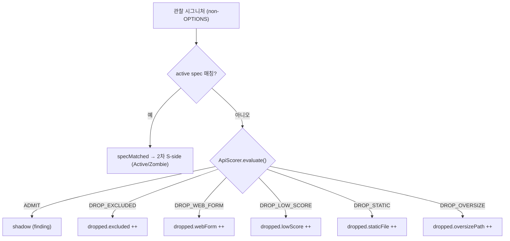

# non_api dropped observation 메트릭 (설계)

> 범위: 게이트 DROP_* 사유별 집계 + 스캔 결과(reportJson/`/result`) 노출 + 테스트. 근거 결정은 [DECISIONS](DECISIONS.md) **D19**. 연계: [09-explicit-hint-matcher](09-explicit-hint-matcher.md) §2.2(Gate), [07-msa-and-central-integration](07-msa-and-central-integration.md) §8(ETag).
> **남은 한계(후속)**: 별도 Actuator/Micrometer 대시보드·알람(TASKS "부하/운영 메트릭"), ScanResult/scan-status 에 total 비정규화(선택).

**구현 위치**

| 대상 | 소스 |
|---|---|
| 사유별 집계 | `classify/Classifier.classifyWithMetrics()` (게이트 switch) |
| 집계 버킷 | `model/DroppedNonApi`(record, 5필드 + `total()`) |
| 분류 결과 묶음 | `classify/ClassificationResult`(findings + dropped + preflightSignal) |
| 리포트 임베드 | `model/DiscoveryReport.droppedNonApi` · `report/ReportBuilder.build()` |

## 0. 설계 당시 현 상태 (연결 대상)

- `Classifier`(5-arg): spec 미매칭 분기에서 `scorer.evaluate→Gate`, **ADMIT 만 Shadow**, `DROP_*` 는 당시 **단순 무시**("메트릭 후속" 주석) → 이 작업에서 사유별 집계. OPTIONS·spec 매칭은 게이트 이전 `continue`.
- 당시 `Gate`는 4값 → **현재 6값** `{ADMIT, DROP_EXCLUDED, DROP_WEB_FORM, DROP_LOW_SCORE, DROP_STATIC, DROP_OVERSIZE}`(D55/D68, [09](09-explicit-hint-matcher.md) §2.2).
- `DiscoveryReport`(record): 이후 필드가 늘어 현재 host/generatedAt/logWindow/specVersion/Summary(+lowConfidence)/findings + `droppedNonApi`·`droppedByLimit`·`droppedNonExistent`·신호들·specSource([01](01-architecture.md) §4).
- `ScanResult.reportJson` = `DiscoveryReport` 통째 직렬화. `/result` 는 reportJson 직접 반환.
  ETag = `EtagUtil.of(...)` (generatedAt/window 제외, [07](07-msa-and-central-integration.md) §8).

## 1. 집계 방식 — Classifier 가 사유별 집계

게이트 결과를 아는 유일 지점이 `Classifier` 의 `evaluate` 호출부다. 다른 곳 집계는 evaluate **재실행** + OPTIONS/spec/cors 로직 중복
→ 비효율·이중 진실. **Classifier 에서 집계**한다.

**dropped 카운트 대상** (D-side, non_api):

| 관찰 분기 | dropped? |
|---|---|
| OPTIONS (CORS-only, 게이트 전 continue) | ✗ 보고도 카운트도 안 함 |
| spec 매칭 (Active/Zombie 후보, 게이트 우회) | ✗ 스펙 권위 |
| DELETED 인벤토리 키 → Zombie(deleted-from-spec) | ✗ Zombie 보고됨(doc/37 §6) |
| 게이트 ADMIT → Shadow | ✗ Shadow 보고됨 |
| 게이트 **DROP_EXCLUDED/DROP_WEB_FORM/DROP_LOW_SCORE/DROP_STATIC/DROP_OVERSIZE** | **✓ 사유별 ++** |

dropped = **non-OPTIONS · spec 미매칭 · 게이트 DROP_*** 인 관찰 시그니처 수(5개 사유 버킷).

**반환 방식(하위호환)**: `classify(...)→List<Finding>` 3 오버로드 유지. findings+dropped 를 함께 내보낼 신규 메서드 추가
(반환타입만 다른 동명 오버로드는 Java 불가 → 다른 이름).

```text
record ClassificationResult(List<Finding> findings, DroppedNonApi dropped,        // classify 패키지
                            PreflightSignal preflightSignal)                       // (preflightSignal 은 doc/23 §9 에서 추가)
Classifier.classifyWithMetrics(discovered, spec, matcher, scorer, hints)          // 실 impl(카운트)
       → ClassificationResult
Classifier.classify(...5-arg...) → List<Finding>                                  // classifyWithMetrics(...).findings() 위임
```

기존 3/4-arg → 5-arg(List) → classifyWithMetrics 위임. 모든 List 오버로드·기존 테스트·LokiLiveIntegrationTest 불변.
DiscoveryJobService 만 `classifyWithMetrics` 로 전환.

**카운트 검산식(항상 성립, 테스트로 고정)**: `discovered(non-OPTIONS) = specMatched + shadow + dropped.total`.
(active/zombie/unused 는 S-side 카운트로 별개 — 위 식과 직접 연관 없음.)



## 2. 노출 방식 (린 결정) — DiscoveryReport 임베드 → /result

**(a) DiscoveryReport 임베드** vs (b) Micrometer 카운터. → **(a) 채택.**

- 요구는 "이 스캔에서 무엇이 왜 빠졌나" = **스캔 결과 콘텐츠**(인프라 시계열 아님). `/result`(reportJson) 노출이 자연.
- (b) Micrometer/Actuator 는 **TASKS 별도 항목**("부하/운영 메트릭 Actuator/Micrometer + 알람") → 여기서 하면 범위 중복(user 명시).
  또 host-tag 카디널리티 등 인프라 메트릭 고유 고려가 그 항목 소관.
- (a) 는 기존 결과 전달(조건부 GET·ETag·DB 저장)과 일관, 신규 전송 0.
- **우선순위**: v1 = (a)만. 동일 `DroppedNonApi` 카운트를 후속 Actuator 항목이 재사용 가능(재작업 없음).

## 3. 버킷 + 하위호환

```text
model/DroppedNonApi(int excluded, int webForm, int lowScore, int staticFile, int oversizePath)
  @JsonProperty("total") int total() { return excluded + webForm + lowScore + staticFile + oversizePath; }  // 파생, 단일 진실원
```
> 초기 3필드(excluded/webForm/lowScore)에 `staticFile`(정적 파일 veto, D55)·`oversizePath`(초장문 경로 veto, D68)가 추가돼 **현재 5필드**다.

- `DiscoveryReport` 에 **top-level 필드 `DroppedNonApi droppedNonApi` 추가**. Summary 안에 넣지 않음 — Summary 는
  `/scan-status` 경량 메타라 비대화 방지. 사유별 상세는 `/result` 로.
- 항상 non-null(빈 결과=`(0,0,0,0,0)`) → shape 일관.
- **가산적**: reportJson 에 `droppedNonApi` 필드 추가 = 기존 소비자 무시 가능(비파괴). `/result` 응답에 필드 1개 추가.
- `total` 파생 accessor `@JsonProperty` 노출(user "필요 시 합계"). dev 가 JSON 에 `total` 출현 검증
  (Jackson record 의 `@JsonProperty` accessor 직렬화).

## 4. 결과 저장 + ETag(변경 감지)

> **ETag** = HTTP 응답 콘텐츠의 **버전 지문**(fingerprint). 클라이언트가 이전에 받은 ETag 를 `If-None-Match` 헤더로 보내면, 콘텐츠가 그대로일 때 서버가 `304 Not Modified`(본문 없음)로 답해 재전송을 막는다([07-msa-and-central-integration](07-msa-and-central-integration.md) §3.3). 여기선 "스캔 결과가 바뀌었는가"를 판별하는 값이다.

- **저장(DB)**: `DiscoveryReport` 가 `ScanResult.reportJson`(text 컬럼) 통째로 직렬화되므로 droppedNonApi 도 자동 포함된다. **ScanResult 신규 컬럼 불필요**(summary 컬럼은 `/scan-status` 경량용, dropped 상세는 미포함). 스키마 변경 0.
- **ETag 입력에 dropped 포함**: dropped 는 결과 콘텐츠다. 예) operator 가 exclude 를 추가해 어떤 endpoint 가 `DROP_LOW_SCORE→DROP_EXCLUDED` 로 옮겨가면 **findings 는 그대로인데 dropped 분포만 바뀐다** → 종전 ETag(summary+findings)는 이 변화를 못 잡아 304 로 새 결과를 안 내보내는 버그. → ETag 입력을 `List.of(specVersion, summary, findings, droppedNonApi)` 로 확장한다. generatedAt/window 제외 원칙([07](07-msa-and-central-integration.md) §8)과 일관(내용 기반).
- 부작용: 기존 저장 결과의 ETag 가 1회 바뀐다(같은 로그를 재분석해도 version 1회 갱신). 콘텐츠 정의 확장이라 정당하다.

## 5. 한계 / 후속

- Actuator/Micrometer 노출·알람(별도 TASKS 항목)에서 동일 카운트 재사용 가능.
- 필요 시 `/scan-status`·ScanResult 에 `totalDropped` 비정규화 컬럼 1개 추가(at-a-glance) — 선택, 후속.
