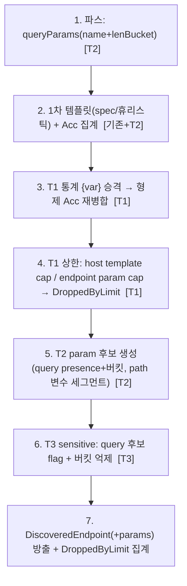

# 정규화 고카디널리티 방지 (T1 통계 승격+상한 / T2 param 후보 / T3 sensitive)

> 정규화/인벤토리 계층에서 카디널리티 폭발을 막는 3항목(T1/T2/T3). 근거 결정은 [DECISIONS](DECISIONS.md) **D20**.
> 연계: [02-log-parsing-and-normalization](02-log-parsing-and-normalization.md) §1.2(query)·§3.3(통계 보정)·§3.4(false merge), [12-non-api-dropped-metric](12-non-api-dropped-metric.md)(DroppedNonApi 노출 패턴), [07-msa-and-central-integration](07-msa-and-central-integration.md) §8(ETag).

**구현 위치**

| 대상 | 소스 |
|---|---|
| 설정 | `config/NormalizationProperties`(`apidiscover.normalization`) · `config/SensitiveKeyProperties` |
| T1 통계 승격·상한 | `normalize/CardinalityNormalizer.normalize()` |
| T2 query param 파스 | `parse/LogLineParser.queryParams()` → `model/QueryParamObs` |
| T2 param 후보 | `normalize/ParamCandidateExtractor` → `model/ParamCandidates` |
| T3 sensitive | `normalize/SensitiveKeyMatcher.isSensitive()` |
| 상한 집계 | `model/DroppedByLimit`(templates/params) |
| 오케스트레이션 | `normalize/InventoryBuilder.buildWithLimits()` |

## 0. 설계 당시 현 상태 / 가용 신호

- 정규화: `PathNormalizer`(세그먼트 휴리스틱 `{uuid}/{id}/{token}/{date}`), `InventoryBuilder`(시그니처 Acc 집계).
  당시 **통계 보정([02](02-log-parsing-and-normalization.md) §3.3) 미구현** → T1 에서 구현.
- query: 당시 파서가 **키만 보존, 값 폐기**(`ParsedRequest.queryKeys: List<String>`, 값 길이 미수집) → **T2 에서 `queryParams: List<QueryParamObs>`(이름+값 길이 버킷)로 교체**(§2.1).
- 노출 패턴: `DroppedNonApi`(record + `@JsonProperty total()`) → `DiscoveryReport` top-level + ETag 포함([12](12-non-api-dropped-metric.md)). 재사용.
- **참고**: T1 통계 `{var}` 승격 = [02](02-log-parsing-and-normalization.md) §3.3 "통계적 정규화 보정 3단계"와 동일 알고리즘.

## 1. (T1) 통계적 {var} 승격 + 상한 + dropped_limit

### 1.1 승격 (2차 패스, 집계 후)
휴리스틱(1차)이 못 잡은 고카디널리티 정적 세그먼트를 `{var}` 로 수렴. 입력은 1차 산출 템플릿 집합
(원본 path 저장 불필요 — 형제 템플릿의 위치별 distinct 정적값으로 카디널리티 산출).

- 클러스터: (method, host, 세그먼트수, 위치 i 제외 나머지 세그먼트) 동일군.
- 승격 조건(전부 충족):
  - `distinct_at_i / cluster_requests ≥ statVarRatio(0.3)` (doc/02 §3.3)
  - `distinct_at_i ≥ statVarMinDistinct(20)` (소표본 오승격 방지)
  - 승격 후 수렴 `merged_hits / cluster_hits ≥ statVarMinConvergence(0.7)` (false merge 방지, doc/02 §3.4)
- 동작: 위치 i → `{var}`, 형제 Acc 재병합(hits/metrics 합산), `templateSource=INFERRED`(Shadow 신뢰도 -0.1 기존 적용).
- **무회귀**: 조건 보수적(≥20 distinct)이라 소규모/기존 테스트 입력은 미발동 → 템플릿 동일.

### 1.2 상한 (최후 안전망, 승격 후에도 폭발 시)

| 상한 | 기본값 | 초과 처리 |
|---|---|---|
| host 당 distinct template | 5000 | hits 낮은 순 초과분 drop → `dropped_limit.templates++` |
| endpoint 당 distinct query param | 50 | 초과 param drop → `dropped_limit.params++` |

- 근거: 실 API 는 수백~저수천 endpoint, param 수십개 → 넉넉한 헤드룸. 초과 = 비정상 카디널리티(랜덤 경로/스캐너).
- **노출**: `model/DroppedByLimit(int templates, int params)` + `@JsonProperty total()` → `DiscoveryReport` top-level
  (`droppedNonApi` 와 형제, DroppedNonApi 패턴 재사용). ETag 입력 포함(콘텐츠 일관).
- **조용한 누락 금지** — 카운트로 항상 노출(운영자가 카디널리티 폭발 인지).

## 2. (T2) 파라미터 후보 (body 없음 → query/path)

### 2.1 query param (파스 확장, privacy-preserving)
파서가 `key=value` 분리 시 **값 길이만 버킷화하고 값은 폐기**.
- `ParsedRequest.queryKeys`(List<String>) → **`queryParams: List<QueryParamObs(name, ValueLenBucket)>`** 교체
  (내부 필드, 외부 노출 없음 → 무회귀). `hadQuery = !queryParams.isEmpty()`(기존 신호 보존).
- `ValueLenBucket {NONE, S(1-8), M(9-32), L(33-128), XL(129+)}` — 값 자체 미저장, 길이 버킷만.
- 인벤토리 집계: endpoint 별 param name → presence count + 관측된 버킷 집합(≤5, 카디널리티 안전).

### 2.2 path param 후보
템플릿 변수 세그먼트(`{id}/{uuid}/{token}/{date}/{var}`) 열거 → `PathParam(position, token)`.
T1 의 `{var}` 가 곧 path param 후보(저신뢰). 세그먼트수로 자연 상한.

### 2.3 저장 구조
`DiscoveredEndpoint.params: ParamCandidates(query: List<QueryParam>, path: List<PathParam>)`.
`QueryParam(name, count, lenBuckets, sensitive)`. per-endpoint query param 상한(50, §1.2)·sensitive(§3) 적용 후 저장.

## 3. (T3) sensitive key matcher

### 3.1 매칭
`SensitiveKeyMatcher`(@Component) — 기본 키 목록 + 정규식, 대소문자 무시.
- 기본 키(예): `password/passwd/pwd, token/access_token/refresh_token, secret, apikey/api_key, session/sid,
  authorization/auth, otp/pin/cvv, ssn, card/cardno`.
- 기본 정규식(예): `.*(passw|secret|token|apikey).*`.

### 3.2 정책 (보안도구 관점 — 린 결정)
**키 이름 보존 + `sensitive=true` 플래그 + value-len 버킷 억제(REDACTED).**
- 근거: WAAP 보안 디스커버리다 — "endpoint 가 `token`/`password`/`ssn` 쿼리 파라미터를 받는다"는 **고가치 보안 신호**
  (쿼리스트링 내 시크릿 = finding 후보)라 **숨기지 않고 노출**. 값은 이미 파스 폐기, 추가로 **길이 버킷도 억제**(길이가 값 특성 누출 가능).
- 더 엄격한 **완전 제외(이름+버킷 drop)** 는 옵션 — v1 기본은 flag+버킷억제.

### 3.3 설정 저장 연계 (린 판단)
**이번 범위는 `@ConfigurationProperties`(application.yml) 만. DB 설정 저장/REST 제외.**
- 근거: sensitive 목록·상한은 대체로 **정적 인프라 정책**(D12: 정적→yml, 동적→DB). yml 기본값 → ConfigMap override 가능.
  도메인별 override·중앙 API 는 분류설정(doc/10/11) 패턴으로 **후속**. 이번 PR 범위 폭주 방지.
- `apidiscover.normalization.*`(상한·승격 임계·버킷 경계) + `apidiscover.sensitive-keys.{names,patterns}` 기본값 내장.

## 4. 상호작용 / 순서 / 하위호환

### 4.1 파이프라인 (InventoryBuilder 오케스트레이션)

순서 근거: 승격(3)이 템플릿을 **줄이므로** 상한(4) 앞에 둔다(병합될 것을 미리 drop 방지). sensitive(6)는 후보 생성 직후·방출 전.

### 4.2 하위호환 / 무회귀
- `queryKeys→queryParams`: 내부 필드만(외부 리포트/REST 미노출) → 외부 무영향. hadQuery 보존.
  (알려진 사용처: LogLineParser 채움, InventoryBuilder hadQuery — dev grep 확인.)
- `DiscoveredEndpoint.params`·`Finding.Shadow.params`·`DiscoveryReport.droppedByLimit`: **가산적**. 기존 소비자 무시 가능.
- 승격 보수적(≥20 distinct) + 상한 높음(5000/50) → 기존 테스트 입력 미발동 = 템플릿/카운트 동일, `DroppedByLimit=(0,0)`.
- ETag 입력에 `droppedByLimit` 추가(콘텐츠 일관, doc/07 §8). param 후보는 Shadow finding 에 실려 findings(이미 ETag)에 포함.
- **노출**: param 후보 = `Finding.Shadow.params`(미문서 endpoint param = 최고가치 보안신호). Active/Zombie 도 이후 `params` 를 실어 노출한다([25-report-output-enhancements](25-report-output-enhancements.md) §B — 관측 query + 스펙 path). `droppedByLimit` top-level.

## 5. 범위 밖 / 후속

- **남은 한계**: sensitive 목록·상한의 **도메인별 override·중앙 REST/대시보드**(분류설정 [10](10-classification-config-store.md)·[11](11-classification-rest-api.md) 패턴 재사용) — 후속.
- ✅ **구현 완료**: Active/Zombie finding 의 param 노출(`Finding.Active`/`Zombie` 에 `ParamCandidates params`, [25-report-output-enhancements](25-report-output-enhancements.md) §B). distinct/분위수 대용량 근사(HLL/KLL) → [22-hll-tdigest-approximation](22-hll-tdigest-approximation.md).
