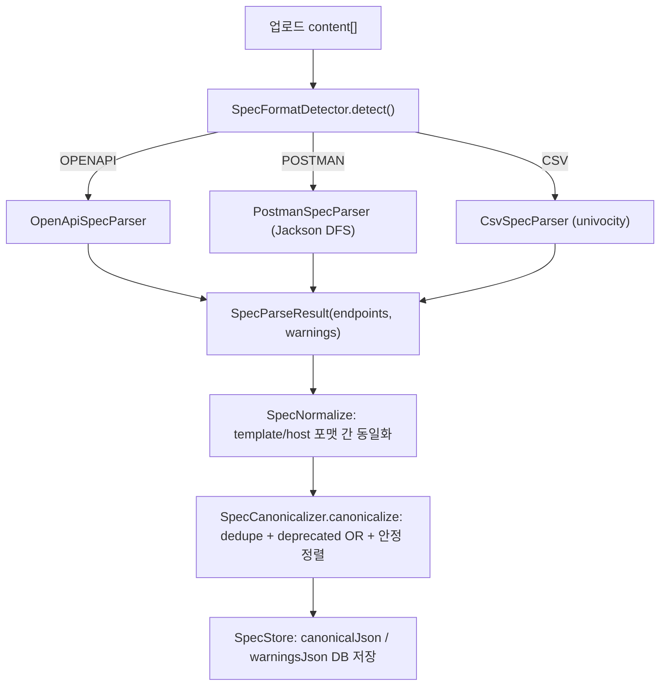

# 스펙 파서 Postman/CSV 실구현 (설계)

> Postman Collection v2.1·CSV 를 Canonical 로 변환하는 두 파서. `OpenApiSpecParser` 가 참조 구현·Canonical 출력 기준이고, 신규 의존성 0(Jackson·univocity-parsers 기존). 근거 결정은 [DECISIONS](DECISIONS.md) **D21**.
> 연계: [03-spec-formats-and-canonical-model](03-spec-formats-and-canonical-model.md)(스펙·Canonical), [25-report-output-enhancements](25-report-output-enhancements.md) §A.1(warnings 채널), [26-multi-spec-merge](26-multi-spec-merge.md)(멀티 문서 병합), [37-spec-inventory-reconcile](37-spec-inventory-reconcile.md) §2(SpecParam).
> **설계 당시 "범위 밖"이던 세 항목은 이후 모두 구현됨** — 구조화 `spec_source.warnings` 채널(→ [25](25-report-output-enhancements.md) §A.1), 매칭 규칙 캐시 무효화(→ [15](15-matcher-cache.md), `SpecStore.upload` 가 `matcherCache.invalidate(host)`), 멀티 스펙 병합(→ [26](26-multi-spec-merge.md)).

**구현 위치**

| 대상 | 소스 |
|---|---|
| 파서 인터페이스 | `spec/SpecParser.parse(byte[])` → `spec/SpecParseResult(endpoints, warnings)` |
| Postman 파서 | `spec/PostmanSpecParser`(Jackson 트리 DFS) |
| CSV 파서 | `spec/CsvSpecParser`(univocity) |
| 공유 정규화 | `spec/SpecNormalize.template()` / `host()` |
| Canonical 정규화 | `spec/SpecCanonicalizer.canonicalize()` / `merge()` |
| 포맷 감지 | `spec/SpecFormatDetector.detect()` |
| 디스패치·저장 | `spec/SpecStore.upload()` |

## 0. 설계 당시 현 상태 / 가용

- `SpecParser.parse(byte[])` — 설계 당시 `List<CanonicalEndpoint>` 반환, **warnings 채널 없음**. → **이후 `SpecParseResult(endpoints, warnings)` 로 확장**(recoverable 경고를 리포트 `spec_source.warnings` 로 노출, [25](25-report-output-enhancements.md) §A.1). `SpecStore` 가 `Map<SpecFormat,SpecParser>` 디스패치, parse 결과 empty → `IllegalArgumentException`("no endpoints found in spec", 중앙 400).
- `CanonicalEndpoint` — 설계 당시 6필드 `(method, pathTemplate, host, deprecated, version, sourceRef)`. → **이후 `params: List<SpecParam>` 추가로 7필드**(스펙 파라미터, dedupe 키 아님·method+host+template 불변, [37](37-spec-inventory-reconcile.md) §2).
- `OpenApiSpecParser`(참조): method 대문자, joinPath(선행 `/`·후행 strip·`//` collapse), host 소문자/null, sourceRef `openapi#...`. `:var`/`{{var}}` 변환은 OpenAPI 에 불필요(이미 `{}`).
- 의존성: univocity-parsers(CSV), Jackson(Postman JSON 트리) — 둘 다 기존 존재.
- 설계 당시 두 파서는 스캐폴드(`throw UnsupportedOperationException`) → 이 작업에서 구현.

## 0.1 공통 — Canonical 동일성을 위한 공유 정규화 (신규 util)

3종 동일성(§5)의 핵심은 template/host 정규화가 포맷 간 **동일**해야 함.
- `spec/SpecNormalize`:
  - `template(raw)`: 세그먼트별 `:seg→{seg}`, `{{x}}→{x}`(정규식 `\{\{\s*([\w.-]+)\s*\}\}`), 이미 `{x}` 유지.
    선행 `/` 보장·`//` collapse·후행 `/` strip(루트 제외). (doc/03 §1.1)
  - `host(raw)`: trim, 빈값→null, 아니면 소문자.
- `spec/SpecCanonicalizer.canonicalize(list)`: (method,host,template) **dedupe + deprecated OR 결합 + 안정 정렬**(doc/03 §6).
  **SpecStore.upload 의 parse 직후 적용**(3종 일괄·균일, 정렬로 ETag 결정성·동일성 비교 용이). OpenAPI 포함 전 포맷 균일.
- `spec/SpecCanonicalizer.merge(list)`: 멀티 active 문서 병합용(dedupe + deprecated OR + 비-deprecated latest-wins). 단일 문서면 `canonicalize` 와 동치(무회귀). 상세는 [26](26-multi-spec-merge.md) §5.

## 1. PostmanSpecParser (Jackson 트리)

- ObjectMapper 주입(신규 의존성 X). `readTree` → 루트 object·`item` 배열 검증, 아니면 **IllegalArgumentException**(fatal→400).
- **item 트리 DFS**: 노드에 `request` 있으면 leaf(엔드포인트), `item` 있으면 폴더(재귀). 폴더 name·deprecated 를 자식에 전파.
- leaf 추출:
  - method = `request.method` 대문자. 없으면 **skip + log.warn**.
  - url: object(`path`/`host`/`raw`) 또는 string 모두 처리. object: `path` 배열→`/` join / 문자열→그대로, 없으면 `raw` 에서 경로 추출.
    string: raw URL 에서 scheme://host·`?query` 제거 후 경로.
  - path 변수 `:id`/`{{id}}`→`{id}`(SpecNormalize). query 는 dedupe 키 제외(키=method+host+template). 단 이후 확장에서 `url.query`/`url.variable`/`body` 를 `params`(SpecParam)로 별도 수집한다([37](37-spec-inventory-reconcile.md) §2).
  - host: `host` 배열 `.` join. `{{baseUrl}}` 등 변수 host 는 collection `variable[]` 치환 시도, 실패 시 **null**(host-agnostic).
    (path 변수=파라미터 vs host 변수=환경값 구분.)
  - deprecated(doc/03 §3.3, OR): 상위폴더/item `name` 에 `[DEPRECATED]`/`(deprecated)`(대소문자 무시) OR `request.description` 에 deprecated 키워드.
  - version = `info.version`(없으면 null), 전 엔드포인트 공통.
  - sourceRef = `"postman#" + 이름경로`(예 `postman#FolderA/Get User`).
- 엣지: 상대 url→host=null, host-only→path `/`, 중복→SpecCanonicalizer 병합, 폴더만(leaf 없음)→정상(경고 안 함).

## 2. CsvSpecParser (univocity)

- univocity `CsvParser`(header 추출 ON, UTF-8, `,`, 따옴표/이스케이프/내장 개행 자동, **BOM strip**).
- **헤더 검증**: 필수 `method`,`path`(대소문자·trim 무시) 없으면 **IllegalArgumentException**(fatal). 선택: host/deprecated/version/description. 여분 무시.
- 행→endpoint:
  - method(필수, 대문자)·path(필수) 빈값 → **skip + log.warn(row n)**.
  - host: 빈값→null, 아니면 SpecNormalize.host.
  - deprecated 파싱: `true/false/1/0/y/n/yes/no`(대소문자 무시), 빈값→false, 미인식→warn+false.
  - version: 빈값→null. path: SpecNormalize.template(`:id`→`{id}`).
  - 선택 `params` 컬럼(이후 확장): `name:in:required:type` 를 `;` 로 구분(예 `id:path:true:integer;q:query:false:string`) → `SpecParam`([37](37-spec-inventory-reconcile.md) §2). 컬럼 없음/빈=빈 리스트(하위호환).
  - sourceRef = `"csv#row" + n`.
- 엣지: header-only(0행)→빈 리스트→SpecStore "no endpoints" 400. 행 컬럼수 부족→null→빈값 처리.

## 3. SpecFormatDetector 라우팅

라우팅(CSV→OpenAPI→Postman, fallback `item`+`info`)은 `SpecFormatDetector.detect()`.
- Postman 스키마 host 매칭은 `getpostman.com` **또는 `schema.postman.com`**(신버전 컬렉션)을 둘 다 인식하도록 구현됨. CSV·OpenAPI 무영향.

## 4. 오류 처리 / warnings 연계

- **fatal → `IllegalArgumentException`**(SpecStore→중앙 400): 손상 JSON, Postman `item` 부재, CSV 필수 헤더 누락, 유효 0.
- **recoverable → skip + `warn()`**(유효분만 반환, doc/03 §6): CSV method/path 누락·deprecated 미인식·param 형식 오류, Postman leaf method/url 누락.
- **구조화 `spec_source.warnings` 채널은 이후 구현됨**([25](25-report-output-enhancements.md) §A.1). 설계 당시엔 seam 만 남겼으나(파서 PR 을 작게), 실제로 `parse` 가 `SpecParseResult(endpoints, warnings)` 를 반환하도록 확장돼 warnings 가 `SpecRecord.warningsJson` 에 저장·리포트로 노출된다. 각 파서의 `warn()` 이 warnings 리스트 수집 + `log.warn` 을 함께 수행한다.

## 5. 3종 포맷 Canonical 동일성

동일 논리 스펙(예: 4 endpoint, deprecated 1·host 지정·`{id}`)을 OpenAPI/Postman/CSV 로 표현 → 각 파서 + SpecCanonicalizer 후
**(method, host, pathTemplate, deprecated, version) 동일** 검증(`sourceRef` 는 포맷별 provenance → 비교 제외).
공유 SpecNormalize 가 template/host 동일화, SpecCanonicalizer 안정정렬로 순서 무관 비교. → 품질 TASKS "3종 동일성 테스트" 충족.
- 전제: OpenAPI server basePath(`/v2`)에 대응해 Postman path 배열·CSV path 에 prefix 포함(doc/03 예시 일치). 테스트 데이터 명시.

## 6. 이후 확장 (설계 당시 후속 → 현재 구현 완료)

- ✅ 구조화 `spec_source.warnings` 채널 — `SpecParseResult` seam 실현([25](25-report-output-enhancements.md) §A.1).
- ✅ 매칭 규칙 캐시 무효화 — `SpecStore.upload` 가 업로드 시 `matcherCache.invalidate(host)`([15](15-matcher-cache.md) §2).
- ✅ 멀티 스펙 업로드/병합 — `SpecCanonicalizer.merge()` + 문서별 active 관리([26](26-multi-spec-merge.md)).
- ✅ 스펙 파라미터(`SpecParam`) 추출 — Postman `url.query`/`url.variable`/`body`·CSV `params` 컬럼([37](37-spec-inventory-reconcile.md) §2).
