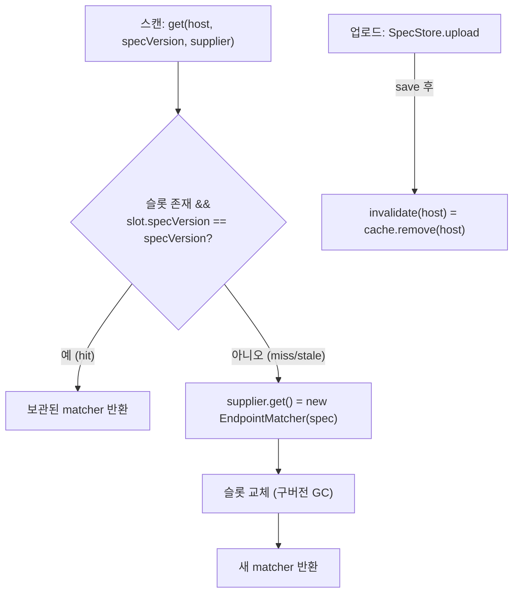

# EndpointMatcher 캐시 무효화 (설계)

> 매 스캔마다 재생성하던 `EndpointMatcher`(매칭 규칙 인덱스)를 (host, specVersion) 키로 캐시. 참고 패턴 = `EffectiveClassificationResolver`([11](11-classification-rest-api.md) §3 캐시). 근거 결정은 [DECISIONS](DECISIONS.md) **D22**.
> 연계: [03-spec-formats-and-canonical-model](03-spec-formats-and-canonical-model.md) §7.3·§7.5, [26-multi-spec-merge](26-multi-spec-merge.md) §8(합성 specVersion).
> **범위 밖**: 멀티 인스턴스 cross-instance 무효화(HA, 후속 — [11](11-classification-rest-api.md) §3 한계와 동일).

**구현 위치**

| 대상 | 소스 |
|---|---|
| 캐시 컴포넌트 | `match/EndpointMatcherCache.get()` / `invalidate()` / `invalidateAll()` |
| 무효화 호출(writer) | `spec/SpecStore.upload()` → `matcherCache.invalidate(host)` |
| 획득(소비자) | `batch/DiscoveryJobService.analyze()` → `matcherCache.get(host, specVersion, supplier)` |

## 0. 설계 당시 현 상태

- `EndpointMatcher`: 생성자에서 `final index` 1회 빌드, `match()` read-only → **불변·스레드 안전**.
- 설계 당시 `DiscoveryJobService.analyze` 는 매 스캔 `new EndpointMatcher(spec)` 를 재생성했다. matcher 는 `buildWithLimits`+`classifyWithMetrics` 에 동일 인스턴스로 재사용된다.
- `SpecStore.upload` 에 `(host, specVersion)` evict 가 TODO 였다(doc/03 §7.3/§7.5). 스캔은 항상 active 버전만 사용.
- **specVersion 의미 변화**: 설계 당시엔 per-record 단조 버전(스펙 부재→0)이었으나, 멀티 스펙 병합 이후 **merged canonical 콘텐츠 해시**(`SpecStore.syntheticVersion()`, 무스펙=0)로 바뀌었다([26](26-multi-spec-merge.md) §8). 동일 콘텐츠=동일 버전이라 캐시 키로 그대로 유효하다.

## 1. 캐시 컴포넌트 — 키 (host, specVersion), host당 단일 슬롯

신규 `match/EndpointMatcherCache`(@Component).

```text
ConcurrentHashMap<String, VersionedMatcher>   // host → (specVersion, matcher)  ※ host당 1슬롯
record VersionedMatcher(long specVersion, EndpointMatcher matcher)

EndpointMatcher get(String host, long specVersion, Supplier<EndpointMatcher> build)
void invalidate(String host)      // cache.remove(host)
void invalidateAll()              // cache.clear() (대칭/테스트용)
```



- **get**: `compute(host, (h,cur) -> (cur!=null && cur.specVersion==specVersion) ? cur : new VersionedMatcher(specVersion, build.get()))` → `.matcher()`.
- **키 (host, specVersion) 인데 host당 1슬롯인 이유**: 스캔은 항상 **active 버전만** 조회 → 구버전 matcher 보관은 낭비.
  새 버전이 슬롯을 덮어써(구 matcher GC) **누수 없음** + version 필드로 **stale 슬롯 서빙 불가**(mismatch→재빌드). doc/03 §7.5 의 린 실현.
- **권장 근거(vs host-only)**: host-only 는 evict 호출에 정합성 전적 의존(잊으면 stale). (host,specVersion) 는 **구조적으로 stale 불가**
  (버전이 키의 일부) → evict 누락에도 안전. EffectiveClassificationResolver 가 host-only 인 건 분류설정에 단조 버전이 없어서고,
  **스펙은 specVersion 이 있으니 활용**(두 캐시 키 차이는 이 이유로 정당).
- **불변·동시성**: EndpointMatcher 불변 → 슬롯 공유·동시 read 안전. `compute` 가 host 단위 원자.
- **poisoning-free**: build throw 시 `compute` 매핑 불변(미저장)→다음 호출 재시도. (실제 EndpointMatcher 생성자는 throw 안 함 — 정적 세그먼트 `Pattern.quote`.)

## 2. 무효화 연결 + 의존 방향 (순환 회피)

- `SpecStore.upload` 가 save 후 **`matcherCache.invalidate(host)`** 호출.
  의미: (host,specVersion) 키라 새 버전은 자동 miss 지만, 업로드 즉시 구버전 슬롯 메모리 해제 + 의도 명시.
- **의존 방향**: `SpecStore → EndpointMatcherCache`(invalidate), `DiscoveryJobService → EndpointMatcherCache`(get). **캐시는 무의존**(ConcurrentHashMap 뿐).
- **순환 회피 핵심**: 캐시는 스펙을 스스로 로드하지 않는다 — `get(host, specVersion, Supplier<EndpointMatcher>)` 의 **build supplier 를 호출측이 제공**
  (`DiscoveryJobService` 가 `() -> new EndpointMatcher(spec)`). 따라서 캐시→SpecStore 의존 없음 → SpecStore↔캐시 순환 불가.
  (EffectiveClassificationResolver 와 동일 원칙: 무효화는 writer 가 호출, 빌드는 소비자가 공급.)

## 3. 획득 경로 (DiscoveryJobService)

`analyze` 의 matcher 획득 한 줄.

```text
// before
EndpointMatcher matcher = new EndpointMatcher(spec);
// after
EndpointMatcher matcher = matcherCache.get(host, specVersion, () -> new EndpointMatcher(spec));
```

- `spec`·`specVersion`(§0 의 합성 콘텐츠 해시) 그대로 활용. supplier 가 `spec` 캡처.
- **specVersion=0(스펙 없음)**: 빈 matcher 를 version 0 으로 캐시(특별분기 없음, 균일). 업로드(→v1) 시 invalidate + 0≠1 자동 재빌드.
- matcher 는 inventory+classify 에 동일 인스턴스로 두 번 사용(현행 유지).
- **in-flight 스냅샷**: 스캔이 v1 인스턴스를 로컬로 쥔 뒤 업로드가 v2 로 evict 해도 그 스캔은 v1(로드 시점)로 일관 완료, 다음 스캔이 v2.
  matcher 불변이라 torn 없음.

## 4. 무회귀

- 동일 spec → 동일 EndpointMatcher 동작 → 동일 findings/리포트/ETag. 캐시는 **재생성만 제거**(동작 불변).
- `EffectiveClassificationResolver` 와 일관 패턴(ConcurrentHashMap·writer 무효화·poisoning-free·불변 공유·HA 한계 문서화).
- 생성자 의존 추가: `SpecStore`·`DiscoveryJobService` 에 `EndpointMatcherCache` 주입 → 두 서비스의 **수동 생성 테스트** 인자 추가(가산적).
  직접 `new EndpointMatcher` 하는 테스트/타 경로는 무영향(캐시는 스캔 경로만 경유).

## 5. 범위 밖 / 후속

- 멀티 인스턴스 cross-instance 무효화(HA, ShedLock 도입 시 — doc/11 §3 한계와 동일).
