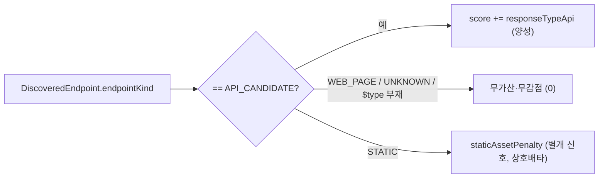

# response_type_api 양성 가중치 (설계)

> `$type`(브라우저 요청 타입) 기반 API성 신호를 ApiScorer 의 **14번째 가중치** `responseTypeApi` 로 추가. doc/08 §9 보류 항목을 **양성-only 비대칭(가산만·감점 없음) + 보수적 집합**으로 활성화한다.
> 보류 사유($type taxonomy 불확실, §8 발견1: document 가 JSON API 에도 붙음)를 이 비대칭으로 해소. 근거 [DECISIONS](DECISIONS.md) **D24**.
> 연계: [08-api-scoring-and-profiles](08-api-scoring-and-profiles.md) §4·§8·§9, [02-log-parsing-and-normalization](02-log-parsing-and-normalization.md) §5, [10-classification-config-store](10-classification-config-store.md) §2.

**구현 위치**

| 대상 | 소스 |
|---|---|
| $type → EndpointKind | `classify/EndpointKindClassifier`(dominant $type ∈ API_TYPES → API_CANDIDATE) |
| 신호 보유 | `model/DiscoveredEndpoint.endpointKind` |
| 가중치·프리셋·검증 | `classify/ApiScorer.Weights.responseTypeApi` / `WEIGHT_KEYS` / `applyOverrides()` |
| 가산 | `classify/ApiScorer.score()` — `endpointKind==API_CANDIDATE` 일 때만 양성 |

## 0. 결정적 발견 — 신호가 이미 존재

`EndpointKindClassifier`(doc/02 §5.0): dominant $type ∈ `{xhr, fetch, json, api, ajax}`(`API_TYPES`) → `EndpointKind.API_CANDIDATE`
(confidence=typeFraction). `$type=document→WEB_PAGE`, `library→STATIC`, 부재/그외→UNKNOWN.
- **`DiscoveredEndpoint.endpointKind` 가 이미 API성 $type 신호를 보유** → **신규 필드/플래그/Acc 변경 불필요.** 신호 = `endpointKind == API_CANDIDATE`.
- 집계(다수결 vs any)도 이미 해결: EndpointKindClassifier 가 **dominant(plurality) $type** 로 판정 → 보수적(API-ish 가 최다일 때만). 별도 집계 불요.

## 1. API성 집합 — 기존 API_CANDIDATE 재사용 (보수적 충분)

**xhr/json 만으로 좁히지 않고 기존 API_TYPES(5값) 재사용.** 근거:
- 5값(xhr/fetch/json/api/ajax) **모두 정당한 API 신호** — `document` 트랩(§8: JSON API 에도 붙음)과 달리 비-API 응답에 붙는 역위험 낮음
  (fetch/xhr/ajax=데이터 호출, json=JSON 응답, api=명시).
- API_CANDIDATE 가 이미 이 집합 인코딩 → 별도 신호 신설 시 EndpointKind 와 불일치·새 필드 비용. 재사용이 DRY·일관.
- 집합 자체는 `EndpointKindClassifier`(= TASKS "$type 전체 taxonomy 샘플링" 항목 소관)가 governs. ApiScorer 는 API_CANDIDATE 만 소비 → taxonomy 정제 시 자동 수혜.
- (대안=xhr/json-only 별도 boolean: 한계효용 작고 불일치 유발 → 미채택.)

## 2. 비대칭 (양성-only) + 충돌 없음

- `endpointKind == API_CANDIDATE` → score += `responseTypeApi`(양성). **그 외(WEB_PAGE/UNKNOWN/STATIC·$type 부재) 무가산·무감점.**
- `document→WEB_PAGE`·부재→UNKNOWN 은 신호 미발화 = 0 (penalty 아님). §8/§9 비대칭 원칙 충족.
- **staticAssetPenalty 와 충돌 없음**: kind 는 정확히 1값(STATIC ⊕ WEB_PAGE ⊕ API_CANDIDATE ⊕ UNKNOWN) → responseTypeApi(API_CANDIDATE)와
  staticAssetPenalty(STATIC)는 **상호배타**, 동시 발화 불가.
- path 신호와의 동시 발화(예 `/api/x` + $type=json → apiSegment + responseTypeApi)는 **의도된 독립 증거 가산**(경로+응답타입), 충돌 아님.
- score 연결 위치: **양 모드(pathless/explicit-hint) 공통** 섹션(응답타입은 path 신호 아님). staticAssetPenalty 와 같은 공통 구간에 추가.

## 3. Weights 확장 — 전수 터치포인트 (모두 ApiScorer 내부로 캡슐화)

14번째 override 가능 double `responseTypeApi` 추가. funnel 구조 덕에 변경은 **ApiScorer 1파일 + 테스트로 한정**.

| 터치포인트 | 변경 |
|---|---|
| `ApiScorer.Weights` record | `responseTypeApi` 필드 추가(위치: `pathHint` 뒤·`threshold` 앞) |
| `MIDDLE/HIGH/LOW` presets | 값 추가 — **MIDDLE 0.25 / HIGH 0.18 / LOW 0.32**(1차값, §9 "보정 전 임의값" 캐비엇, customWeights 튜닝 가능) |
| `WEIGHT_KEYS` Set | `"responseTypeApi"` 추가(13→14, doc/10 §2 단일 명명원) |
| `applyOverrides` | `ov(overrides, "responseTypeApi", base.responseTypeApi())` 추가 |
| `score()` | `if (d.endpointKind()==API_CANDIDATE) s += w.responseTypeApi();` (공통 섹션) |
| **무변경 확인** | `EffectiveClassificationResolver`(presetWeights/applyOverrides 경유, 필드 비열거), `ClassificationDtos`(Weights record 재사용→JSON 자동), `ClassificationController`(검증 WEIGHT_KEYS 경유→customWeights 키 자동 수용), `EndpointKindClassifier`/`DiscoveredEndpoint`/`InventoryBuilder`(신호 재사용) |

→ REST `PUT /classification` 의 customWeights 가 `responseTypeApi` 를 **컨트롤러 변경 없이** 수용(WEIGHT_KEYS 검증). effective 노출도 record 재사용으로 자동.

## 4. 무회귀

- **비-API endpoint(endpointKind ≠ API_CANDIDATE) 무변경** — 신호 미발화 → score 동일. 대다수 무회귀.
- **API_CANDIDATE endpoint 는 api_confidence 상승**(의도된 효과 — 보류 해제 목적). 게이트 통과 가능성↑.
- 기존 ApiScorerTest 영향: UNKNOWN/STATIC 케이스 무영향. API_CANDIDATE 케이스만 점수 상승 — `scoreClampsToUpperBound`(API_CANDIDATE+전신호+cors)는
  이미 1.0 clamp 라 여전히 통과. exact-score 단언이 있는 API_CANDIDATE 테스트만 갱신(대부분 UNKNOWN 사용이라 소수).
- preset/CUSTOM 모두 기본값에 responseTypeApi 포함 → 운영자 무설정 시 기본 적용, 비-API 무영향.

## 5. 범위 밖 / 후속

- `$type` 전체 taxonomy 샘플링 확정(별도 항목, API_TYPES 정제 시 responseTypeApi 자동 수혜 — [21-type-taxonomy-sampling](21-type-taxonomy-sampling.md)).
- responseTypeApi 가중치 **실데이터 보정**(§8 패턴). 중앙 API 튜닝은 이미 customWeights 로 가능.
