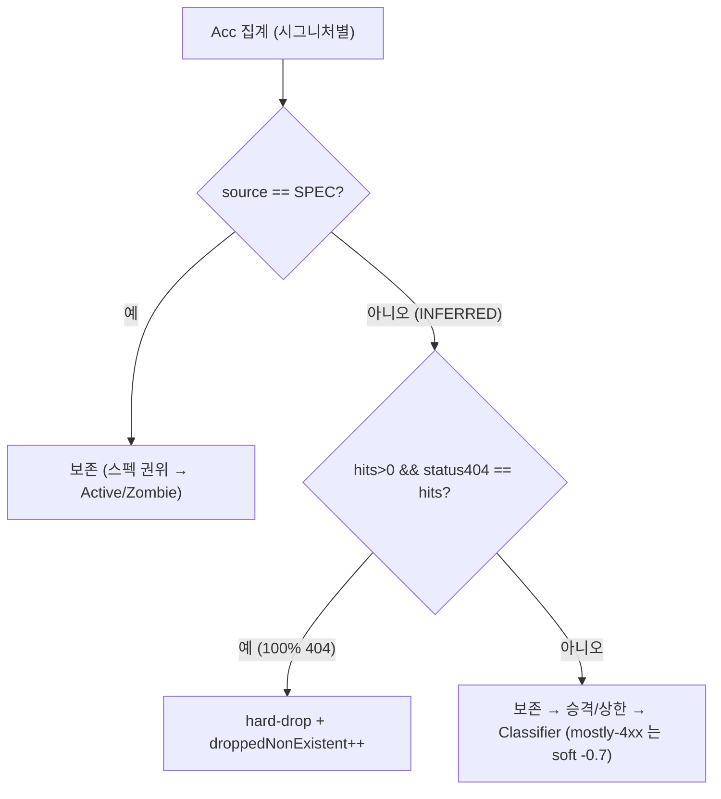

# 실재성 404-only 필터 (인벤토리 단계) — 설계

> 전 요청이 404 인 INFERRED 시그니처(스캐너 탐침)를 인벤토리에서 hard-drop 한다. 근거 [02-log-parsing-and-normalization](02-log-parsing-and-normalization.md) §4(거의 전부 404 → 비실재)·[04-matching-and-classification](04-matching-and-classification.md) §4.1(mostly-4xx soft -0.7)·§7(실재성 필터), 결정 [DECISIONS](DECISIONS.md) **D27**.
> 연계: [12-non-api-dropped-metric](12-non-api-dropped-metric.md)(형제 dropped 노출 패턴), [13-normalization-cardinality](13-normalization-cardinality.md)(승격/상한).

**구현 위치**

| 대상 | 소스 |
|---|---|
| 404 카운터·판정 | `normalize/Acc.status404` / `isNonExistent()`(hits>0 && status404==hits) |
| 필터 적용 | `normalize/InventoryBuilder.buildWithLimits()`(승격/상한 전, `source==INFERRED` 만) |
| 노출 | `model/DroppedNonExistent(notFound)` → `DiscoveryReport` top-level |

## 0. 설계 당시 현 상태

- `Acc.statusBuckets[4]`=2xx/3xx/4xx/5xx **통합**(404 별도 카운트 없음). `source`=SPEC/INFERRED(정규화 시 부여).
- `InventoryBuilder.buildWithLimits`: Acc 집계 → `CardinalityNormalizer`(T1 승격+host 상한) → param/kind → 방출.
- `Classifier.shadowConfidence`: `4xx/total ≥ 0.9 → -0.7`(soft, 저신뢰 Shadow). **이미 존재.**

## 1. '비실재' 정의 — 404-only hard-drop (보수적) vs mostly-4xx soft (기존)

| 메커니즘 | 조건 | 동작 | 위치 |
|---|---|---|---|
| **hard-drop (신규)** | `hits>0 AND status404==hits` (= 전 요청이 404, 따라서 2xx/3xx/5xx·비-404 4xx 전무) | 인벤토리에서 **제외** | InventoryBuilder |
| **soft penalty (기존)** | `4xx/total ≥ 0.9` (100%-404 아님) | Shadow 신뢰도 **-0.7**(low_confidence) | Classifier |

- **404-specific 인 이유(401/403 보호)**: `statusBuckets[2]` 는 4xx 통합 → 그대로 쓰면 **401/403-only(인증벽 뒤 실재 endpoint)**까지 drop → 보안 미탐.
  → `Acc` 에 **`status404` 전용 카운터** 추가, `status404==hits`(정확히 404 100%)만 hard-drop. 401/403/405 섞이면 `status404<hits` → 보존. doc/02 "404" 표현 정합.
- **100%(보수적) 인 이유**: 2xx/3xx/5xx 하나라도 = 라우트 실재 신호(doc/02 §4) → 보존. 100% 404 만 명백한 비실재(스캐너 탐침). "거의(90%)"는 soft 가 처리(보고+저신뢰).

## 2. 적용 위치 — InventoryBuilder, 승격/상한 전, spec 보호

```text
Acc 집계 → ★404-only 필터(INFERRED only)★ → CardinalityNormalizer(승격+상한) → param/kind → 방출
```



- **spec 매칭 보호**: 필터 대상 = **`source==INFERRED` 만**. `TemplateSource.SPEC`(spec 매칭됨)은 제외 안 함(스펙 권위).
  정규화 시점에 SPEC/INFERRED 가 부여되므로 "매칭 전 단계"여도 구분 가능(matcher 주입됨). 문서화된 endpoint 가 404-only 면 observed→Active 유지(미배포 경고는 별도 항목, 범위 밖).
- **승격/상한 전에 두는 이유**: 404-only 스캐너 noise 가 host template 상한(5000) 예산을 먹어 정상 template 를 밀어내지 않게 noise 를 가장 먼저 제거.
  **병합 대상이 모두 404-only 인 클러스터**는 승격 전 개별 제거 = 승격 후 제거와 동치(404-only 는 단조). **혼합 클러스터(404-only 형제 + 비-404 형제)**에서는 승격 전 제거가
  비실재 noise 를 승격 template 통계(distinct/카디널리티)에서 **배제하는 의도된 동작**이다(전후 '동치'는 아니지만, noise 를 stats 에서 빼는 것이 더 정확).
- `Acc.isNonExistent()`(hits>0 && status404==hits) 캡슐화, InventoryBuilder 가 `source==INFERRED && acc.isNonExistent()` 면 skip + 카운트.

## 3. 기존 soft -0.7 과의 관계 — 역할 분리, 충돌 없음

- hard-drop 조건(404==hits, **100%**) ⊂ soft 조건(4xx/total≥0.9, **90%**). hard-drop 이 인벤토리에서 먼저 제거 → 해당 시그니처는 Classifier 에 **도달 안 함** → soft 와 **중복 적용 없음**.
- Classifier 에 남는 soft 대상 = "mostly-4xx 인데 100%-404 는 아닌" 회색지대(2xx/3xx/5xx 일부 또는 401/403 포함) → 저신뢰 Shadow 로 **보고**.
- 우선순위: **hard-drop(가장 보수적·명백) → 통과분에 soft.** 서로 독립적(별개 축).

## 4. 노출/메트릭 (린) — DroppedNonExistent

- 비실재 drop 을 **노출**(단순 제외 아님). 근거: 보안 도구라 "N개 탐침 경로가 비실재로 제외됨"은 운영자 가시성 가치(doc/12 `DroppedNonApi` 동일 취지), reportJson 에 실려 신규 전송 0.
- 게이트 탈락(DroppedNonApi)·카디널리티 상한(DroppedByLimit)과 성격이 달라(인벤토리 실재성) **신규 형제 필드**: `model/DroppedNonExistent(int notFound)`
  → `DiscoveryReport` top-level(항상 non-null). 형제 record 패턴 일관.
- **ETag**: 입력에 `droppedNonExistent` 추가(콘텐츠 일관, doc/12 패턴).
- `discovered`(보고 count)는 필터 후 집합 기준이라 자동 감소. 불변식: 원관측(non-OPTIONS) = discovered + droppedNonExistent(+ 게이트 단계 dropped).

## 5. 무회귀

- 2xx/3xx/5xx 하나라도 있거나 404≠100% → `status404<hits` → **보존**(현행 동일).
- 401/403/405-only → 404 아님 → 보존.
- spec 매칭(SPEC) → 필터 비대상 → 보존(Active/Zombie 현행).
- mostly-4xx(≠100%) → 보존 → Classifier soft -0.7 그대로.
- 기존 테스트: `ClassifierTest`(DiscoveredEndpoint 직접 생성)는 인벤토리 필터 미경유 → 무영향(soft -0.7 유지). `InventoryBuilderTest` 에 INFERRED 404-only 케이스 있으면 drop → dev 확인·갱신.

## 6. 범위 밖

- "문서화됐는데 404-only = 미배포" 경고(spec 매칭분, 별도 신호).
- 401/403 세분(버킷 4xx 통합 → 현재 404 만 별도). 필요 시 status 세분 후속.
