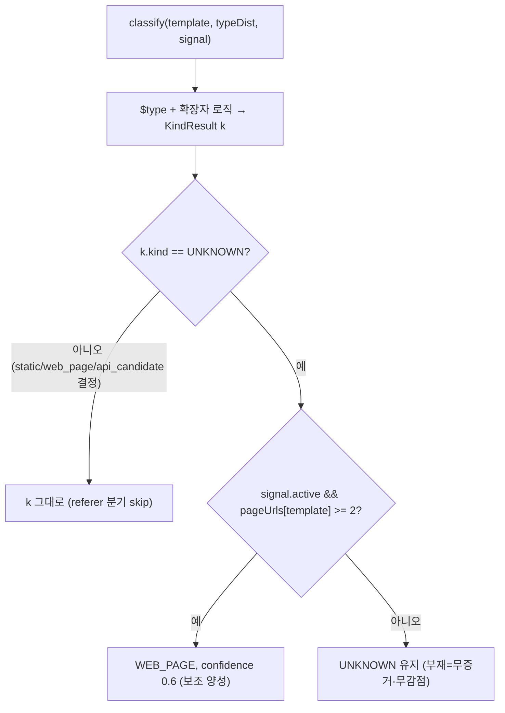

# endpoint_kind referer 보조 신호 — 설계

> 정적 자원의 부모 페이지(referer)를 corpus 에서 모아, `$type` 으로 판정 안 된 UNKNOWN endpoint 를 **WEB_PAGE 로 보조 양성** 분류한다(비대칭 — 부재 시 무감점). 근거 [02-log-parsing-and-normalization](02-log-parsing-and-normalization.md) §5.1(비대칭)·§5.2(PAGE_URLS)·§5.3(절차)·§5.4(게이트·노출), 결정 [DECISIONS](DECISIONS.md) **D29**.
> 연계: [17-response-type-api](17-response-type-api.md)(responseTypeApi 와 배타), [04-matching-and-classification](04-matching-and-classification.md) §4.1(WEB_PAGE Shadow 제외).

**구현 위치**

| 대상 | 소스 |
|---|---|
| corpus pre-pass | `normalize/RefererSignalExtractor.build(requests)` → `model/RefererSignal`(status·pageUrls·ratios) |
| 커버리지 게이트 | `RefererSignalExtractor`(static_ratio≥0.05 && referer_present≥0.20 → ACTIVE, 아니면 DORMANT) |
| 분류 통합 | `normalize/EndpointKindClassifier.classify(template, typeDist, RefererSignal)`(UNKNOWN+active+자식≥2 → WEB_PAGE 0.6) |
| 노출 | `model/EndpointKindSignal(status, staticRatio, refererPresentRatio)` → `DiscoveryReport` top-level |

## 0. 설계 당시 현 상태

- `EndpointKindClassifier.classify(pathTemplate, typeDist)`: 확장자 static → `$type=library` static → `document` web_page → API_TYPES api_candidate → **UNKNOWN**. referer 미사용.
- `Acc` 는 referer 미수집. `ParsedRequest.referer`(필드13, nullable) 존재.
- `InventoryBuilder.buildWithLimits(requests, matcher)` — **requests 보유 → corpus pre-pass 가능**. kind classify 는 방출 루프(`classify(acc.template(), acc.typeDist())`).
- `DiscoveryReport` 메타(droppedNonApi/byLimit/nonExistent) 전부 `.NONE` 폴백 record 패턴. `ReportBuilder.build` 8인자.

## 1. PAGE_URLS 구축 (§5.2/§5.3) — corpus pre-pass

HTML 페이지가 css/js/img 의 부모(referer). **정적 요청의 referer = 부모 페이지 URL**.
- **위치**: `buildWithLimits` 시작 시 신규 `RefererSignalExtractor.build(requests)` 1회. corpus 횡단 신호라 Acc(시그니처별)엔 부적합 → Acc 무변경.
- **절차**: requests 중 **static 요청**(확장자 또는 `$type=library`)의 `referer` → **path 부분만 추출 + `PathNormalizer.inferTemplate` 정규화**
  (endpoint pathTemplate 과 동일 정규화 → 매칭 가능) → `PAGE_URLS = Map<정규화template, childCount>`.
  - static 판정은 `EndpointKindClassifier.isStaticPath()` public 노출 재사용(DRY).
  - referer host 무시(path 만, doc §5.3), query 제거.

## 2. 커버리지 게이트 (§5.4) — dormant

환경이 이 신호를 줄 수 있는지 먼저 측정(잘못된 신호 방지).
- `static_ratio` = static 요청수/전체, `referer_present_ratio` = referer 비어있지 않은(`-`/null 아님) 비율.
- **`static_ratio ≥ 0.05 AND referer_present_ratio ≥ 0.20` → ACTIVE, 아니면 DORMANT**(전 endpoint 현행 UNKNOWN, referer 분기 skip). 1차값·캐비엇.
- **근거**: 정적 자원이 프록시를 안 타거나(api 호스트) referer 가 대부분 빈 환경에선 부모-자식 신호 무의미 → dormant.
  **실 Loki 검증 환경(정적 미경유)은 dormant → 무영향(무회귀 핵심).**

## 3. EndpointKindClassifier 통합 — $type 우선, UNKNOWN 일 때만 보조 양성

```text
classify(pathTemplate, typeDist, RefererSignal s):
  KindResult k = <기존 $type+확장자 로직>
  if k.kind == UNKNOWN && s.active && s.pageUrls.get(pathTemplate) >= minChildHits(2):
      return WEB_PAGE, confidence 0.6   // 보조 양성
  return k                               // 그 외 전부 현행
```



- **$type 결정 우선**: static/web_page/api_candidate 로 이미 결정되면 referer 분기 안 탐(doc 명시).
- **비대칭 양성(§5.1)**: PAGE_URLS 에 있으면 WEB_PAGE 가점, **없으면 UNKNOWN 유지(감점·api 단정 없음)**. 부재=무증거.
- **인터페이스 최소 변경**: 3-arg 신규 + **2-arg 오버로드(→`RefererSignal.dormant()` 위임)** 하위호환 → 기존 `EndpointKindClassifierTest` 무영향.
- confidence 0.6 고정(보조 신호 중간, 1차값). PAGE_URLS 임계 `minChildHits ≥ 2`(정적 자식 2개 이상의 부모 = 페이지 확정).

## 4. (선택·약) api_candidate 약가점 — 범위 밖(미채택)

§5.3 step4 "non-browser UA + referer 부재 지속 → api_candidate 약가점"은 **이번 범위 제외**.
- ① non-browser UA 는 이미 `ApiScorer.nonBrowserUa` 가중치로 직접 반영(중복). ② referer **부재**를 양성 근거로 쓰는 건 §5.1 비대칭(부재=무증거)과 결 충돌 → false precision.
- 이번 작업은 **referer 존재→web_page 양성**만. api_candidate 약신호는 후속/미채택.

## 5. 노출 (§5.4) — EndpointKindSignal

- `RefererSignal`(내부 corpus: status/pageUrls/ratios, classify 입력)에서 노출용 `model/EndpointKindSignal(SignalStatus status, double staticRatio, double refererPresentRatio)`
  파생(pageUrls 비노출). `DiscoveryReport` top-level(항상 non-null, `.NONE`=DORMANT/0). 형제 패턴(DroppedNonApi 등).
- **ETag**: 입력에 `endpointKindSignal` 추가(ratios round3, 콘텐츠 일관 doc/12 패턴). WEB_PAGE 분류 변화는 findings(WebPage)로도 자동 반영.

## 6. 무회귀 / 상호작용

- **$type 결정 케이스**(document/library/json 등) → referer 분기 안 탐 → 무변경.
- **DORMANT 환경**(실 Loki api 호스트 등 정적 미경유/referer 부재) → 전 endpoint 현행 UNKNOWN → **무회귀**.
- **doc/17 responseTypeApi 충돌 없음**: referer 보조는 **UNKNOWN 일 때만**. API_CANDIDATE($type=json 등)는 이미 결정돼 분기 안 탐 → responseTypeApi 그대로.
  UNKNOWN→WEB_PAGE 전환은 원래 responseTypeApi 안 받던 케이스(WEB_PAGE⊕API_CANDIDATE 배타) → 손실 없음.
- **doc/09 web-form drop 일관**: WEB_PAGE 정확도↑ → write-to-WEB_PAGE 폼 억제 정확도↑(의도). referer WEB_PAGE 는 GET 페이지 위주라 write 와 겹침 적음.
- **Classifier**: WEB_PAGE 미문서 → Shadow 제외(doc/04 §4.1) → Shadow 오탐 감소(정확도 개선).
- 기존 테스트: `EndpointKindClassifierTest`(2-arg) 오버로드로 무영향. `InventoryBuilderTest` 는 dormant 기본 → 대체로 무영향, 영향 시 dev 갱신.

## 7. 범위 밖 / 후속

- api_candidate 약가점(non-browser UA + referer 부재) — §4 사유로 미채택.
- referer 동적 임계 중앙 API 튜닝(현재 코드 상수, seam=`@ConfigurationProperties`).
