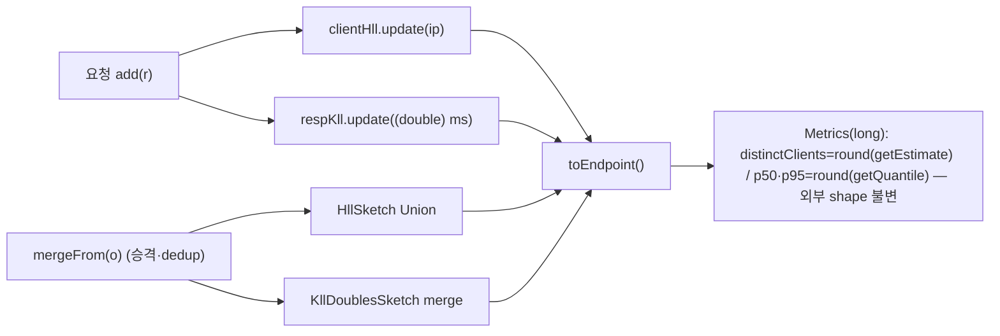

# distinct/분위수 대용량 근사 (HLL/KLL) — 설계

> `Acc` 의 정확 자료구조(client IP HashSet·응답시간 ArrayList)를 **고정 크기 sketch**(HLL distinct·KLL 분위수)로 교체해 per-signature 메모리를 bound 한다. 근거 [02-log-parsing-and-normalization](02-log-parsing-and-normalization.md) §4·[13-normalization-cardinality](13-normalization-cardinality.md)(D20)·D8(DataSketches), 결정 [DECISIONS](DECISIONS.md) **D31**.

**구현 위치**

| 대상 | 소스 |
|---|---|
| distinct 근사 | `normalize/Acc.clientHll`(`HllSketch` lgK=12) + 병합 `hll.Union` |
| 분위수 근사 | `normalize/Acc.respKll`(`KllDoublesSketch` k=200) + `merge` |
| 추출 | `Acc.toEndpoint()` → `Math.round(clientHll.getEstimate())` / `respKll.getQuantile(.5/.95, INCLUSIVE)` |
| 소비 | `classify/Classifier.shadowConfidence`(distinctClients `<=1`, HLL small-N exact) |

## 0. 현 상태 / 문제

- `Acc` 가 시그니처별로 **정확 자료구조 2개**를 보유.
  - `clients = HashSet<String>` → `distinctClients = clients.size()`. 메모리 **O(distinct client IP)**.
  - `respTimes = ArrayList<Long>` → `percentile()`(sort + nearest-rank). 메모리 **O(hits)** — 요청마다 1 long 적재, **실질 스케일 병목**(1M hits ≈ 8MB/시그니처).
- `Acc.toEndpoint()` 는 이 둘로 `DiscoveredEndpoint.Metrics(distinctClients, p50RespMs, p95RespMs)`(전부 `long`)를 산출.
- **라이브러리 이미 확보**: `datasketches-java:6.1.1` 이 build.gradle 에 존재(주석 "HLL distinct + KLL 분위수"), `Metrics.distinctClients // 근사(HLL)`·Acc `TODO: distinctClients=HLL, 분위수=KLL` 로 의도 명시. **신규 의존성 0.**
- **소비처 전수**(grep): distinctClients → `Classifier.shadowConfidence`(`<=1`) 1곳뿐. percentile(p50/p95) → **소비처 0**(Metrics 정의 외 read 없음, 리포트·ETag 미노출). `Evidence`(severity)·`ApiScorer`·`CardinalityNormalizer` 는 **hits/statusDist/timestamp 만** 사용(근사 무관).

## 1. 라이브러리 — Apache DataSketches HLL + KLL (이미 의존성, t-digest 미채택)

- **distinct = `org.apache.datasketches.hll.HllSketch`**(lgK), 병합 = `hll.Union`. **분위수 = `org.apache.datasketches.kll.KllDoublesSketch`**(k), 병합 = `merge`.
- **t-digest 미채택**: 브랜치명의 "t-digest" 는 분위수 근사 일반 지칭. 실제는 **이미 들어온 DataSketches 의 KLL** 사용 — 신규 의존성 0, distinct·분위수 **한 라이브러리**로 통일, Apache-2.0·Java 21 순수자바·활발 유지보수. 별도 t-digest 라이브러리 추가는 D8/린 위배 → 미채택.
- **자체 구현 미채택**: HLL/분위수 sketch 정확성·병합 정합성은 검증 비용 큼 → 성숙 라이브러리 채택(D8).
- 크기(1차값, 코드 상수): HLL **lgK=12**(RSE≈1.6%, ~수 KB), KLL **k=200**(rank error≈1.65%, ~수 KB). 튜닝 seam = `@ConfigurationProperties`(NormalizationProperties), 이번은 상수(D12 정적 우선).

## 2. 정확↔근사 경계 — **전면 근사 채택**(hybrid 미채택)

작은 N 정확/임계초과 근사 전환(hybrid) 대신 **전면 근사**. 근거 — 근사가 **판정에 영향을 주는 경계가 사실상 없음**.
- **distinctClients `<=1`(유일 결정 경계, shadowConfidence)**: DataSketches HLL 은 **소 카디널리티 exact**(coupon/list 모드 — n=0/1/2 추정 정확). `Math.round(getEstimate())` → `<=1` 분기 **무오차**. ⇒ 근사 전환해도 이 경계 안전.
- **percentile**: 결정 미사용·미노출 → 정확도 비민감(보고 시에도 진단용).
- **CardinalityNormalizer `distinct`(승격 임계 distinct≥20 등)**: 이는 `statics.size()` = **클러스터 내 distinct 세그먼트 값 수(= Acc 멤버 수, 맵 엔트리 카운트)** 이지 `distinctClients` 가 **아님**. `clusterHits`·`ratio`·`convergence` 모두 `Acc.hits()`(정확 카운터) 기반. ⇒ **승격 임계는 근사와 무관**(정확 유지). *(과제 전제 #1 의 "근사가 distinct≥20 판정에 주는 오차"는 두 distinct 가 다른 양이라 비해당 — 명시 정정.)*
- 따라서 hybrid 의 모드전환 분기·`mergeFrom` 에서 exact↔sketch 전이 복잡도는 **한계효용 없음**. sketch 는 이미 고정 소크기, host template 상한(5000)이 시그니처 수를 bound → 전면 근사가 단순·충분.

## 3. 적용 범위 — `Acc.java` 한정 (surgical)

블라스트 반경 = **Acc 내부뿐**. `Metrics` 는 여전히 `long` 산출 → 외부 전부 불변.
- 필드: `HashSet clients` → `HllSketch hll`, `ArrayList respTimes` → `KllDoublesSketch kll`(+ `Union` 은 병합 시).
- `add(r)`: `clients.add(ip)`→`hll.update(ip)`(null skip), `respTimes.add(ms)`→`kll.update((double) ms)`.
- `mergeFrom(o)`: `clients.addAll`→HLL **union**, `respTimes.addAll`→KLL **merge**(§4).
- `toEndpoint()`: `clients.size()`→`Math.round(hll.getEstimate())`, `percentile(50/95)`→`Math.round(kll.getQuantile(0.5/0.95))`(빈 sketch→0 가드).
- **불변(무변경)**: `DiscoveredEndpoint.Metrics`(long shape) · `Classifier`(distinctClients/Evidence) · `CardinalityNormalizer`(new Acc/mergeFrom 캡슐화) · `InventoryBuilder` · 리포트 · 영속.

## 4. 병합 / 직렬화 / 메모리 가드

- **병합 정합성**: HLL union = 합집합 distinct(멤버 간 중복 client 제거 — HashSet.addAll 의미 보존), KLL merge = 결합 분포 분위수(ArrayList.addAll 의미의 근사). 승격(`promoteAtPosition`)·dedup(`dedupBySignature`)의 `mergeFrom` 의미 **무회귀**.
- **직렬화 = N/A**: sketch 는 **스캔 transient**(Acc 는 비영속). 결과는 `toEndpoint()` 에서 `long` 으로 추출 후 DiscoveredEndpoint→findings→reportJson 영속. **sketch 자체는 DB/JSON 직렬화 안 함** → 직렬화 복잡도 없음.
- **카디널리티 가드(doc/13 철학)**: sketch 는 **구성상 고정 크기**(lgK/k) → 시그니처당 메모리 상한이 내장(현 HashSet O(distinct)·ArrayList O(hits) 의 무한 성장 제거). 별도 cap 불요. (이것이 본 작업의 본질 — per-signature 메모리 bound.)

## 5. 노출 / ETag — churn 0

- **ETag 무영향**: 입력 = specVersion·summary·findings·dropped*·endpointKindSignal·typeDistribution.distinctKeys (DiscoveryJobService 확인). **distinctClients·percentile 둘 다 ETag 입력 아님** → 근사로 바뀌어도 **churn 0**.
- distinctClients 는 shadowConfidence(`<=1`, HLL-exact)로만 findings 에 간접 반영 → 경계 무오차라 findings/ETag 영향 없음.
- **percentile 은 ETag 금지(설계 불변식)**: KLL compaction 은 비결정 가능(병합 순서/랜덤) → ETag 입력화 시 매 스캔 churn. percentile 은 현행대로 **미노출**(추후 노출해도 리포트 body 진단용, **ETag 입력 금지**).

## 6. 무회귀 / 오차 허용 / 검증

- **무회귀**: distinctClients `<=1` 경계 HLL-exact → shadowConfidence 불변. percentile 미소비 → 관측가능 변화 0. normalizer 승격(statics.size/hits 정확)·severity(hits/2xx/span 정확) 불변. Metrics shape·외부 API 불변.
- **오차 허용**: HLL RSE≈1.6%(lgK=12), KLL rank error≈1.65%(k=200). 둘 다 **hard threshold 비입력**(distinctClients 경계는 exact 구간) → 허용.
- **검증 방법**: ① 정확도 — 알려진 스트림(예 distinct 10k, 응답분포)에 sketch vs 정확값 **허용오차 내**(HLL ±3%, KLL 분위수 rank 오차) 단언. ② 경계 — distinct clients 0/1/2 → HLL exact → `<=1` 분기 정확. ③ 병합 — 스트림 분할→union/merge 가 단일 스트림 추정과 근사 일치. ④ 회귀 — shadowConfidence/severity/normalizer 기존 테스트 green.
- **기존 테스트 영향**: `Acc`/`InventoryBuilder` 테스트 중 distinctClients·percentile **정확값 단언**은 (a) 소-N(정확) 케이스로 유지하거나 (b) 허용오차 단언으로 전환(dev). shadowConfidence `<=1` 테스트는 HLL-exact 라 그대로 유효.

## 7. 범위 밖 / 후속

- sketch 크기(lgK/k) `@ConfigurationProperties` 노출 — 이번 코드 상수, seam 만.
- percentile 리포트 노출(현재 computed-but-unexposed) — 원하면 body 진단용만(ETag 입력 금지). 별도 리포트 항목.
- distinctClients `<=1` 의 더 강한 보장이 필요해지면(미래 소비처) 캡 exact-set(size≤2) 마이크로옵션 — 현재 HLL small-N exact 로 충분, 미채택.
