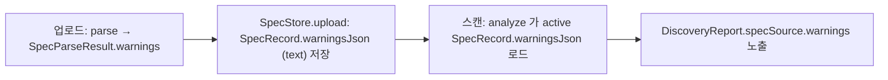

# 리포트/출력 보강 3항목 — 설계

> A·B·C 세 독립 보강 — (A) low_confidence 분리 + `spec_source.warnings`, (B) Active/Zombie param 후보, (C) scan-status `total_dropped`. 근거 [12-non-api-dropped-metric](12-non-api-dropped-metric.md)(dropped 메트릭)·[13-normalization-cardinality](13-normalization-cardinality.md)(ParamCandidates)·[14-spec-parsers](14-spec-parsers.md)(SpecParseResult seam)·[07-msa-and-central-integration](07-msa-and-central-integration.md) §8(ETag)·[21](21-type-taxonomy-sampling.md)·[24](24-cross-scan-recency-zombie-severity.md)(ETag 버킷화 선례). 결정 [DECISIONS](DECISIONS.md) **D34**.

**구현 위치**

| 대상 | 소스 |
|---|---|
| A: warnings seam | `spec/SpecParseResult(endpoints, warnings)` ← 3 파서, `SpecStore.upload` 영속 |
| A: spec_source 노출 | `model/SpecSource(specVersion, format, warnings, documents)` → `DiscoveryReport.specSource` |
| A: low_confidence | `model/Finding` Shadow/Zombie `@JsonProperty("low_confidence")`(confidence<0.5) + `Summary.lowConfidence` |
| B: param 노출 | `model/Finding.Active`/`Zombie` `+params`(편의 ctor) ← `classify/Evidence` query union + spec 템플릿 path |
| C: total_dropped | `domain/ScanResult.totalDropped`(`@Column(integer default 0)`) → `ScanStatusView` |

공통 원칙: **가산 노출(additive)·하위호환(편의 ctor)·무회귀**. ETag 는 **데이터 ts 만(now 불사용)·버킷/명칭집합 투영**(doc/21·24 선례)으로 churn 억제.

---

## A. low_confidence 분리 노출 + spec_source.warnings

### A.1 SpecParseResult seam — **신설**(doc/14 에서 deferred → 이 작업에서 구현)
- 설계 당시 `SpecParser.parse(byte[]) → List<CanonicalEndpoint>`, recoverable 경고(skip 행/item)는 **`log.warn` 만**(doc/14/D21 이 seam 만 명시·미구현).
- **신설(구현 완료)**: `spec/SpecParseResult(List<CanonicalEndpoint> endpoints, List<String> warnings)`. `SpecParser.parse → SpecParseResult`. 3 파서(OpenApi/Postman/Csv)가 기존 log.warn 메시지를 **warnings 에 수집**(로그도 유지). fatal 은 현행대로 예외(→400).
- 인터페이스 변경은 **내부 한정**(파서 ↔ SpecStore). 외부 REST 무변경. 기존 파서 테스트는 `.endpoints()` 로 소폭 갱신.

### A.2 warnings 전파·영속 (SpecParser→SpecStore→리포트)
경고는 **업로드(파싱) 시점** 생성, 리포트는 **스캔 시점** 생성 → 경고를 **spec 에 영속**해 스캔이 로드.

- `SpecRecord` +`@Column(columnDefinition="text") String warningsJson`(`List<String>` 직렬화). **`@Lob` 아님** — PG `oid` 함정 회피(doc/28 D40/D37). `SpecStore.upload` 가 `SpecParseResult.warnings` 저장(canonical 과 함께). 스캔 재파싱 없음(doc/10) → 영속 필수.
- 스캔(`DiscoveryJobService.analyze`)이 active `SpecRecord.warningsJson` 로드 → 리포트 `specSource.warnings`.
- 노출: `model/SpecSource(long specVersion, SpecFormat format, List<String> warnings, List<SpecDocument> documents)` → `DiscoveryReport` top-level `specSource`(항상 non-null, 무스펙=EMPTY). `documents`(문서별 메타)는 이후 멀티 스펙(doc/26 §4)에서 추가된 4번째 필드. 기존 top-level `specVersion` 은 **유지**(가산, 호환). 형제 패턴.

### A.3 low_confidence 노출 형태 — **파생 플래그 + 요약 카운트**(별도 섹션 아님)
- findings 는 이미 `confidence` 보유(Shadow·Zombie). **별도 리스트 분리 대신**: ① Shadow/Zombie 에 **파생** `@JsonProperty("low_confidence")` = `confidence < THRESHOLD`(단일 진실원=confidence, `Severity.band`·`Unused.preflightAmbiguous` 선례), ② `DiscoveryReport.Summary` +`lowConfidence` 카운트(at-a-glance). 
- **별도 섹션 미채택 이유**: findings 리스트 계약 불변(가산·하위호환), 소비자는 플래그로 필터(분리 가능). 리스트 재구성은 무회귀 리스크↑.
- `THRESHOLD = 0.5`(1차값·캐비엇, 보정 후속). 대상 = **Shadow·Zombie**(confidence 보유·actionable). Active/Unused(이진 spec 사실)·WebPage(kindConfidence)는 범위 밖.

### A.4 ETag (A)
- `specSource.warnings`: spec 버전당 **고정**(업로드 시 결정) → 신규 업로드=새 specVersion=기존 bump 에 편승. churn 0. ETag 입력에 `specSource`(또는 warnings) 포함(내용 충실, 안정).
- `low_confidence` 플래그: confidence 파생 → confidence 가 이미 findings/ETag 에 존재(Shadow confidence 의 hits 발 churn 은 **pre-existing**, 본 건이 악화 안 함). 요약 `lowConfidence` 카운트는 **임계 교차 시에만** 변동(연속 confidence 보다 coarse) → 추가 churn 미미.

---

## B. Active/Zombie finding 에 param 후보 노출 (doc/13 후속)

### B.1 Finding 구조 — Active/Zombie +params (편의 ctor)
- `Finding.Active(...,  ParamCandidates params)`·`Finding.Zombie(..., ParamCandidates params)` 가산. **편의 ctor**(params 생략→`ParamCandidates.EMPTY`)로 하위호환(doc/16 severity·doc/23 preflightAmbiguous 추가와 동형). 기존 호출/테스트 무변경.

### B.2 params 출처 — 관측(재사용) + spec 템플릿 path
- **관측 query 후보 = 기존 `ParamCandidates` 재사용**: 매칭된 `DiscoveredEndpoint.params`(InventoryBuilder 가 `ParamCandidateExtractor` 로 이미 생성, doc/13). 현재 1차 패스에서 매칭 시 **params 폐기** → `Evidence` 가 params 도 누적하도록 보강(여러 host d 가 한 spec 키에 합산 시 query 이름 union).
- **path 후보 = spec 템플릿 변수**(권위): 매칭 spec 의 `pathTemplate {var}` 세그먼트(Active/Zombie 는 spec 매칭이라 path param 이 추론 아닌 **spec 정의**).
- **한계 명시**: `CanonicalEndpoint` 는 **query param 정의 미보유**(doc/03: method/path/host/deprecated/version/sourceRef 뿐) → "spec param 정의" 는 **path 템플릿 변수 한정**, query 는 관측 기반. 스펙 query-param 정의 확장(canonical+파서)은 **범위 밖**(큰 변경).
- 일관성: Shadow 와 동일 `ParamCandidates`(privacy-preserving — 값 폐기·길이버킷·sensitive REDACTED, doc/13 §3). 비대칭(가산, 없으면 EMPTY).

### B.3 ETag (B) — params **명칭집합** 투영(doc/21·24 선례)
- params 의 `count`·`lenBuckets` 는 데이터 발(發) 변동(per-scan) → raw 포함 시 churn(현 Shadow.params 도 pre-existing churn).
- **doc/24 의 ETag findings-투영을 확장**: findings→ETag 투영에서 params 를 **정렬 query 이름집합 + path 토큰**(count/buckets 제외)으로 축약(doc/21 `distinctKeys` 동형). Shadow·Active·Zombie **균일 적용** → Active/Zombie 추가가 churn 안 늘리고 **기존 Shadow params churn 도 완화**. raw params(count 포함)는 body 유지.

---

## C. scan-status 요약에 total_dropped (doc/12 후속, 선택·낮음)

- 현재 사유별 상세(`droppedNonApi`/`droppedByLimit`/`droppedNonExistent`)는 `/result` 만. scan-status 에 **합계 1개**(at-a-glance).
- **비정규화 컬럼**: `ScanResult` +`int totalDropped`. `persist()` 에서 `= droppedNonApi.total + droppedByLimit.total + droppedNonExistent.notFound` 저장(reportJson 파싱 불필요). `ScanStatusView` +`totalDropped`(`r.totalDropped` 노출). ddl-auto 컬럼 추가 시 `@Column(columnDefinition="integer default 0")` 로 ALTER ADD COLUMN DEFAULT 0 → 기존 행 NULL 없이 0 백필(int primitive 안전).
- **중복 아님**: 사유별 상세(/result, ETag 입력)는 그대로, scan-status 는 비정규화 합계만(경량 메타 일관, doc/12 §3 "scan-status 경량 유지" 보완).
- **ETag 무영향**: scan-status 는 ETag 비대상(상태 메타). 합계 구성요소(dropped 3종)는 이미 /result ETag 입력 → 신규 ETag 입력 0. 최소 변경(선택·낮음).

---

## 공통 — 무회귀 / 하위호환

- 전부 **가산**: SpecSource/specSource·low_confidence(파생)·Summary.lowConfidence·Active/Zombie.params·ScanResult.totalDropped — 모두 신규/파생, 기존 필드 불변. 편의 ctor 로 기존 생성부 무변경.
- ddl-auto: `SpecRecord.warningsJson`·`ScanResult.totalDropped` 컬럼 자동 추가(기존 데이터 무영향, null/0 기본). doc/18 sync=technical_writer.
- ETag: 시간非의존(데이터 ts) + 버킷/명칭집합 투영(doc/21·24) → 신규 churn 없음. 무스펙/무params/무dropped 경로 = 현행 동일.
- 기존 테스트: 파서(`SpecParseResult.endpoints()`)·Finding 생성(편의 ctor→무변경)·ETag(투영 확장분) 갱신. findings 리스트/Summary 카운트 단언 가산 갱신.

## 범위 밖 / 후속

- 스펙 **query param 정의** 캐노니컬·파서 확장(현재 path 템플릿 한정) — 큰 변경, 별도 항목.
- low_confidence THRESHOLD·spec_source 포맷 상세 **실데이터 보정**(D24 보류 연계).
- Shadow confidence 등 연속 신호의 ETag 버킷화(pre-existing) — params 투영으로 일부 완화, 잔여는 별도.
- `spec_source.warnings` 의 구조화(코드/위치 등) — 현재 문자열 list(린).
