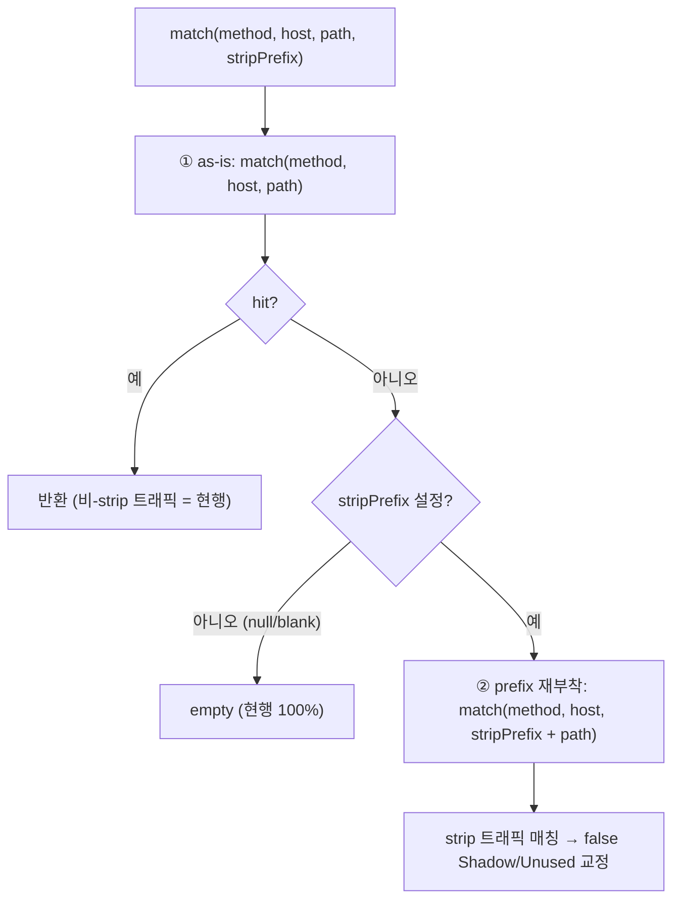

# base-path-strip — false Shadow 방지 (D37 F1 해소)

> 프록시가 로그에서 base prefix(예 `/v2`·`/api`)를 strip 하면 관측 경로 segCount 가 canonical 템플릿과 어긋나 false Shadow/Unused 가 난다. operator 가 선언한 prefix 를 **매칭 시점에 재부착**해 교정한다. 근거 [03](03-spec-formats-and-canonical-model.md) §2.1·§2.2(basePath 결합·strip 옵션)·[04](04-matching-and-classification.md) §7(엣지)·[15](15-matcher-cache.md)(매처캐시)·[26](26-multi-spec-merge.md)(멀티스펙·DomainConfig), 결정 [DECISIONS](DECISIONS.md) **D38**(D37 F1 갱신).

**구현 위치**

| 대상 | 소스 |
|---|---|
| 옵션 | `domain/DomainConfig.basePathStrip`(nullable, 기본 null=off) + `DomainController`/`DomainDtos` |
| at-match strip | `match/EndpointMatcher.match(method, host, path, stripPrefix)`(as-is 우선 → 미매칭 시 `stripPrefix+path` 재시도) |
| 주입 | `batch/DiscoveryJobService`·`batch/CombinedDiscoveryService` → `classify/Classifier.classifyWithMetrics(..., stripPrefix)` |

## 0. 문제

- `OpenApiSpecParser` 가 `servers[].url` 의 base path(예 `/v2`)를 각 path 에 **결합**(`joinPath(basePath, pathKey)`) → canonical 템플릿 = `/v2/users/{id}`.
- 프록시(게이트웨이)가 그 prefix 를 **strip** 한 뒤 로깅하면 관측 path = `/users/1` → segCount(2) ≠ 템플릿(3) → **매칭 실패**.
- 결과: 스펙 endpoint `/v2/users/{id}` 는 관측 안 됨 → **false Unused**, 관측 `/users/1` 는 스펙 미매칭 → **false Shadow**. (실제론 strip 된 동일 endpoint.)
- doc/03 §2.2 가 "base path 결합 정책 on/off(프록시 prefix strip 대응)"을 **명시했으나 미구현**(D37 F1).

## 1. 해결 방식 — (a) 옵션 구현 vs (b) 문서화만

- **권장 = (a) 구현**. 근거: false Shadow/Unused 는 **실 오분류**(게이트웨이가 `/api`·`/v2` 등 prefix 를 strip 하는 구성은 흔함). 스펙이 업로드된 도메인에서 매칭 정확도의 핵심 결함이라 한계 문서화로 끝낼 사안 아님. 수정 범위가 작고(옵션·match 분기) 기본 off 로 무회귀.
- (b)는 채택 안 함(실 오분류 방치). 단 (a)는 **기본 off**라 미설정 도메인은 (b)와 동일(현행).

## 2. 옵션 위치 / 형태 (권장)

- **권장 — `DomainConfig.basePathStrip`(String, nullable, 기본 null)**: 프록시가 관측 경로에서 제거한 base prefix(예 `/v2`, `/api`)를 operator 가 명시. `specMergeStrategy`(doc/26)와 동일 위치·패턴(per-domain 라우팅 정책, DomainController CRUD/DTO 가산=엔드포인트 0). ddl-auto 컬럼(기존 null→off).
  - **MatcherConfig 아님**: MatcherConfig 의 prefix 들은 ApiHintMatcher(게이트/스코어)용 — basePathStrip 은 **spec EndpointMatcher** 라우팅 정합용이라 계층이 다름. DomainConfig(도메인 라우팅 사실)가 맞다.
- **operator 명시 prefix (권장) vs basePath 자동 strip**:
  - 자동(스펙 basePath 자동 제거) 미채택 — ① 프록시 strip prefix ≠ 스펙 basePath 인 경우 못 맞춤(독립 사실), ② 멀티 server(여러 basePath) 모호, ③ 관측 비교 기반 auto-detect 는 fragile(오strip 위험).
  - operator 명시 = 결정적·일반적(프록시 구성자가 정확히 앎). 기본 null=off=무회귀.
- **doc/03 §2.2 의 "join on/off 토글" 대안과의 차이**: 토글(파싱 시 basePath 미결합)은 ① 설정 변경 시 **재파싱/재업로드 필요**, ② 스펙 자체 basePath 만 strip(임의 prefix 불가), ③ canonical SoT 가 basePath 정보 손실. → **at-match strip(아래 §3)**가 재파싱 불요·SoT 보존·더 일반적이라 우선. (doc/03 §2.2 목표는 동일, 메커니즘만 정제.)

## 3. 적용 지점 (권장) — at-match, additive prefix

canonical 은 **그대로**(basePath 결합 유지, SoT 보존). 매칭 시점에 strip prefix 를 **재부착해 추가 시도**.
```text
EndpointMatcher.match(method, host, path, stripPrefix):
   hit = match(method, host, path)                    // ① as-is (현행)
   if hit.isEmpty() && stripPrefix != null:
       hit = match(method, host, stripPrefix + path)   // ② prefix 재부착
   return hit
```


- **as-is 우선** → 비-strip 트래픽은 현행대로 매칭(무회귀·double-prefix 위험 없음). strip 트래픽만 ②에서 `/users/{id}`→`/v2/users/{id}` 로 매칭. **혼합 트래픽도 path 별로 둘 다 시도라 안전.**
- **연결**: `DiscoveryJobService`/`CombinedDiscoveryService` 가 `DomainConfig.basePathStrip` 로드 → `Classifier.classifyWithMetrics(..., stripPrefix)`(빈/null 오버로드 하위호환) → `matcher.match(..., stripPrefix)`. (discovered 의 pathTemplate 에 prefix 부착 — 템플릿 `/users/{id}`→`/v2/users/{id}` 가 canonical regex `^/v2/users/[^/]+$` 매칭, `{id}`⊂`[^/]+`.)
- **matcherCache(doc/15) 정합**: matcher 는 canonical 로 빌드(불변), stripPrefix 는 **match 호출 파라미터**(matcher 비포함) → 캐시 키(host,specVersion) 불변, basePathStrip 변경 시 **무효화 불요**(다음 스캔 match 가 새 prefix 사용).
- **멀티스펙(doc/26) 정합**: strip 은 도메인 레벨·merged canonical 매칭에 일괄 적용 → 모드 무관 자연 합성.
- **멀티 server(여러 basePath)**: 단일 String prefix=프록시가 strip 하는 1개 대응(공통). List 다중 prefix(각 시도)는 후속(§7).

## 4. 비대칭 / 무회귀

- 기본 null → ② 미발동 → **as-is 만 = 현행 100%**.
- 설정 시 **가산적**: ②는 매칭 시도를 *추가*만 함 → false Shadow→Active·false Unused→observed 로 **교정**, 기존 매칭 절대 안 깸(as-is 우선).
- 잘못된 prefix = operator 선언 오류(opt-in)로 한정 — 기본 off·명시 선언이라 시스템이 임의로 새 오판 안 만듦.

## 5. ETag / 노출

- canonical 불변(basePath 결합 유지) → `specVersion`/합성버전 **무변경**.
- strip 설정 시 findings 변화(false Shadow→Active 등) → 리포트 콘텐츠 변화 → ETag bump(정당). **결정적·시간非의존**(strip=정적 config, `now()` 무관) → 재스캔 동일(304 보존). basePathStrip 은 findings 에 반영되므로 ETag 입력 별도 추가 불요.
- (선택) discovery/리포트 메타에 `basePathStrip` 활성 여부 노출(traceability, endpoint_kind signal status 류) — 린, 후속 가능.

## 6. 범위 밖 / 후속

- **다중 strip prefix**(`List<String>`, 멀티 server 별 strip) — 단일 String 으로 공통 케이스 충족, 다중은 후속.
- **자동 strip 감지**(관측 vs 스펙 basePath 비교) — fragile·오strip 위험으로 미채택.
- **parse-time join 토글**(doc/03 §2.2 literal) — 재파싱·SoT 손실로 at-match 우선; 필요 시 대안 재검토.
- basePathStrip **중앙 API 튜닝**(DomainController CRUD 로 자체 충족) / 멀티 인스턴스 — 기존 패턴 일관.
