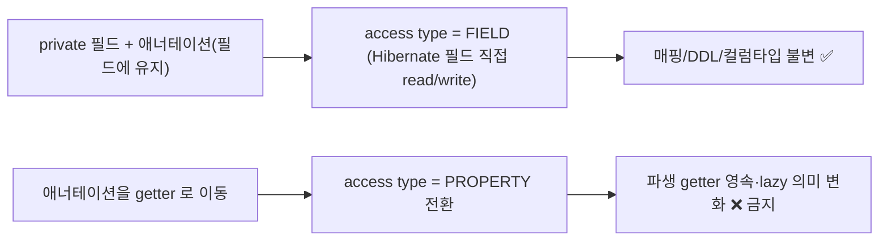

# 엔티티 캡슐화 — public 필드 → private + 접근자 (P2 마무리)

> 스캐폴딩 단계의 `public` 필드 엔티티(P2 당시 7종·약 63필드)를 private 필드+접근자로 캡슐화한다. **행동·매핑·직렬화 결과 불변이 절대 조건**. 근거 결정 [DECISIONS](DECISIONS.md) **D41**.
> **갱신**: 이후 추가된 `DocumentedApiRecord`·`StaticClassifyRule` 은 처음부터 캡슐화된 채 생성됐다(현재 총 9 엔티티, [18](18-db-schema.md)). `SpecRecord.rawDoc`(@Lob byte[])는 이후 컬럼째 제거됨([37](37-spec-inventory-reconcile.md) §7).

## 0. 목적 / 범위

스캐폴딩 단계에서 `public` 필드로 둔 7 엔티티(각 NOTE 주석 "TODO: 캡슐화")를 정리한다. **순수 가시성 리팩터** — 매핑/DDL/직렬화/분류 결과 어느 것도 바뀌면 안 된다.

| 엔티티 | 필드수 | PK | 특이 매핑 |
|---|---|---|---|
| `DiscoveredEndpointRecord` | 16 | `@GeneratedValue` id | text 2(status_dist/params), boolean 2(hadQuery/nonBrowserUa) |
| `ScanResult` | 14 | `@Id host` | text 1(report_json), `@Column(columnDefinition="integer default 0")` totalDropped |
| `SpecRecord` | 11 | `@GeneratedValue` id | text 2(canonical/warnings), `@Lob byte[]` rawDoc(이후 제거·doc/37 §7), boolean active |
| `DomainConfig` | 8 | `@Id host` | **`@ElementCollection` hostnames**, `@Enumerated` specMergeStrategy, boolean enabled |
| `ClassificationConfig` | 6 | `@Id` 고정 `id=1L` | text 2(customWeights/matcher), `@Enumerated` profile |
| `DomainClassificationConfig` | 6 | `@Id host` | text 2(customWeights/matcher), `@Enumerated` profile |
| `Watermark` | 2 | `@Id host` | — |

## 1. 접근자 방식 (D41 — 권장: 수기/IDE 생성 getter·setter)

- **권장 = (a) 손수(IDE 생성) getter/setter**. 근거:
  - **신규 의존 0** — 코드베이스에 Lombok 전무. 전역지침 §2(요청 안 한 의존·추상 추가 금지)·§3(기존 스타일 일치). 매니저 'ponytail' 주의(리팩터 하나로 신규 의존 도입 신중).
  - **보일러플레이트 비용은 도구로 상쇄** — 63필드라도 *작성*은 IDE "Encapsulate Fields"/"Generate getters·setters"가 즉시 생성(수타이핑 아님). 부담은 파일 LOC 볼륨이지 저작 노력이 아님.
  - **plain POJO 유지** — 컴파일 시 애너테이션 프로세서·전 개발자 IDE 플러그인 요구·향후 전 엔티티 컨벤션 변경 없음 → 우리가 지키려는 JPA/Jackson 불변에 새 변수를 안 더함.
- **(b) Lombok 미채택** — `@Getter/@Setter` 가 LOC 는 줄이나 **신규 컴파일 의존 + 애너테이션 프로세서 + 전 엔티티 컨벤션 전환**을 *정리 리팩터의 부산물*로 끌어들임. 의존 도입은 원하면 **별도 심의 결정**으로(이 리팩터에 결합 금지). → §9 후속.

## 2. JPA 접근 타입 보존 (★ 매핑 불변의 핵심)

현재 모든 엔티티는 **field access**(JPA 애너테이션이 *필드*에 부착, `@Id` 위치로 결정). 캡슐화 후에도 이를 **반드시 유지**한다.

- **애너테이션은 필드에 그대로 둔다**(getter 로 이동 금지). 필드를 `private` 으로 바꾸고 getter/setter 를 추가해도, 애너테이션이 필드에 있으면 **access type=field 유지** → Hibernate 가 필드를 직접 read/write(getter/setter 우회) → **매핑/DDL/ddl-auto/컬럼타입 전부 동일**.
- **getter 로 애너테이션 이동 = property access 전환 = 리스크**(파생 getter 영속화·lazy 의미·순서 변화) → **금지**.
- **그대로 보존할 특수 매핑**(필드에 고정): `DomainConfig.hostnames` 의 `@ElementCollection @CollectionTable @Column`(필드 접근 필수 — getter 이동 시 컬렉션 매핑 파손), `SpecRecord.rawDoc` `@Lob byte[]`(이후 제거·doc/37 §7), text 9필드 `@Column(columnDefinition="text")`, `@GeneratedValue` id, `@Enumerated(STRING)`, **필드 초기화자**(`= true`·`= new ArrayList<>()`·`id = 1L`·`state = "idle"`·`= SpecMergeStrategy.MERGE`).
- **JPQL/파생쿼리 무영향** — 리포지토리의 파생 메서드(`findByHost` 등)·JPQL 은 **필드명** 기준이고 필드명은 불변 → 영향 없음. **doc/18 스키마 무영향**(스키마 불변).

## 3. 직렬화 / ETag 불변 — 조사결과: 위험 없음(MOOT)

매니저 ★우려(getter 네이밍·순서가 JSON/ETag 를 바꿀 위험)를 조사 → **엔티티는 Jackson 으로 직접 직렬화되는 경로가 없다**:
- **엔티티에 Jackson 애너테이션 0**(`@Json*` grep 0).
- **전 컨트롤러 반환은 DTO/뷰/모델** — `DomainView`·`ScanStatusView`·`SpecMetaView`·`Global/DomainClassificationView`(record DTO), `CombinedDiscovery`(model), `ResponseEntity<String>`(reportJson 문자열). **엔티티 직접 반환 0**.
- **모델/DTO 가 엔티티를 품지 않음**(model/·api/dto/ 에서 엔티티 타입 참조 grep 0).
- **ETag**: `EtagUtil.of(String)` 은 문자열 SHA-256 일 뿐. 입력 문자열은 `DiscoveryJobService.toJson(report)`(=`DiscoveryReport` **모델**)·`SpecStore` 의 `writeValueAsString(canonical/warnings)`(**모델/List**)에서 생성 — **엔티티 직렬화 아님**.
- **PR #20 조건부 GET 304 경로**(`ScanController.result`): `r.reportJson`/`r.version` 읽기 → `r.getReportJson()`/`r.getVersion()` 로 바뀔 뿐, 반환 본문(String)·304 판정(version 문자열 비교) 불변.

→ **결론: 접근자 네이밍/순서가 어떤 JSON 계약·ETag 도 바꿀 수 없다.** #3 위험은 사실상 소멸.

**그래도 지킬 원칙**(미래 안전): ① getter 는 필드값 그대로 반환(변형·파생 금지) ② boolean 은 `isX()`(`isEnabled`·`isActive`·`isHadQuery`·`isNonBrowserUa` — 만약 후일 직렬화돼도 프로퍼티명 "x" 보존) ③ **필드당 접근자 1쌍만**(Jackson 이 주울 파생 getter 신설 금지). ④ 만약 후속 작업이 엔티티를 직접 직렬화하면 그때 네이밍/순서 계약을 별도 검토(현재는 무경로라 안전).

## 4. setter 범위 (D41 — 전 필드 getter / 자동생성 id 제외 setter)

- **getter: 전 필드**(DTO 구축·서비스·테스트의 상태 읽기 필요).
- **setter: `@GeneratedValue` 자동생성 PK 2개(`SpecRecord.id`·`DiscoveredEndpointRecord.id`) 제외 전 필드**. 자동생성 id 는 **앱이 쓰지 않고 Hibernate 가 field-access 로만 기록** → setter 불요 = 가벼운 불변 신호. 그 외 비생성 `@Id`(host PK 류·`ClassificationConfig.id=1L` 고정)와 일반 필드는 현행 쓰기 지점 보존 위해 setter 노출.
- **범위 명확화(정직)**: 본 작업은 **가시성 캡슐화**(private+접근자)다. *진짜 불변*(생성자 강제 주입·setter 전면 제거·wither)은 더 큰 재설계라 **범위 밖**(§9). 현행은 "construct→필드 set→save" 패턴이라 setter 제거는 대규모 API 변경·생성자 신설을 부르므로 지금은 자동생성 id 미노출 정도의 불변 신호만 둔다.
- **equals/hashCode/toString 신설 금지** — 현재 없음(identity 기본). 신설은 `HashSet`/`Map` 동작 변화 위험 + 범위 밖 → 추가하지 않는다.

## 5. 진행 방식 (D41 — 엔티티 단위 스테이지, 단계별 빌드, 단일 PR)

63필드·광범위 call-site → **엔티티 1개씩 내부 스테이지 + 단계별 `build` green**(리뷰 가능·bisect·롤백). **단일 PR**.

권장 순서(블래스트 반경 오름차순, 패턴 먼저 검증):
1. `Watermark`(2) — 패턴 확립
2. `ClassificationConfig`(6) · `DomainClassificationConfig`(6) — 설정 쌍
3. `DomainConfig`(8) — `@ElementCollection` 주의
4. `SpecRecord`(11)
5. `ScanResult`(14)
6. `DiscoveredEndpointRecord`(16) — 최다 필드·테스트 최다 참조

엔티티별 스테이지 절차: (i) IDE "Encapsulate Fields"(private 화 + 접근자 생성, **애너테이션은 필드 유지**) → (ii) 컴파일 에러가 가리키는 전 call-site(`obj.field`→`obj.getField()`/`obj.setField()`) 교체(main+test) → (iii) `JAVA_HOME=/usr/lib/jvm/java-21-openjdk ./gradlew build` green → (iv) 시맨틱 커밋(엔티티 단위, CLAUDE.md §9). boolean 접근자 `isX()` 확인.

## 6. 블래스트 반경

- **main**(엔티티 쓰기/읽기 지점, ~5–6 파일): `DomainController`(DomainView 매핑)·`ScanController`/`HostQueryController`(View 매핑)·`SpecController`/`SpecStore`(SpecRecord)·`DiscoveryJobService`(ScanResult/DiscoveredEndpointRecord 구축·저장)·`ClassificationController`/`EffectiveClassificationResolver`/`ClassificationConfigSeeder`(config 엔티티). 구축 site 4(main).
- **test**(~9 파일, 구축 site ~34): 최다 `DiscoveryJobServiceTest`(14)·`PostgresIntegrationTest`(8)·`CombinedDiscoveryServiceTest`(3) 등. **테스트가 public 필드를 광범위 직접 대입** → 캡슐화 churn 의 대부분이 테스트(매니저 경고와 일치). 전부 `obj.field=`→`obj.setField()` 기계적 치환(IDE Encapsulate Fields 가 호출측까지 갱신).
- 도구: IDE "Encapsulate Fields" 가 선언+전 참조를 한 번에 변환 → 수작업 최소. 단 **애너테이션 비이동·boolean isX 확인**은 수동 점검.

## 7. 무회귀 보장 (요약)

- **매핑/DDL 불변**: 애너테이션 필드 고정 → field access 유지(§2). ddl-auto·컬럼타입·`@ElementCollection`·text 9필드 그대로.
- **직렬화/API/ETag 불변**: 엔티티 무직렬화 경로(§3) → getter 네이밍/순서 무관.
- **분류/스캔 결과 불변**: 접근자는 필드값 그대로 전달, 로직 무변경.
- **검증**: 단계별 `./gradlew build`(332 그대로 green). PG 통합테스트(`PostgresIntegrationTest`)도 green 유지(엔티티 구축 8 site 갱신 포함). 행동 불변이라 **테스트 기대값 변경 0**(대입 구문 형태만 변경).

## 8. 범위 밖 / 후속

- **진짜 불변 재설계** — 전 필드 final + 생성자/빌더 강제, setter 전면 제거, record 화. API 대변경이라 별도 항목(필요 시).
- **Lombok 표준화** — 팀이 원하면 *별도 심의 결정*(이 리팩터에 결합 금지). 채택 시 본 엔티티 + 향후 일괄 적용.
- **equals/hashCode/toString** — 도메인 동등성 정책이 필요해지면 별도(현재 identity 기본 유지).
- **doc/18 동기 불요** — 스키마 불변(field access 보존)이라 갱신 없음.
