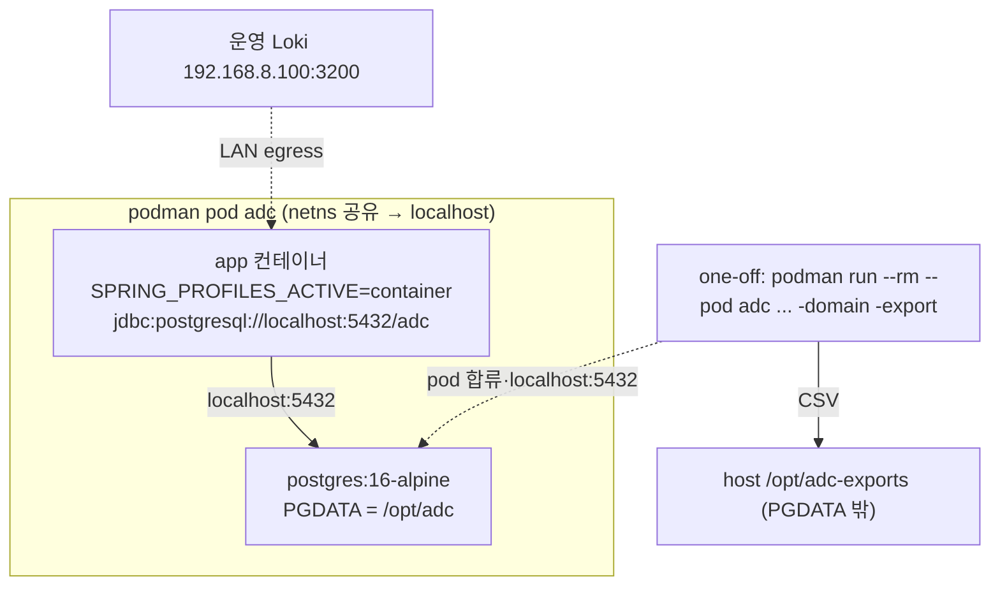

# 테스트 배포 — CLI CSV 내보내기(B) + Docker/podman 패키징(C) (P3)

> 동일 bootJar 를 CLI 모드로 실행해 한 도메인의 결합 Discovery 결과를 CSV 로 내보내고(B), app+postgres 2컨테이너 pod 로 테스트 배포한다(C). 근거 [26](26-multi-spec-merge.md)(CombinedDiscoveryService·Finding)·[28](28-testcontainers-pg-integration.md) D40(PG 컨테이너 검증)·[07](07-msa-and-central-integration.md)(REST), 결정 [DECISIONS](DECISIONS.md) **D43**.
> 사용자 확정(재논의 금지): 배포 DB=PostgreSQL 컨테이너, app+postgres 2컨테이너(pod), PGDATA→host `/opt/adc` 마운트. CLI 문법=`-domain -`(D47).

**구현 위치**

| 대상 | 소스 |
|---|---|
| CLI 진입·분기 | `ApiDiscoverWorkerApplication`(`-domain -export/-ls/-register/-scan` 감지 → `web(NONE).profiles("cli")`) |
| export/ls/scan 러너 | `cli/CliExportRunner`·`CliListRunner`·`CliScanRunner`(@Profile("cli"), CommandLineRunner) |
| CSV 직렬화 | `cli/DomainCsvWriter`(15컬럼·RFC4180·discovered_endpoint join) ← `batch/CombinedDiscoveryService.forHost` |
| 등록 공유 | `batch/DomainRegistrar`(register·scan 자동등록) |
| 배포 | `Dockerfile`(멀티스테이지)·`adc.yaml`(podman play kube)·`application-container.yml` |

---

# B. CLI: {도메인명} → API 목록 CSV

## B0. 목적

동일 bootJar 를 **CLI 모드**로 실행해 한 도메인의 결합 Discovery 결과(Active/Zombie/Shadow/Unused/WebPage)를 CSV 로 내보낸다. 서버 모드와 분리. **확장 가능하되 프레임워크 과설계 금지**(지금 1 명령).

## B1. CLI 모드 — 서버와 분리, 실행 후 종료

- **트리거**: `-domain -export <domain>`(단일대시 서브커맨드, D47 통일문법). `main().parseCli` 가 신문법 감지·내부 `--adc.cli.export-domain=<domain>` 로 translate → `new SpringApplicationBuilder(App.class).web(WebApplicationType.NONE).profiles("cli").run(args+주입)` 기동(웹 미기동). 런너/바인딩은 내부 프로퍼티 그대로(불변).
- **스케줄러/Loki 차단**: 현재 `@EnableScheduling` 이 main 클래스에 무조건 부착 → **`SchedulingConfig`(@Configuration @EnableScheduling) 로 분리하고 `@Profile("!cli")`** 부여. CLI 모드는 스케줄러(스캔·디스커버리)·Loki 미기동. (batch.job.enabled=false 는 기존대로.)
- **실행체**: `CliExportRunner implements CommandLineRunner`(`@Profile("cli")`) — `adc.cli.export-domain` 읽어 1 도메인 내보내고, `SpringApplication.exit`→`System.exit(code)`(성공 0 / 미존재·오류 비0). 웹·스케줄 미기동이라 비데몬 스레드 없음 → 자연 종료(명시 exit 로 코드 보장).
- **확장 형태(과설계 금지)**: 명령 디스패치는 "어떤 `adc.cli.*` 인자가 있나" 수준의 단순 분기만. 향후 명령은 프로퍼티/서브분기 추가로 자연 확장. **일반 CLI 프레임워크(picocli 등) 미도입**(신규 의존 0).
- **추가 서브커맨드(D47 확장)**: `-domain -ls`(목록 CSV) / **`-domain -register <domain>`(즉시 등록, DB만·Loki 미호출·멱등)** / `-domain -export <domain>`(결과 CSV) / `-domain -scan <domain>`(즉시 스캔, **미등록이면 `enabled=true` 자동등록 후 스캔**; doc/33 §7). 복수 서브커맨드 동시 지정은 모호 → usage 오류(fail-loud). 등록 로직은 `DomainRegistrar`(register·scan 자동등록 공유, REST `DomainController` 는 409 라 CLI 부적합).

## B2. CSV 스키마 (architect 확정)

소스 = **`CombinedDiscoveryService.forHost(host)`**(배치 패키지) → `List<Finding>`(5 subtype). 평탄화·헤더행·RFC4180 이스케이프(`,`·`"`·CRLF 포함 필드는 `"`로 감싸고 내부 `"`→`""`).

| 컬럼 | 출처 | 비고 |
|---|---|---|
| `host` | Finding.host | |
| `method` | Finding.method | |
| `path_template` | Finding.pathTemplate | |
| `status` | classification | ACTIVE/ZOMBIE/SHADOW/UNUSED/UNDOCUMENTED_WEB_PAGE |
| `source` | status 파생 | Shadow→`detected`, Unused→`spec`, Active→`both`, Zombie→`both`, WebPage→`detected` |
| `confidence` | Shadow/Zombie.confidence, WebPage.kindConfidence | 그 외 공란 |
| `severity` | Zombie.severity.band | HIGH/MED/LOW, 그 외 공란 |
| `estimated` | Zombie.estimated | 그 외 공란 |
| `spec_ref` | Active/Zombie/Unused.specRef | Shadow/WebPage 공란 |
| `preflight_ambiguous` | Unused.preflightAmbiguous | 그 외 공란 |
| `low_confidence` | Shadow/Zombie 파생(confidence<0.5) | 그 외 공란 |
| `param_query` | params.query 이름목록 | `;` 결합(Shadow/Zombie/Active) |
| `param_path` | params.path 이름목록 | `;` 결합 |
| `first_seen` | discovered_endpoint join | ISO-8601, 아래 ★ |
| `last_seen` | discovered_endpoint join | ISO-8601, 아래 ★ |

- **★first/last seen — 별도 join 필요(정직)**: `Finding` 은 hits/firstSeen/lastSeen/score 를 **안 가짐**(검출 메트릭은 `discovered_endpoint`, 분류뷰엔 미포함). first/last_seen 은 `DiscoveredEndpointRepository.findByHost(host)` 를 (method,host,template) 키로 join 해 채움(`CombinedDiscoveryService.key()` 동형). **spec-only 행(Unused·검출없는 Active)은 검출 레코드 없음→공란**(정상).
- **`score` 미포함(한계)**: 최종 api score 는 **영속 안 됨**(ApiScorer 런타임값, discovered_endpoint 엔 hadQuery/nonBrowserUa 신호만). CSV 에 넣으려면 스코어링 재실행 필요 → **범위 밖**(B 한계로 명시). 필요 시 후속.
- 결정성 불요(CSV 는 ETag 아님). 단 안정 정렬(예 status→method→path) 권장(가독성).

## B3. 출력 위치

- 기본 `adc.cli.output-dir` 하위 `<domain>-<timestamp>.csv`(시간 포함 자유 — ETag 아님). 설정 가능.
- **★PGDATA 충돌 회피**: 확정 마운트가 `-v /opt/adc:/var/lib/postgresql/data`(=`/opt/adc` 전체가 PGDATA) → **`/opt/adc/exports` 는 PGDATA 내부**라 PG initdb("디렉터리 비어있어야 함")와 충돌·혼재. → exports 는 **PGDATA 밖 별도 host 경로**(예 host `/opt/adc-exports` → 컨테이너 `/exports`, 기본 `adc.cli.output-dir=/exports`). 확정된 PGDATA 마운트는 그대로 유지(재논의 아님), exports 만 분리. (manager 예시 `/opt/adc/exports` 를 이 사유로 조정.)

## B4. 컨테이너에서 DB 접속 + 실행

PostgreSQL(네트워크)이라 파일잠금 무관. 같은 pod 의 PG 에 접속(§C2, **pod=localhost:5432**):
- **권장 — one-off `podman run` 으로 pod 합류**: `podman run --rm --pod adc -v /opt/adc-exports:/exports  -domain -export foo.example.com` → netns 공유(localhost:5432)·exports 마운트·실행 후 `--rm`. 서빙 app 컨테이너에 부하 안 줌, 수명 깔끔. (인자는 exec-form ENTRYPOINT `java -jar /app/app.jar` 뒤에 append.)
- **대안 — `podman exec`**: `podman exec adc-app java -jar /app/app.jar -domain -export foo.example.com` → 같은 컨테이너 2nd JVM(localhost:5432·기존 exports 마운트 가시). 빠르나 서빙 컨테이너 자원 점유.
- 두 방식 모두 §C2 토폴로지의 JDBC URL 과 **동일 접속**(pod→localhost). 절차 문서화(§C4).

---

# C. Docker 이미지 + podman + /opt/adc

## C1. Dockerfile (멀티스테이지)

- stage1 build: `gradle:8-jdk21`(또는 `eclipse-temurin:21-jdk` + gradlew) → `./gradlew bootJar`.
- stage2 runtime: `eclipse-temurin:21-jre` → bootJar 복사, `ENTRYPOINT ["java","-jar","/app/app.jar"]`(인자로 서버/CLI 모드 분기 — 무인자=서버).
- (Dockerfile/compose/yaml 은 config 류 → 한국어 헤더주석 면제, 단 의도는 본 문서 기록.)

## C2. 토폴로지 — pod (★localhost 정정)

- **2 컨테이너 1 pod**: `app` + `postgres:16-alpine`(doc/28 PR#20 검증된 이미지/매핑).
- **★pod 네트워킹 정정**: podman **pod 는 netns 공유** → 컨테이너 간 통신은 **`localhost`**(컨테이너명 DNS `db` **미해석**). → app 의 `SPRING_DATASOURCE_URL=jdbc:postgresql://localhost:5432/adc`. (manager 의 `db:5432` 는 *user-defined network*(비-pod) 토폴로지에서만 성립 — pod 선택 시 localhost 가 맞음. 둘 중 택1: **pod+localhost 권장** / 또는 podman network+`db`.)
- **PGDATA 볼륨**: postgres 컨테이너 `-v /opt/adc:/var/lib/postgresql/data`(사용자 확정). 첫 기동 시 initdb(빈 디렉터리 전제 — exports 분리 §B3 가 이를 보장).
- **배포 산출물(권장)**: `podman play kube adc.yaml`(선언적 Pod, 2컨테이너 localhost 공유, hostPath 볼륨) — podman 네이티브·재현가능·추가 툴 불요. **대안**: 셸 스크립트(`podman pod create -p 8080:8080` + 2×`podman run --pod`). podman-compose 는 별도 파이썬 툴(부재 가능)이라 비권장.

## C3. 설정 / 프로파일

- **`container` 프로파일(권장)**: `application-container.yml`(커밋) — PG datasource(driver `org.postgresql.Driver`, url/user/pw env override)·`ddl-auto=update`(첫 기동 스키마 생성, doc/28 PR#20 PG text 매핑 검증됨)·Loki `addr` LAN. `SPRING_PROFILES_ACTIVE=container` 로 활성. (이름 `test` 회피 — src/test 와 혼동.)
  - 기존 `application.yml`(H2)은 불변 → 로컬/단위테스트 영향 0. env(`SPRING_DATASOURCE_*`) override 도 병용 가능.
- **★Loki LAN 도달**: 컨테이너에서 `192.168.8.100:3200` 도달해야 함. rootless podman(slirp4netns/pasta)에서 LAN egress 는 일반적으로 가능하나 **pod 네트워크에서 1회 확인 필요**(리스크). 미도달 시 `--network` 조정.

## C4. 배포/실행 절차 (문서화)

1. 빌드: `podman build -t apidiscover:test .`
2. 기동: `podman play kube adc.yaml`(또는 pod 스크립트) — host `/opt/adc`=PGDATA, `/opt/adc-exports`=CSV.
3. CLI: `podman run --rm --pod adc -v /opt/adc-exports:/exports apidiscover:test -domain -export <domain>` → `/opt/adc-exports/<domain>-<ts>.csv`.
4. **운영 주의(필수 문구)**: 대상 Loki(192.168.8.100:3200)는 **운영 서버** — 컨테이너 스캔/디스커버리도 부하보호(윈도우·limit·throttle·동시성) 준수, 대용량은 **off-peak**. 임시 확인도 창/limit 작게.

---

## 무회귀 / 리스크 (B·C 공통)

- **무회귀**: CLI 는 `cli` 프로파일·인자 게이트라 서버 모드 무영향. `@EnableScheduling`→`SchedulingConfig(@Profile("!cli"))` 이동은 서버 모드(비-cli)에서 **동일 활성**(행동 불변), CLI 만 비활성. Docker/프로파일은 신규 파일·`application.yml`(H2) 불변 → 332 테스트·로컬 실행 영향 0.
- **리스크①(localhost vs db)**: pod=localhost 확정(§C2) — 토폴로지·JDBC URL·CLI 접속 일관 필수.
- **리스크②(exports/PGDATA 충돌)**: §B3 분리로 해소(확정 PGDATA 마운트 유지).
- **리스크③(컨테이너→LAN Loki 도달)**: §C3, pod 네트워크 1회 확인.
- **리스크④(CLI 2nd JVM/DB)**: one-off run 권장(서빙 부하·커넥션 경합 최소), exec 는 대안.
- **리스크⑤(score 미영속)**: CSV score 컬럼 범위 밖(§B2) — 명시.

## 범위 밖 / 후속

- **전체 CLI 명령 체계·외부서버 API 목록** — 사용자 명시 범위 밖(추후 별도 정의). 지금 디스패치 형태만, 일반화 금지.
- **CSV score 컬럼** — score 영속/재계산 필요(§B2), 후속.
- **prod 배포(k8s 등)·이미지 레지스트리 푸시·시크릿 관리** — 테스트 배포 범위 밖.
- **user-defined network(`db:5432`) 토폴로지** — pod 대안, 필요 시.
