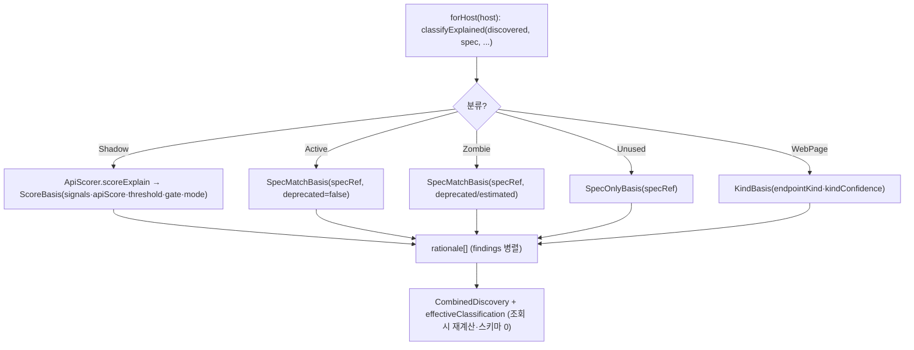

# API 판단 근거(점수 산출 내역) 노출 — /discovery 응답 가시화 (사용자 개선요구)

> `GET /api/v1/domains/{host}/discovery` 응답에 도메인 현재 preset/threshold 와 엔드포인트별 판단 근거(Shadow=신호별 점수·게이트, Active/Zombie=스펙 매칭, Unused=spec_only)를 **조회 시 재계산**해 additive 로 동봉한다(스키마 변경 0). 근거 [08](08-api-scoring-and-profiles.md)(ApiScorer)·[10](10-classification-config-store.md)·[11](11-classification-rest-api.md)(effective 설정)·[26](26-multi-spec-merge.md)(CombinedDiscovery)·[04](04-matching-and-classification.md)(분류), 결정 [DECISIONS](DECISIONS.md) **D49**.
> 매뉴얼 §4.3 은 `doc/manual/api-discovery-manual.html` 에 반영 완료. 운영 Loki 미호출(정적/mock).

**구현 위치**

| 대상 | 소스 |
|---|---|
| 신호별 점수 내역 | `classify/ApiScorer.scoreExplain()` → `ScoreBreakdown`(`score()` 위임·단일 진실원) + `weightsAsMap()` |
| 근거 수집 | `classify/Classifier.classifyExplained()`(rationaleOut, 스캔 경로=null=바이트 동일) |
| 근거 모델 | `model/EndpointRationale` + `model/ApiBasis`(sealed: Score/SpecMatch/SpecOnly/Kind) + `EffectiveClassificationView` |
| 응답 동봉 | `batch/CombinedDiscoveryService.forHost()` → `model/CombinedDiscovery.effectiveClassification`/`rationale`(/discovery 전용 additive) |

## 0. 목적 / 문제 / 현황

사용자 요구: "API 로 판단된 요청이 **어떤 항목에 어떤 점수**가 부여돼 **어떤 기준**으로 API 로 판단됐는지" 를 DB/응답에서 직관적으로 알 수 있어야 하고, 도메인 API 목록 조회(`GET /api/v1/domains/{host}/discovery`) 시 **판단 근거로 함께 제공**돼야 한다. §4.3 가중치/프리셋 기준의 신호별 점수·총점, 도메인의 현재 preset(middle/high/low/custom)·threshold 가시화.

**현황·갭(코드 확인)**:
- 점수기 `ApiScorer.score()` = 14 신호 가산→clamp[0,1](3자리 반올림), `evaluate()`→`Gate`(threshold 게이트). effective preset/threshold/weights 는 `EffectiveClassificationResolver`(도메인>전역>MIDDLE)가 해석.
- **★분류별 근거가 다름**: 점수 게이트는 **Shadow(스펙 미매칭) admit 판정에만** 쓰인다. **Active=스펙 매칭(점수 무관, 근거=specRef)**, Zombie=스펙 매칭(deprecated/추정), Unused=스펙에 있고 무트래픽. → "API 판단 근거" 를 **분류별로 다르게** 표현해야 한다.
- **갭1**: 엔드포인트별 신호 발화·가산 내역·총점·게이트가 분류 시 계산 후 **폐기**(어디에도 영속/노출 안 됨).
- **갭2**: `CombinedDiscovery{host, specVersion, mode, findings, versionGroups, specSource}` 에 effective preset/threshold·점수 내역 **미포함**. `Finding`(sealed) 에 점수 필드 없음.

## 1. ★핵심 갈림길 — (A) 조회 시 재계산 vs (B) 스캔 시 영속

**★권고 = (A) 조회 시 on-demand 재계산. 스키마 변경 0.**

### 근거 (A 채택)
1. **/discovery 는 이미 재계산 경로다(결정적)**: `CombinedDiscoveryService.forHost` 가 조회 시점에 `classifier.classify(discovered, spec, matcher, eff.scorer(), eff.hints(), stripPrefix)` 로 **findings 를 현재 effective 설정으로 재산출**한다(스캔 스냅샷 아님). → 근거(점수 내역)도 **같은 경로에서 재계산**해야 응답 내 findings 와 **일관**. B(스캔시 영속)면 저장된 근거가 재계산된 분류와 **불일치**할 수 있다.
2. **corsPreflight 입력이 조회시 가용(스키마 불요)**: corsPreflight 는 per-endpoint 저장값이 **아니라** discovered 집합의 **OPTIONS sibling 관측**에서 도출된다(`Classifier` 의 `corsKeys`, host+template). OPTIONS 행은 `discovered_endpoint` 에 영속되고 `forHost` 가 전부 로드 → **corsKeys 재구성 가능**. 실제로 forHost 의 classify 가 **이미 corsPreflight 를 올바로 도출**해 Shadow 점수에 반영 중. → 매니저가 우려한 "corsPreflight 1컬럼 추가" **불필요**(집합에서 도출). 나머지 입력(hadQuery·nonBrowserUa·endpointKind·method·path·hits)도 전부 `discovered_endpoint` 영속 → **전 신호 재계산 충실**.
3. **사용자 의도 = 현재 설정 기준**: 요구가 "**현재** 도메인에 세팅된 preset/threshold" → 재계산(A)이 현재 effective 를 반영(operator 가 preset 변경 시 /discovery 근거도 즉시 갱신). B 는 stale.
4. **린**: 영속 JSON blob 없음·stale 없음·scorer 가 이미 forHost 에 있음. 재계산 비용 = N×14 신호(무시 가능).

### B(스캔시 영속) 미채택
- 스키마 증가(엔드포인트별 점수 JSON)·**가중치/preset 변경 시 stale**(사용자 "현재 preset" 의도 위배)·report_json 비대·재계산 findings 와 불일치 위험. "스캔시점 결정 충실 재현"은 acrm-active(M3) 등 특수 케이스 외엔 A 와 동일 결과(§6 한계).

### 절충(미채택) — corsPreflight 1컬럼
- §1.2 로 **불요** 판명(집합 도출). 추가 안 함(YAGNI).

## 2. 응답 스키마 (additive, /discovery 전용)

**원칙: `Finding` 레코드 불변 → `report_json`(/result)·ScanResult.version(ETag) 무변경.** 근거는 **`CombinedDiscovery` 에만** 가산(=/discovery 전용, doc/26). /result 소비(중앙 조건부GET) 무파괴.

`CombinedDiscovery` 에 2 필드 추가:
1. **`effectiveClassification`**(top-level) — 도메인 현재 설정. `forHost` 가 이미 `classificationResolver.resolve(host)` 로 보유(`EffectiveClassification.profile()/weights()`).
2. **`rationale: List<EndpointRationale>`** — findings 와 **동일 순서·동일 identity(method,host,pathTemplate)** 병렬. 분류별 polymorphic `basis`.

```jsonc
{
  "host": "api.example.com",
  "specVersion": 0,
  "mode": "MERGE",
  "findings": [ /* 기존 Finding 그대로 (불변) */ ],
  "versionGroups": [],
  "specSource": { /* 기존 */ },

  // ── 추가 1: 도메인 effective 설정 ──
  "effectiveClassification": {
    "profile": "MIDDLE",            // HIGH|MIDDLE|LOW|CUSTOM (현재 도메인 preset)
    "threshold": 0.70,             // effective 임계
    "weightsSource": "preset",     // preset | custom (CUSTOM 이면 override 반영)
    "weights": { "hostApiSubdomain":0.40, "corsPreflight":0.30, "apiSegment":0.55, /* …14개 (§4.3) */ }
  },

  // ── 추가 2: 엔드포인트별 판단 근거 (findings 병렬) ──
  "rationale": [
    { "method":"GET", "host":"api.example.com", "pathTemplate":"/internal/sync",
      "classification":"SHADOW",
      "basis": {                              // Shadow = 점수 근거
        "type":"score",
        "mode":"pathless",                   // pathless | explicit_hint
        "apiScore":0.94, "threshold":0.70, "gate":"ADMIT",
        "signals":[                          // §4.3 신호별 — effective weight·발화·기여
          {"key":"hostApiSubdomain","weight":0.40,"fired":true,"contribution":0.40},
          {"key":"corsPreflight","weight":0.30,"fired":true,"contribution":0.30},
          {"key":"writeMethod","weight":0.34,"fired":false,"contribution":0.0},
          {"key":"query","weight":0.12,"fired":true,"contribution":0.12},
          {"key":"staticAssetPenalty","weight":-0.60,"fired":false,"contribution":0.0}
          /* …평가된 전 신호 (mode 에 따라 path-shape vs pathHint) */
        ]
      }
    },
    { "method":"GET", "host":"api.example.com", "pathTemplate":"/v2/users/{id}",
      "classification":"ACTIVE",
      "basis": { "type":"spec_match", "specRef":"openapi#/paths/~1v2~1users~1{id}/get", "deprecated":false }
    }
  ]
}
```

**`basis` polymorphic(분류별 근거)**:
| 분류 | basis.type | 필드 | 의미 |
|---|---|---|---|
| Shadow | `score` | `apiScore`·`threshold`·`gate`·`mode`·`signals[]` | 점수 게이트 통과(ADMIT)가 근거 |
| Active | `spec_match` | `specRef`·`deprecated:false` | 스펙 매칭(점수 무관) |
| Zombie | `spec_match` | `specRef`·`deprecated:true` 또는 `estimated:true` | 스펙 매칭(deprecated/버전추정) — 점수 무관 |
| Unused | `spec_only` | `specRef` | 스펙에 있고 무트래픽(관측 부재) |
| WebPage | `endpoint_kind` | `endpointKind`·`kindConfidence` | $type/referer 로 비-API 판정 |

- `signals[]` = `score()` 가 평가하는 신호 전부 + **effective weight**(현재 preset/override) + `fired`(발화) + `contribution`(fired 면 weight, staticAssetPenalty 발화 시 음수). 합(clamp[0,1], 3자리)=`apiScore`. `mode=explicit_hint` 면 path-shape 신호 대신 `pathHint` 평가(doc/09 §2.3) — `mode` 로 구분.
- **dropped(비-API) 엔드포인트는 findings 에 없음** → rationale 도 없음(집계만 `droppedNonApi`). per-dropped 근거는 범위 밖(§8).

## 3. 생산 메커니즘




- **`ApiScorer.scoreExplain(d, corsPreflight, hints)` 신규** → `ScoreBreakdown{double total, List<SignalContribution> signals}`(`SignalContribution{key, weight, fired, contribution}`). 기존 `score()` 와 **동일 로직 미러**(발화 조건 1:1) — 중복 회피 위해 `score()` 가 `scoreExplain().total` 을 반환하도록 리팩터 권장(단일 진실원). `evaluate()` 의 `Gate` 는 그대로.
- **`Classifier` 설명 변형(query 전용)**: 분류 core(1차 corsKeys/게이트 + 2차 스펙)를 공유하되, **explain 모드**에서만 `rationale` 수집(Shadow→scoreExplain, Active/Zombie→spec_match, Unused→spec_only, WebPage→kind). 스캔 경로(`classifyWithMetrics`→report_json)는 **explain=false=바이트 동일**(무회귀·ETag 불변). → 게이트/corsKeys 결정 단일 소스 유지(분기 발산 금지).
- **`CombinedDiscoveryService.forHost`**: classify 설명 변형 호출 → `rationale` + `effectiveClassification`(eff.profile()/threshold()/weights()) 동봉해 `CombinedDiscovery` 반환. discovered 집합·eff.scorer()·corsKeys 모두 이미 보유 → 추가 조회 0.
- 신규 모델: `model/EndpointRationale`·`model/ApiBasis`(sealed: ScoreBasis/SpecMatchBasis/SpecOnlyBasis/KindBasis)·`model/EffectiveClassificationView`(또는 기존 ClassificationDtos.EffectiveView 재사용).

## 4. ETag / 조건부 GET 영향 — 없음

- 근거는 **`CombinedDiscovery`(/discovery)에만** 가산. `CombinedDiscoveryController` 는 **plain GET(ETag/조건부GET 없음)** → 영향 0.
- `report_json`·`ScanResult.version`(/result ETag)은 **스캔 경로 산출**이고 `Finding`·report 가 불변 → **무영향**(중앙 조건부GET 무파괴).
- 점수는 **결정적**(동일 입력+weight → 동일 값, 3자리 반올림)이라, 설령 ETag 입력화돼도 creep 없음 — 단 report_json 에 안 넣으므로 무관. **score 를 ETag 입력에 추가하지 않음**(명시).

## 5. 매뉴얼 §4.3 변경 스펙 (technical_writer 협업)

> ✅ **반영 완료(TW, PR #38 후속)** — 아래 (유지)/(추가1~3) 전부 `doc/manual/api-discovery-manual.html` §4.3 에 반영됨.

§4.3(정적 preset 표)에 **"실제 점수 내역 읽는 법"** 추가. (이미 보낸 §4.3 per-domain override 요청과 **함께** 처리 권장 — 같은 절.)
- (유지) HIGH/MIDDLE/LOW/CUSTOM preset 가중치·threshold 표(신호 reference).
- (추가1) **도메인 effective 확인**: `GET /api/v1/domains/{host}/discovery` 응답의 `effectiveClassification.profile/threshold/weightsSource` — 현재 도메인 preset/임계.
- (추가2) **엔드포인트별 점수 내역**: `rationale[].basis` 예시 JSON(위 §2) + 표 — 각 §4.3 신호행 ↔ `basis.signals[].key` 매핑, `fired`/`contribution`/`apiScore`/`threshold`/`gate` 읽는 법.
- (추가3) **분류별 근거 차이 명시**: Shadow=점수(`type:score`), Active/Zombie=스펙매칭(`type:spec_match`), Unused=`spec_only` — "Active 는 점수가 아니라 스펙 매칭이 근거" 를 분명히.
- 값 출처(API 필드) 매핑 표 포함. **문서만**(코드 아님), 실제 편집은 technical_writer.

## 6. 무회귀 / 리스크 (정직)

- **무회귀**: 스키마 변경 0. `Finding`·`report_json`·ScanResult·ETag·스캔 경로 전부 불변. `CombinedDiscovery` 가산 2필드(/discovery 전용). `score()`=`scoreExplain().total` 리팩터는 동일 값(테스트로 고정).
- **리스크①(재계산=현재설정 기준)**: 근거는 **현재 effective 설정**으로 산출 — "스캔 당시" 가 아니다(사용자 의도와 일치하나 명시 필요). preset 변경 시 과거 스캔의 그때 점수는 재현 안 됨(설계 의도).
- **리스크②(입력=최신 스냅샷)**: `discovered_endpoint` 의 hits/endpoint_kind/hadQuery 등은 **최신 스캔 스냅샷**(누적 upsert) → repeatBonus 등은 최신 hits 기준. 특정 과거 윈도우 재현 아님(현재 상태 근거).
- **리스크③(acrm-active 시 corsPreflight 미세차, dormant 기본)**: M3 preflight(acrm)가 ACTIVE 면 genuine-OPTIONS 구분에 per-OPTIONS `acrmPresentCount` 필요한데 `discovered_endpoint` 미영속(toDiscovered=0) → 재계산은 DORMANT(전 OPTIONS=cors) 가정. **기본 acrm-field-index=-1=DORMANT 라 현 출하 상태선 무차이**. M3 활성 운영 시 corsPreflight 도출이 스캔시와 다를 수 있음(후속 — acrm 영속 시 해소).
- **리스크④(dropped 근거 부재)**: 비-API drop 은 findings 에 없어 per-endpoint 근거 미제공(집계만). 필요 시 후속(§8).

## 7. 범위 밖 / 후속

- **per-dropped(비-API) 엔드포인트 근거** — findings 부재라 미제공(집계 droppedNonApi 만). 필요 시 별도 노출 설계.
- **스캔시점 점수 영속(B)** — 현재 미채택. "그때 그 설정의 결정" 감사 필요 시 재검토(stale·스키마 비용 감수).
- **acrm 영속(M3 활성 corsPreflight 정합)** — acrm-active 운영 채택 시 per-OPTIONS acrmPresentCount 영속(리스크③ 해소).
- **중앙 노출** — /discovery 자체조회용. 중앙 서버 노출은 P4(외부연동) 시 함께.
