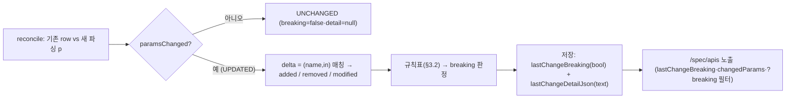

# doc/38 — M7 재설계 P2 (매칭 source 대체·백필·풍부 param diff·도메인-merged 뷰)

> [37-spec-inventory-reconcile](37-spec-inventory-reconcile.md) §10 P2 상세화. `documented_api` 인벤토리에 **UPDATED 의 breaking 판정 + param delta**(P2-3)와 **도메인-merged 뷰**(P2-4)를 더한다. 근거 결정 **DECISIONS D54**.
> **구현 완료(P2-2+P2-3+P2-4, PR #47 머지)** — §7 참조. **P2-1(매칭 source 대체)=보류**(동작보존=가시가치 0·분류 직격 위험, §1), **P2-5(inactive prune)=범위 밖**(TODO).

**구현 위치**

| 대상 | 소스 |
|---|---|
| breaking 판정·param delta | `spec/ApiInventoryService.applyUpdate()`(added/removed/modified + 규칙표 breaking) |
| 영속 | `domain/DocumentedApiRecord.lastChangeBreaking`(boolean) · `lastChangeDetailJson`(text) |
| merged 뷰·필터 | `api/ApiInventoryController`(`GET /spec/apis?view=merged`·`?breaking=true`) → `ApiInventoryService.list()`/merged 산출 |
| 노출 | `spec/DocumentedApiView`(`lastChangeBreaking`·`changedParams`·`contributingSpecNames`) |

## 0. P1 기반 (확인 — 실제 머지 코드)

- `DocumentedApiRecord`/`documented_api`: 키 (host, specName, method, path_template)·`paramsJson`(text)·`status{ACTIVE,DELETED}`·`lastChange{ADDED,UPDATED,UNCHANGED}`·`deprecated`·`version`·`sourceSpecVersion`·시각 3종.
- `ApiInventoryService.reconcile(host, specName, parsed, newSpecVersion, now)`: `findByHostAndSpecName` 만 로드 → **그 specName 격리**(삭제 마킹도 그 집합 안에서만, line 66-74). `applyUpdate`(line 96-117)가 `paramsChanged||deprecated||version` 변경 시 UPDATED. `list()`(line 127)·`deletedKeys()`(line 141).
- 매칭 진실원 `SpecStore.loadActiveCanonical(host)`: `findByHostAndActiveIsTrue` → `SpecCanonicalizer.merge`(dedupe `method|host|template`·deprecated OR·latest-by-specVersion). **모드 무관**(merge 자체 불변, `specMergeStrategy` 는 upload 가 어느 spec_record 를 `active` 로 두는지에만 영향).
- `CanonicalEndpoint`=7-arg(+`List<SpecParam> params`). `SpecParam(name, ParamIn{QUERY/PATH/HEADER/COOKIE/BODY}, required, type 요약)`.

## 1. ★P2-1 매칭 source 대체 — 위험 평가 + 보류 권고

### 1.1 목표·동작보존 원칙
스캐너/분류 매칭 진실원 `loadActiveCanonical`(active `spec_record` 들 `canonicalJson` 스캔 시점 병합)을 **`documented_api` 인벤토리(status=ACTIVE 행)로 대체**해 단일 진실원화. **동작보존 필수** — 인벤토리 산출 매칭 집합이 `loadActiveCanonical` 과 **동일**(method·host·pathTemplate·deprecated·version)해야 Shadow/Zombie/Active/Unused **불변**.

### 1.2 모드별 재현 가능성 (코드 근거)
- **MERGE / VERSION_GROUPED — 재현 가능**. 인벤토리 ACTIVE 행에 cross-specName 병합(dedupe `method+host+path`·deprecated OR·latest-by-`sourceSpecVersion`)을 적용하면 `merge` 와 동치. 인벤토리가 deprecated·version·sourceSpecVersion 보유. specVersion 이 host-monotonic 이라 cross-specName 중복키는 sourceSpecVersion 이 항상 달라 latest-wins 모호성 없음(merge 의 sourceRef tie-break 미발동 — 인벤토리에 sourceRef 미보유 무관).
- **★SEPARATE — 발산(확정)**. `reconcile` 은 업로드된 specName 만 만진다(line 49 `findByHostAndSpecName`·line 66-74 그 집합 내 DELETED). 그런데 `SpecStore.upload` 의 SEPARATE(`replaceAll=true`)는 **host 전체 spec_record 를 비활성**. 결과 — 문서 B 업로드 후 `loadActiveCanonical`=B 만, **인벤토리 ACTIVE=A ∪ B**(reconcile 가 A 를 안 건드림). **불일치**.

### 1.3 ★status 오버로드 지뢰 (결정적)
SEPARATE 발산을 "인벤토리 status 를 spec_record.active 와 동기화"로 고치면 — 교체된 문서 A 의 API 가 status=DELETED 가 되고, 이는 **DELETED→Zombie 결합(P1-6)의 입력**이다. → A 의 API 가 여전히 관측되면 **deleted-from-spec Zombie(0.8)로 오탐**(계약에서 삭제된 게 아니라 운영자가 SEPARATE 전체교체했을 뿐). 즉 인벤토리 `status` 는 **문서별 존재 플래그(Zombie 입력)** 이지 **host 매칭 active 집합**이 아니다 — 두 의미는 **양립 불가**. status 오버로드는 매칭 또는 Zombie 중 하나를 반드시 깨뜨린다.

### 1.4 백필 갭
인벤토리는 go-forward(업로드 시점부터). P1 이전 업로드 spec 은 인벤토리에 없다 → 매칭 source 를 인벤토리로 바꾸면 **기존 spec 이 매칭에서 누락**(핵심 제품인 분류가 훼손). **prod 사용자 spec ~0** 이라 현재는 무해하나 잠재 정확성 위험.

### 1.5 가치 평가 + ★보류 권고
- **동작보존 = 사용자 가시 가치 0**. 외부 동작이 동일해야 하므로 얻는 건 **내부 단일 진실원(중복 표현 제거)** 뿐.
- **위험은 핵심(분류 정확도) 직격** — SEPARATE 발산·status 지뢰·백필 갭 어느 것이든 Shadow/Zombie/Active/Unused 를 틀리게 만든다(제품 존재 이유).
- **비용/가치 = 음수**. → **★권고 = 보류**(이 PR·현 시점 제외). `loadActiveCanonical` 을 매칭 source 로 **유지**, 인벤토리는 **보완**(노출·param·status·Zombie) 유지. 두 표현 공존 비용은 낮다(canonicalJson 저렴·스캔 시점 merge 는 mode-aware 로 이미 정확).

### 1.6 (그래도 추진 시) 안전 경로 — 미권고지만 명시
1. **MERGE/VERSION_GROUPED 한정** 적용 + **빈 인벤토리=canonicalJson 폴백**(백필 갭 방어). SEPARATE 는 `loadActiveCanonical` 유지 → 단 이는 **두 경로 잔존 = 단일화 목적 미달**.
2. **status 오버로드 금지** — 매칭 active 는 별도 개념(예 인벤토리에 active 집합을 따로 표현)으로, Zombie 의 DELETED 와 분리해야 함(=더 큰 모델 변경).
3. **★골든 이중경로 회귀(컷오버 전 필수 가드)** — 인벤토리→CanonicalEndpoint 변환을 만들어 `loadActiveCanonical` 과 **shadow 병행**, 동일 입력(업로드 spec+관측 트래픽)에 분류 findings 가 **동일**함을 실 PG 골든으로 단언. divergence=RED. 동일성 확증 전 컷오버 금지. (이 자체가 P2-4 merged 뷰[§4]와 일부 공유 — merged 뷰가 검증 artifact 가 됨.)

## 2. P2-2 백필 — 문서 노트(코드 0)

rawDoc 컬럼 삭제(P1·doc/37 §7)로 **(a) 재업로드 방식 확정**. 기존 spec 의 param 채움 = **운영자가 문서 재업로드**(reconcile 이 param INSERT/UPDATE). **코드 작업 없음**(go-forward). (b) bytea 는 **기각 유지**(원본 보관/대규모 백필 수요 없음·prod ~0). → **설계 산출 = 문서/매뉴얼 노트만**("기존 spec 의 파라미터 백필 = 재업로드"). dev 구현 항목 아님.

## 3. P2-3 풍부한 param diff + ★breaking 판정 (제품가치 최고)

### 3.1 현 상태
`applyUpdate`(line 104-110)가 `paramsChanged`(Set 동등 boolean) 등으로 **UPDATED 한 비트**만 마킹. 무엇이·breaking 인지는 미보유. old params 는 row 에, new 는 p 에 있어 **덮어쓰기 직전 둘 다 가용**(line 107 `setParamsJson` 전).

### 3.2 ★breaking vs non-breaking 규칙표 (요청 계약 기준·보수적)
판정 관점 = "기존 클라이언트 호출이 계속 성공/동작하는가". 모호 시 **breaking 으로 보수 판정**(실 breaking 누락 방지).

| 변경 | breaking | 근거 |
|---|---|---|
| required param **추가** | **★breaking** | 기존 클라 미전송 → 서버 거부 |
| optional param **추가** | non-breaking | 기존 클라 무영향 |
| optional param **제거** | **★breaking** | 그 param 의존 클라 동작 변화(서버 미처리) |
| required param **제거** | non-breaking(주의 노트) | 클라 전송분 무시 — 요청 성공엔 무해, 의미변화 가능성은 노트 |
| optional → **required** | **★breaking** | 미전송 클라 거부 |
| required → optional | non-breaking | 제약 완화 |
| `type` **비호환/narrowing** 변경 | **★breaking** | 기존 값 거부 가능(예 string→integer) |
| `type` 호환/widening | non-breaking | 단 type 요약 문자열론 구분 한계 → **호환 허용표(예 integer→number) 외엔 보수적 breaking** |

- **엔드포인트 단위 ADDED/DELETED 는 P2-3 범위 밖**. ADDED 엔드포인트=가산(non-breaking), DELETED 엔드포인트=클라 영향이나 **이미 Zombie 신호(P1-6)로 포착**. P2-3 은 **UPDATED(기존 엔드포인트의 param-level)** 의 breaking 세분화에 한정.

### 3.3 type 상세 범위
현 `type`=요약 문자열. **breaking 판정에 필요한 최소**만 — (name, in, required, type 요약) + 소형 **호환 허용표**(integer→number 등). enum 값집합·format·nested object 깊이 비교는 **범위 밖**(파서 부담·과설계). 한계는 매뉴얼 명시(P2 후속서 정밀화 가능).

### 3.4 compute 시점 / 스키마 (최소화)



- **reconcile `applyUpdate` 에서 계산·저장**. old(row.paramsJson) vs new(p.params) 를 (name,in) 키로 매칭 → `added[]`/`removed[]`/`modified[{name,in,fromRequired,toRequired,fromType,toType}]` 산출 + 규칙표로 `breaking` 판정. **old 는 덮어쓰기 전이라 가용 → 사후 재계산 불가 → 저장 필수**(조회 시점 계산 불가).
- **신규 컬럼 2개(가산·ddl-auto ADD·무손실)**.
  - `lastChangeBreaking boolean`(snake `last_change_breaking`, 기본 false) — UPDATED 의 breaking 여부.
  - `lastChangeDetailJson @Column(columnDefinition="text")`(`last_change_detail_json`, nullable) — 위 delta 구조 직렬화(changedParams 상세 노출용·**text 재사용 원칙**).
  - paramsJson 은 현행 유지(현재 params). 정당화 — old params 가 reconcile 후 사라져 "무엇이 변했나"는 **저장 외 표현 불가**.

### 3.5 노출
- `/spec/apis` 응답(`DocumentedApiView`)에 `lastChangeBreaking`(boolean)·`changedParams`(= lastChangeDetailJson 파싱) **가산**. UPDATED 행에서 의미. 다른 lastChange 는 false/null.
- 필터 `?breaking=true`(선택) — breaking UPDATED 만. additive.

## 4. P2-4 도메인-merged 뷰

### 4.1 노출 — `?view=merged`(신규 엔드포인트 대신)
현 `/spec/apis`=문서(specName)별 행. 도메인 전체 표면을 문서 구분 없이 병합·dedupe(키 `method+path_template`)한 뷰를 **기존 `/spec/apis` 의 `?view=merged`** 로 제공(신규 엔드포인트보다 surface 적음·권고). 기본(`?view` 무)=현행 per-document 목록(무회귀).

### 4.2 ★병합/겹침 규칙 (loadActiveCanonical 정합)
docA·docB 가 같은 `(method, path_template)` 정의 시.
- **status**: 기여 문서 중 **하나라도 ACTIVE → ACTIVE**(도메인 표면=active union). **전부 DELETED → DELETED**. (DELETED 만 남은 표면은 Zombie 후보 표시와 일관.)
- **deprecated**: 기여 ACTIVE 행 **OR**(merge 동형).
- **version**: 최신 `sourceSpecVersion` 행 값(latest-wins, merge 동형).
- **params**: 최신 ACTIVE 행(sourceSpecVersion 최대) **택1**(merge latest-wins 동형). **union 미채택** — 어느 문서도 선언 안 한 합성 param 집합은 오해 소지. (대안 union 은 노트만.)
- **표시 보강**: `contributingSpecNames[]`(기여 문서 목록)·`sourceSpecVersion`(최대). 단일 문서면 그 값.

### 4.3 응답 shape (샘플)
```jsonc
// GET /api/v1/domains/{host}/spec/apis?view=merged
[
  { "method": "GET", "pathTemplate": "/v2/users/{id}",
    "status": "ACTIVE", "deprecated": false, "version": "v2",
    "params": [ { "name": "fields", "in": "QUERY", "required": false, "type": "string" } ],
    "sourceSpecVersion": 7,
    "contributingSpecNames": ["users", "public-api"] },     // 두 문서가 같은 (method,path) 정의 → 병합 1행
  { "method": "GET", "pathTemplate": "/v1/legacy",
    "status": "DELETED", "deprecated": false, "version": "v1",
    "params": [], "sourceSpecVersion": 6,
    "contributingSpecNames": ["users"] }
]
```
- 결정적 정렬(pathTemplate asc·method asc). compute-on-read(저장 0).

### 4.4 시너지
merged 뷰의 병합 규칙은 `SpecCanonicalizer.merge`(매칭 source)와 **의도적으로 정합** → 향후 P2-1 추진 시 **이중경로 골든(§1.6.3)의 비교 기준**으로 재사용 가능(읽기 전용·무위험).

## 5. 스키마 / 중앙 영향

- **스키마**. P2-3 = **신규 컬럼 2개**(`last_change_breaking` boolean·`last_change_detail_json` text, **둘 다 ddl-auto ADD·무손실·기존행 false/null**). P2-4 = **0**(compute-on-read). P2-2 = 0(노트). P2-1 = 0(보류). text 재사용 원칙 준수, 신규 컬럼은 "old params 소실로 저장 필수"로 정당화.
- **중앙 영향**. `/spec/apis` 에 `lastChangeBreaking`·`changedParams` 필드 + `?view=merged`·`?breaking=true` = **전부 additive**(기존 소비자 무영향·신규 필드/옵션). **매칭 내부 변경 없음**(P2-1 보류 → 분류 외부 동작 불변). 신규 컬럼=워커 로컬 DB(중앙 무관).

## 6. 실 PG 테스트 계획 (Testcontainers podman)

- **P2-3 breaking 규칙**(각 케이스 재업로드 → `/spec/apis` 단언). required 추가=breaking·optional 추가=non-breaking·optional 제거=breaking·optional→required=breaking·required→optional=non-breaking·type 비호환=breaking. `lastChangeBreaking` + `changedParams`(added/removed/modified) 영속·노출 확인.
- **P2-4 병합/겹침**. docA+docB 같은 (method,path) → merged 1행·`contributingSpecNames` 2개·deprecated OR·version latest·params latest-active. 겹침 없음=각 1행. status 병합(둘 ACTIVE→ACTIVE·둘 DELETED→DELETED·혼합→ACTIVE). 비-merged(현행)와 공존.
- **oid 무관**(rawDoc 삭제됨 — oid 가드 불요).
- **h2-pg 정렬(D48)**. merged ORDER BY(method/path) 결정적·nullable 컬럼 정렬 시 `nulls first`.
- **P2-1 = 테스트 없음**(보류). (추진 시 §1.6.3 골든 이중경로 = 그때 도입.)

## 7. 단계 / 묶음

> **구현 상태(2026-06-30)**: P2-2+P2-3+P2-4 ★머지 완료(PR #47 / main `b60b929`, build green 497·PostgresIntegrationTest 31/31, DECISIONS D54). 재배포·라이브 스모크(breaking·merged 정상)·Loki 수집 계속 확인. breaking·merged status·merged version 출처(P3-1 reviewer 지목→ACTIVE pool 통일) 실 PG RED-확인. **P2-1=보류(미터치)**·**P2-5=범위 밖(TODO)**. P2-2 매뉴얼 동기=TW 후속.

- **구현된 P2 묶음 = P2-2 + P2-3 + P2-4**(PR #47). P2-2=재업로드 백필(코드 0·문서 노트), P2-3=`applyUpdate` delta+breaking + 컬럼 2개 + `DocumentedApiView` 가산 + `?breaking` + type 호환표, P2-4=merged 산출(병합 규칙) + `?view=merged`.
- **★P2-1 = 보류**(미구현). 추진 결정 시 별도 PR + §1.6 안전경로(MERGE/VERSION_GROUPED 한정·폴백·골든 이중경로) 선행. 동작보존=가시가치 0·분류 직격 위험.
- **P2-5 inactive prune = 범위 밖**(TODO) — `spec_record` inactive 누적은 희소·무해, 상한 prune 은 수요 시.

## 8. 무회귀 / 리스크 (정직)

- **무회귀** — P2-3 컬럼 2개 ADD(기존행 false/null)·`/spec/apis` 필드/옵션 가산·P2-4 compute-on-read·매칭/분류 경로 불변(P2-1 보류). reconcile 의 기존 거동(삭제 격리·UPDATED)은 유지하고 breaking 계산만 **가산**.
- **리스크① (P2-1 미추진의 비용)** — 두 표현(canonicalJson·인벤토리) 공존 지속. drift 가능성은 reconcile/merge 가 독립이라 존재하나, 매칭 진실원이 canonicalJson 단일이라 **분류 정확도엔 무영향**(인벤토리는 노출 전용). 수용.
- **리스크② (breaking 판정 보수성)** — type 요약 한계로 일부 호환 변경을 breaking 으로 과판정 가능. 보수적(누락<과판정) 선택·매뉴얼 명시·후속 정밀화.
- **리스크③ (merged params 택1)** — 겹침 시 latest-active params 만 노출(union 아님). 드문 다문서 동일경로에서 비최신 문서 고유 param 미표시 — per-document 뷰(기본)로 확인 가능. 의도적 단순화.
- **리스크④ (P2-3 컬럼 정당성)** — 신규 2컬럼은 "old params 소실로 사후 계산 불가"가 근거. 최소(1 boolean+1 text)·text 재사용.
